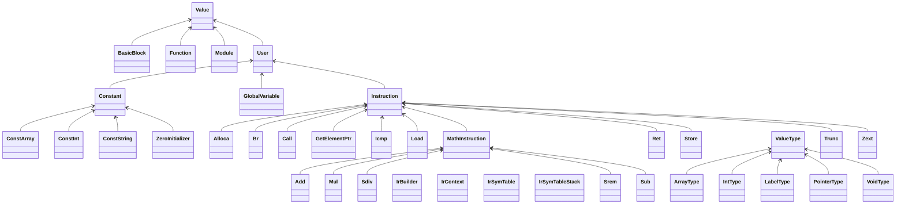

# 编译器设计文档

> 软件学院 高铭 22373386

[TOC]

## 1 参考编译器介绍

为了完成一款自己的编译器，我阅读了PL/0编译器的源代码，以之为参考完成编译器的总体架构设计。

### 1.1 总体结构

参考文档给出的PL/0编译器总体上是按照词法分析、语法分析、代码生成、解释执行这些步骤进行的。相比于课程所要求的编译器，参考编译器缺少了语义分析这一步骤。

#### 1.1.1 相关常、变量定义

程序首先定义了编译器的基本常量，如保留字数量、标识符表长度、最大地址等，为后续代码提供基础配置。随后，编译器定义了多种数据结构来表示程序中的符号类型（`symbol`）、指令（`instruction`）和符号表（`table`）。

#### 1.1.2 程序逻辑

编译器的入口为主函数`main`，首先从文件中读入代码，对符号表进行初始化，随后依次执行编译步骤。

1. **词法分析**：读取字符并识别符号
2. **语法分析**：解析程序结构
3. **生成中间代码**：把语法分析阶段解析的结果转换为可执行的指令
4. **解释执行**：执行生成的代码

### 1.2 接口设计

参考编译器中，除了IO接口外，每个接口都对应一个程序过程。

- IO接口通过标准输入输出与用户交互，提示用户输入源文件名称，并在执行过程中输出结果或错误信息。代码中使用`assign`、`reset`和`close`等函数管理源程序文件的打开和关闭。
- 词法分析阶段，`getsym`接口负责获取下一个符号，并根据字符分类。
- 语法分析阶段，`block`接口用来解析程序块，处理常量、变量和过程声明，`statement`用来解析具体的赋值、过程调用等语句。
- 代码生成阶段：`gen`过程负责将指令存储到代码数组中。
- 此外，编译器还定义了`error`接口来检测并输出错误。

### 1.3 文件组织

doc文档中提供的代码并没有给出该编译器的文件组织形式，但是按照面向对象思维可将代码划分为如下模块，每个模块对应一个相对独立的功能，实现高内聚低耦合。

```bash
/ReferenceCompiler
|- main                   # 主程序文件
|- lexer                  # 词法分析模块
|- parser                 # 语法分析模块
|- codegen                # 代码生成模块
|- interpreter            # 执行模块
|- error                  # 错误处理模块
|- symbols                # 符号和保留字定义
```


## 2 编译器总体设计

### 2.1 总体结构

我的编译器使用Java语言编写，总体的结构按照编译过程执行的顺序，分为**词法分析、语法分析、语义分析、代码生成**这四部分，各部分分属不同的前端（`frontend`）或后端（`backend`）包。

主文件`Compiler.java`是主入口，负责输入输出操作、按顺序编排四部分的代码逻辑的工作。每个编译过程单独设置为一个类，采用**单例模式**管理，确保每个模块都只在主函数中出现，且是单例模式的唯一实例。主函数中，每个编译过程的输入都是前一编译过程的输出，其输出则是下一编译过程的输入，每个阶段的模块都可以选择执行或者不执行。

在各编译过程中，如若涉及到类别码（如词法分析阶段的单词类别码、错误分析的错误码、语法分析的各类结点、语义分析中符号表的符号类型），均设置一枚举类（`enum`）列举出所有可能的取值，将类型规范化。


### 2.2 接口设计

#### 2.2.1 编译各阶段接口

词法分析、语法分析、语义分析这几个阶段的接口均采用单例模式，在`Compiler.java`中的`main`函数中生成实例进行分析以及输出。

这部分接口在结构上采用统一的设计，先定义一些初始化变量、函数，实现单例模式。例如在词法分析器中需要对标识符数组、保留字键值对等进行定义，有如下初始化语句：

```java
// 单例模式，用final表示不可修改
private static final Lexer instance = new Lexer();
public static Lexer getInstance() {
    return instance;
}
// 标识符数组
private List<Token> tokens = new ArrayList<>();
// 保留字
private Map<String, TokenType> reservedWords = new HashMap<>();
// 保留字初始化函数
private void initReservedWords() { ... }
```

在前端的各分析阶段还定义有一个与`Compiler.java`交互的函数`analyze`，用来执行具体的分析过程，定义形式如下：

```java
public boolean analyze(ParamType param)
```

- 词法分析中，参数为`String srcCode`，代表分析程序的输入为`testfile.txt`
- 语法分析中，分析程序的输入是词法分析输出的标识符数组
- 语义分析中，分析程序的输入是语法分析得到的语法树根节点

最后的需要定义输出函数`printResult`，定义形式如下：

```java
public void printResult()
```

该函数无需传参，默认输出地址可在`IOUtils.java`中设置。传参中，`filePath`字符串是需要输出到的文件地址（文件名）。

在`Compiler.java`中的`main`函数中，以词法分析为例，按如下方法调用上述函数：

```java
// 获取实例
Lexer lexer = Lexer.getInstance();
Boolean result = lexer.analyze(srcCode);
// 程序正确，输出词法分析结果
if (result) {
	lexer.printResult(outputFile);
} else {
	// 程序错误，输出错误信息
	ErrorHandler.getInstance().printErrorTable(errorFile);
}
```

#### 2.2.2 工具接口

编译器的所有工具函数写在`utils`包内，并按照类别分为`IOUtils`等类。所有工具函数均为`public`范围的静态方法，方便全局调用。

在`IOUtils`中，我设计了读取文件（`read(String filePath)`）、写入文件（`write(String content, String filePath)`）以及清空文件（`clean(String filePath)`）三个方法。


#### 2.2.3 错误处理

错误处理类定义为`ErrorHandler`，同样使用单例模式，在其中定义一个`ArrayList`类型的错误表用来存放变异过程中的错误，并且定义添加错误`addErrorTable`与打印错误`printErrorTable`的方法，以便分析过程中调用。

```java
public void addErrorTable(MyError myError) {
    myErrorTable.add(myError);
}
public void printErrorTable(String filePath) {
    for (MyError myError : myErrorTable) {
        IOUtils.write(myError.toString(), filePath);
    }
}
```

错误类定义为`MyError`，重写`toString()`方法输出符合要求的行号+错误类型的输出格式；构造函数则简单定义为行号和错误类型的赋值。

```java
public MyError(int lineNum, ErrorType errorType) {
    this.lineNum = lineNum;
    this.errorType = errorType;
}
```


### 2.3 文件组织

文件组织上，每个package对应一群独立的功能，编译中的每个独立过程、错误处理类等都设置为单例模式，并且为类型设置枚举类。

```bash
Compiler
│  Compiler.java			# 主函数
├─error				# 错误处理
│      ErrorHandler.java	# 错误处理类，单例模式
│      ErrorType.java		# 错误类型枚举
│      MyError.java			# 错误类，记录错误信息
├─frontend			# 前端
│      Lexer.java			# 词法分析器，单例模式
|	   Parser.java			# 语法分析器，单例模式
│      SemanticAnalysis.java # 语义分析器，单例模式
│      Token.java			# 词法分析中的标识符类
│      TokenType.java		# 单词类别码枚举
|-nodes				# 各结点类，语法分析用到
|	   AddExpNode.java
|	   BlockItemNode.java
|      BlockNode.java
|      BTypeNode.java
|      CharacterNode.java
|      CompUnitNode.java
|	   ......
├─symbol			# 各种符号，语义分析用到
│      ArraySymbol.java
│      FuncParam.java
│      FuncSymbol.java
│      Symbol.java
│      SymbolTable.java
│      SymbolType.java
│      VarSymbol.java
├─ir				# 中间代码生成部分
│  │  IrBuilder.java		# 控制各个llvm指令生成的**工厂类**
│  │  IrContext.java		# 保存递归分析过程中的继承属性、综合属性、当前块等上下文
│  │  IrSymTable.java		# llvm符号表类
│  │  IrSymTableStack.java	# 全局栈式符号表工具类：存储符号表栈和全局符号表
│  ├─types			# 中间代码生成的类型类
│  │      ArrayType.java
│  │      IntType.java
│  │      ......
│  └─values			# 各种value
│      │  BasicBlock.java		# 基本块
│      │  Function.java			# 函数
│      │  GlobalVariable.java	# 全局变量
│      │  Module.java			# llvm文件基本单位（根节点），包含全局变量和函数
│      │  User.java				# Value的使用者，是一种可以使用其他 Value 对象的 Value 类
│      │  Value.java			# 基本的Value类，是所有对象的父类：“一切皆value”
│      ├─constants
│      │      Constant.java		# 常量类
│      │      ConstArray.java
│      │      ConstInt.java
│      │      ConstString.java
│      │      ZeroInitializer.java
│      └─instructions			# llvm ir 指令类，涵盖所有中间代码生成阶段需要的llvm指令
│              Add.java
│              Alloca.java
|			   ......
├─backend	# 后端包，即目标代码MIPS生成
│  │  MipsBuilder.java	# MIPS汇编代码生成的控制类、工厂类
│  │  MipsContext.java	# MIPS上下文通信类，包含ir和mips的映射关系
│  ├─instructions		# 指令
│  │      MipsInstruction.java	# 指令类，所有指令的父类
│  │      MipsBinary.java		# 双操作数指令
│  │      MipsBranch.java		# b类指令，包含：j target 跳转指令、b开头的分支指令
│  │      MipsCall.java			# Call(jal)指令
│  │      ......
│  ├─operands			# 操作数
│  │      MipsImm.java
│  │      MipsLabel.java
│  │      MipsOperand.java	# 父类
│  │      MipsRReg.java
│  │      MipsVReg.java
│  ├─reg		# MIPS寄存器
│  │      BlockLiveVarInfo.java		# 基本块的活跃变量分析
│  │      Pair.java			# Pair对，用于存储两个元素
│  │      Reg.java			# MIPS寄存器类型，共32个
│  │      RegBuilder.java	# 分配寄存器，使用图着色算法
│  └─units		# 编译单元
│          MipsBlock.java
│          MipsFunction.java
│          MipsGlobalVariable.java
│          MipsModule.java
└─utils				# 工具
        IOUtils.java			# 输入输出工具类
        IrUtils.java			# 中间代码生成工具类
```


## 3 词法分析设计

### 3.1 编码前的设计

词法分析的任务，本质上讲就是从给定的源程序中识别出单词，把这些单词的类别和名称按顺序存入`tokens`数组当中，也就是使用一个数组来抽象原本的sysY程序。

对于这个任务，一个十分自然的思路就是创建一个`Token`类，用来存储每个单词的各类属性：类型，值，所处行号等；而对于每个单词的类型，我又建立了一个`TokenType`枚举类用来规范化地标识。这便是词法分析阶段所涉及的主要对象了。

有了这些对象，接下来就要思考词法分析的总体过程了。无非就是把源代码从头到尾遍历一遍，遇到标识符就分类进行识别，还要特别注意处理保留字的情况。这一阶段的关键的技术点在于如何**遍历代码字符串**、**划分单词**，以及用编程实现**有限状态自动机**，尤其涉及注释和标识符的识别时需要考虑多种情况。解决了这些，我想词法分析程序就能基本完成了。

#### 3.1.1 遍历代码

编码前的设计是使用`for`循环遍历`content`字符串，维护一个`curPos`变量代表当前遍历到字符所在位置，用`charAt`方法获取当前字符，随后使用多个`if`条件语句对当前字符进行相应判断，如下所示

```java
for (int curPos = 0; curPos < len; curPos++) {
	char c = content.charAt(curPos);
	if (c...) { /* operations */ }
	else if (c...) { /* operations */ }
	// more else-if codes
```

同时，维护一个代表当前行号的`lineNum`变量，当遍历到换行符时则自增。由于使用的for循环中，每次条件判断后都会进行自增操作，而如果条件判断语句中不涉及空白符（除了换行符‘\n’），则循环就会自动跳过空白符，因此决定不特意处理空白符。

每当一个else-if语句结束前，都需要将token保存起来。这里的token是一个自定义的Token类，保存的方式是加入实现定义好的tokens数组中。Token类的构造函数需要传三个参数，分别是标识符类型、名字、行号，代码如下：

```java
tokens.add(new Token(type, ident, lineNum));	// type是TokenType类的
```

#### 3.1.2 标识符的识别

在字符串遍历时，一个重点就是如何识别标识符并区分是否为保留字。

对于保留字，我定义了一个`reservedWords`哈希表，存储名字和类型两个参数。初始化时需要把所有的保留字加入哈希表中，代码如下：

```java
private Map<String, TokenType> reservedWords = new HashMap<>();
private void initReservedWords() {
    reservedWords.put("main", TokenType.MAINTK);
    reservedWords.put("const", TokenType.CONSTTK);
    reservedWords.put("int", TokenType.INTTK);
    reservedWords.put("char", TokenType.CHARTK);
    /* more reserved words */
}
```

对于非保留字，只需按照状态机图示写出代码即可。例如识别标识符，状态图如下：


代码如下：

```java
else if (c == '_' || Character.isLetter(c)) {
    String ident = "";
    while (curPos < len && (Character.isLetterOrDigit(content.charAt(curPos)) || content.charAt(curPos) == '_')) {
        char cc = content.charAt(curPos++);
        ident += cc;
    }
    curPos--;    // 回退一个字符，因为for循环会自动加1
    // 判断是否是保留字
    TokenType type = reservedWords.get(ident);
    if (type == null) type = TokenType.IDENFR;
    tokens.add(new Token(type, ident, lineNum));
}
```

#### 3.1.3 注释识别

词法分析中最难的部分应属注释识别。涉及斜杠的语法成分有**单行注释、多行注释和除法运算符**。


状态转换图如上，单行注释只需要在当前行中执行`while`循环，截止条件就是遍历到换行符，然后行号自增；多行注释在检测到`*`号之后执行`while`循环，以结束或检测到`*/`为停止条件。循环内部还需要两种`while`循环，一种是非`*`字符，继续循环；若为`*`字符，则还需要进入另一种循环。（本质上这两种循环同理，但为了和状态转换机的形式一样，选择按照这种方式实现）。代码如下：

```java
else if (curPos + 1 < len && content.charAt(curPos + 1) == '*') {
    curPos++;
    while (curPos < len) {  // 状态转换循环
        while (curPos < len && content.charAt(curPos) != '*') {
            // 非*字符，继续循环
            char cc = content.charAt(curPos++);
            token += cc;
            if (cc == '\n') lineNum++;
        }
        while (curPos < len && content.charAt(curPos) == '*') {
            // 遇到*，继续循环。如果不是*，则继续走大循环，跳到上一个小循环
            token += content.charAt(curPos++);
        }
        if (curPos < len && content.charAt(curPos) == '/') {
            // 找到*/，结束注释
            token += content.charAt(curPos);
            break;
        }
    }
    // System.out.println("多行注释：" + token);
}
```

对于错误处理，由于只涉及到a类错误，处理方式并不复杂，在[错误处理](####错误处理)部分已有所提及，不再赘述。


### 3.2 编码完成之后的修改

编码完成后，出现了一些编码前没考虑到的问题，对代码进行修改。

首先是**错误处理**，如果在`analyze`函数中进行错误处理，那么我先前所设计的错误处理类将不具有普适性，破坏了低耦合性；此外由于词法分析阶段，错误程序和正确程序是两套不同的输出逻辑，因此决定在`main`函数调用时进行错误处理，区分词法分析中是否有错误的标准就是返回值是否为`true`。基于此，我为`analyze`函数增加了布尔变量返回值，代表是否出现错误。

但值得注意的是，词法分析需要从头到尾执行完，因此不能在`for`循环中间`return false`，而是要设计一个默认值为`true`的指示变量`result`，在分析过程中遇到错误则置为`false`。用法如下：

```java
Boolean result = true;  		// 标记词法分析是否成功
for (int curPos = 0; curPos < len; curPos++) {
	// operations
	else if (c == '&') {
		if (curPos < len && content.charAt(curPos + 1) == '&') {
            curPos++;
            tokens.add(new Token(TokenType.AND, "&&", lineNum));
		} else {
			ErrorHandler.getInstance().addErrorTable(new MyError(lineNum, ErrorType.a));
			result = false;		// 遇到错误，置为falses
		}
	}
}
```

main函数相应做出改动，代码如下：

```java
if (result) {
	lexer.printResult(outputFile);
} else {
	// 程序错误，输出错误信息
	ErrorHandler.getInstance().printErrorTable(errorFile);
}
```

此外是标识符的识别中，如果有需要套`while`循环遍历的`token`，在循环结束后都需要执行`curPos--`回退一个字符，否则会出现漏读字符的问题。这是因为外部的`for`循环会将`curPos`自增，而`while`循环达到终止条件前也会自增，这就导致出`while`循环后，`curPos`多增加了一次，需要回退。

至此，词法分析程序全部编写完毕。


## 4 语法分析设计

### 4.1 编码前的设计

前面的词法分析阶段，我们已经把源程序抽象成了一个个单词`token`。语法分析阶段的任务，就是更进一步地，通过给定的文法，分析这些`token`所处的语法层级，让这些token不再线性地排列在一个数组中，而是根据文法为它们按照树状排列起来，生成所谓的**语法树**。

这一阶段的主要技术就是理论课上所讲到的递归下降分析法。这一方法首先需要对文法中所涉及到的所有非终结符进行抽象，把它们看做**语法树的中间节点**。接着，为这些中间节点按照给定文法编写递归子程序，直到下降到终结符即可退出子程序返回上一级继续分析。如果其中发生错误，还需要进行错误处理，基本的原理和词法分析阶段相同，不再赘述。

我的设计主要分为两个阶段：中间节点的实现（面向对象）以及语法分析过程的实现（面向过程）

#### 4.1.1 中间节点类的实现

语法树的中间节点一定是非终结符，而每个非终结符一定有一个对应的规则可以把拆分成更加低阶的语法成分。因此可以说，所有中间节点之间都是互相关联的。

很自然地，我想到把这些中间节点分别写成`Node`类，放在`nodes`包下面。而考虑到每个中间节点的共同点并不多，只有一个print方法（用来输出结果，后续会提到）是公共的，因此并没有为它们设置抽象父类。

以其中的`InitVal`为例，文法规则为：

```
InitVal -> Exp | '{' [ Exp { ',' Exp } ] '}' | StringConst
```

在`nodes.InitValNode.java`中，首先需要设置该规则所涉及的**局部属性**。可以观察到，其中的`Exp`非终结符可能会在该规则中循环多次，因此把它设置为List类型，此外附带的逗号`commas`也设置为List类型。对于其他的终结符，它们都是`Token`类的，虽说也可以设置数组类型减少码量，但我并没有这么做。因为这样会使得语法分析过程中的代码可读性大幅下降。可以预见，到时会出现众多类似于`tokens.get()`的语句，难以阅读。因此，针对这条规则，我为左大括号、右大括号、字符串常量分别设置了属性。

总结一下，为每个节点类设置属性的总原则就是，所设计的数据结构要能够覆盖规则所涉及的所有情况，宁多勿少，防止在语法分析的过程中找不到相应的数据。

对于`InitVal`，我设计了如下的属性：

```java
private List<ExpNode> expNodes;
private Token leftBrace;
private Token rightBrace;
private List<Token> commas;
private Token stringConst;
```

为了给语法分析过程提供易于调用的接口，我采取了简单的构造函数，一股脑把所有属性都放在构造函数当中初始化，简单粗暴但可能导致`Parser.java`中代码冗长不易读：

```java
public InitValNode(List<ExpNode> expNodes, Token leftBrace, Token rightBrace, List<Token> commas, Token stringConst) {
    this.expNodes = expNodes;
    this.leftBrace = leftBrace;
    this.rightBrace = rightBrace;
    this.commas = commas;
    this.stringConst = stringConst;
}
```

最后，就是所有中间节点所共有的print方法了。既然语法分析需要递归处理，打印语法成分自然也需要递归处理。因此，我的语法分析阶段需要**两遍遍历**，一遍构造语法树，一遍打印结果。具体程序如下，需要分情况考虑，梳理规则的逻辑，不过并不难。

```java
public void print() {
    if (leftBrace == null) {
        if (stringConst == null) {
            // 情况1：只有一个常量表达式
            expNodes.get(0).print();
        } else {
            // 情况3：是字符串常量
            IOUtils.write(stringConst.toString());
        }
    } else {
        // 情况2：是数组常量，可能为空，可能一个，可能多个
        IOUtils.write(leftBrace.toString());
        // 大括号内为空就不用输出了
        if (expNodes.size() > 0) {
            expNodes.get(0).print();
            for (int i = 1; i < expNodes.size(); i++) {
                IOUtils.write(commas.get(i - 1).toString());
                expNodes.get(i).print();
            }
        }
        IOUtils.write(rightBrace.toString());
    }
    IOUtils.write("<InitVal>\n");
}
```

#### 4.1.2 Parser过程的实现

既然是递归下降方法，那么程序的每个非终结符也会有它自己的递归下降子程序，返回值是解析好的语法树结点`node`类。

每个非终结符的递归下降子程序主要进行如下工作：

- 根据FIRST集或者回溯，来选择合适的产生式。
- 通过调用`judge()`方法，根据产生式按顺序接纳**终结符**，并读取下一个`token`。
- 通过调用相应子程序，根据产生式按顺序进行右端非终结符的进一步递归下降分析并接纳。
- 最后构建语法树结点`node`类，供上一层的子程序取用。

仍以`InitVal`子程序举例：

```java
private InitValNode InitVal() {
    List<ExpNode> expNodes = new ArrayList<>();
    Token leftBrace = null, rightBrace = null, stringConst = null;
    List<Token> commaTokens = new ArrayList<>();
    if (curToken.getType() == TokenType.LBRACE) {
        leftBrace = judge(TokenType.LBRACE);
        if (curToken.getType() != TokenType.RBRACE) {
            expNodes.add(Exp());
            while (curToken.getType() != TokenType.RBRACE) {
                commaTokens.add(judge(TokenType.COMMA));
                expNodes.add(Exp());
            }
        }
        rightBrace = judge(TokenType.RBRACE);
    } else if (curToken.getType() == TokenType.STRCON) {
        stringConst = judge(TokenType.STRCON);
    } else {
        expNodes.add(Exp());
    }
    return new InitValNode(expNodes, leftBrace, rightBrace, commaTokens, stringConst);
}
```


程序的入口一定是整个文法的识别符号，也就是`CompUnit()`。

特别要强调的是`judge()`方法，它是读取下一跳终结符的唯一方法，也是检验是否有终结符相关错误的处理函数。这个方法只有当遇到终结符时才会被调用，并且判断当前终结符的类型是否符合预期。如果当前`token`的类型符合预期，则返回当前`Token`，并更新`curPos`和`curToken`，否则依照不同情况分辨出是否为i/j/k类错误。

```java
public Token judge(TokenType type) {
    ErrorHandler errorHandler = ErrorHandler.getInstance();
    int errorLineNum = curPos > 0? inputTokens.get(curPos-1).getLineNum() : 1;
    if (curToken.getType() == type) {
        // 当前token的类型符合预期，返回当前Token，并更新curPos和curToken
        Token returnToken = curToken;
        if (curPos < inputTokens.size()-1) {
            curToken = inputTokens.get(++curPos);
        }
        return returnToken;
    } else if (type == TokenType.SEMICN) {
        // 不符合预期，且预期符号是分号，报错i，行号为分号前一个非终结符所在行号。
        if (recallFlag == 0)
            errorHandler.addErrorTable(new MyError(errorLineNum, ErrorType.i));
        // 纠错，把这个符号改为分号，然后继续分析
        return new Token(TokenType.SEMICN, ";", errorLineNum);
    } else if (type == TokenType.RPARENT) {  // 报错j
        if (recallFlag == 0)
            errorHandler.addErrorTable(new MyError(errorLineNum, ErrorType.j));
        return new Token(TokenType.RPARENT, ")", errorLineNum);
    } else if (type == TokenType.RBRACK) {  // 报错k
        if (recallFlag == 0)
            errorHandler.addErrorTable(new MyError(errorLineNum, ErrorType.k));
        return new Token(TokenType.RBRACK, "]", errorLineNum);
    }
}
```


### 4.2 编码完成之后的修改

#### 4.2.1 左递归问题

文法中有六个涉及到左递归的文法，例如：

```
AddExp -> MulExp | AddExp ('+' | '−') MulExp
```

递归下降子程序分析法是不允许左递归出现的。为了解决这一问题，我最开始所采用的处理方式是把左递归改成右递归，即：
```
AddExp -> MulExp | MulExp ('+' | '−') AddExp
```

一开始，我发现按照后序遍历输出的`<AddExp>`的位置并不对，经过调整，发现只需要改变一下位置，改为如下形式，便可以通过相关测试点了：

```java
public void print() {
    mulExpNode.print();
    IOUtils.write("<AddExp>\n");
    if (op != null) {
        IOUtils.write(op.toString());
        addExpNode.print();
    }
}
```

但是，考虑到之后语义分析和中间代码生成的代码将会更加复杂，直接修改这六条文法可能会出现意料之外的后果，因此我认为还是要摒弃右递归的方法，使用扩充的BNF范式，消除`AddExp`的影响：

```
AddExp -> MulExp {'+' MulExp}
```


这样一来，语法树就变成了上面的形式。但是，这样还是变相地修改了文法，我参考其他人的思路，对于AddExp设计了如下的操作：

```java
private AddExpNode AddExp() {
    MulExpNode mulExpNode = MulExp();
    Token op = null;
    AddExpNode addExpNode = null;
    // 存在('+' | '−') 就捕获外层结构，然后组装回各层的AddExp
    while (curToken.getType() == TokenType.PLUS || curToken.getType() == TokenType.MINU) {
        // 将上一轮捕获的单位进行组装
        addExpNode = new AddExpNode(mulExpNode, op, addExpNode);
        op = judge(curToken.getType());
        mulExpNode = MulExp();
    }
    return new AddExpNode(mulExpNode, op, addExpNode);
}
```

这样处理之后，虽然文法还是左递归的，但是将会对后续的语义分析、代码生成不产生影响，因为相关的数据结构已经存起来，不再受到最左推导的限制。具体来看，我们先识别一个必有的`MulExp`，随后每一次都识别一个`+MulExp`。每识别到一个`+MulExp`，我们便将上一轮识别到的`AddExp`和上一轮识别到的`+MulExp`组装成本轮的新`AddExp`，这样就可以在不破坏文法的情况下，成功识别到该有的语法结构。

#### 4.2.2 预读的弊端&回溯的引入

在通过了语法分析测试和所有公共测试库的样例后，我发现了一种之前从未被测试过的样例，而且被告知最终的期末考试不保证不出现这种样例，这引起了我的格外注意。对于下面的程序：

```c
void f() {}
int main() {
    int a;
    f(); a=1;
    return 0;
}
```

对于第四行，我的编译器会产生`RuntimeError`的报错，理由是无法分辨如下两条文法：
```
Stmt -> LVal '=' Exp ';'
Stmt -> [Exp] ';'
```

按照正常的逻辑，语法分析器会认为`f`是个左值从而寻找下一个`assign`等号，然而实际上这个`f()`仅仅是一个普通的`exp`而已。这便是通过FIRST集预读的弊端所在。为了解决这一问题，我引入了回溯的策略。

需要回溯的文法有如下几条：

```
Stmt -> LVal '=' Exp ';'
Stmt -> LVal '=' 'getint''('')'';'
Stmt -> LVal '=' 'getchar''('')'';'
Stmt -> [Exp] ';'
```

所谓回溯，就是对于一条岔路可能出现的所有情况，先按照一种情况大胆往前分析，不过在迈出这一步前，需要记录岔路口所在的位置，以便回到岔路口再尝试另一条路。具体的代码如下：

```java
private StmtNode Stmt() {
	if (...) {
		...
	} else {
		// 剩下上面提到的四种情况
        // 为分号，';'，无Exp，则无需进行任何操作
        if (curToken.getType() == TokenType.SEMICN) {
            Token semicn = judge(TokenType.SEMICN);
            ExpNode expNode = null;
            return new StmtNode(StmtNode.StmtType.EXP, expNode, semicn);
        } else {
            // 先使用Exp消去LVal和Exp
            savePos1();
            recallFlag = 1;
            ExpNode expNode = Exp();
            recallFlag = 0;
            // 为分号，Exp ';'，有Exp
            if (curToken.getType() == TokenType.SEMICN) {
                restorePos1();  // 这里还是回到原来的位置吧，方便错误处理判断是否处于回溯状态
                expNode = Exp();
                Token semicn = judge(TokenType.SEMICN);
                return new StmtNode(StmtNode.StmtType.EXP, expNode, semicn);
            } else {
                // 非分号，那么有两种情况：1、是LVal开头的语句
                if(curToken.getType() == TokenType.ASSIGN) {
                    restorePos1();
                    LValNode lValNode = LVal();
                    Token assign = judge(TokenType.ASSIGN);
                    if (curToken.getType() == TokenType.GETINTTK) {
                        // LVal '=' 'getint''('')'';'
                        Token getintToken = judge(TokenType.GETINTTK);
                        Token leftParent = judge(TokenType.LPARENT);
                        Token rightParent = judge(TokenType.RPARENT);
                        Token semicn = judge(TokenType.SEMICN);
                        return new StmtNode(StmtNode.StmtType.GETINT, lValNode, assign, getintToken, leftParent, rightParent, semicn);
                    } else if (curToken.getType() == TokenType.GETCHARTK) {
                        // LVal '=' 'getchar''('')'';'
                        Token getcharToken = judge(TokenType.GETCHARTK);
                        Token leftParent = judge(TokenType.LPARENT);
                        Token rightParent = judge(TokenType.RPARENT);
                        Token semicn = judge(TokenType.SEMICN);
                        return new StmtNode(StmtNode.StmtType.GETCHAR, lValNode, assign, getcharToken, leftParent, rightParent, semicn);
                    } else {
                        // LVal '=' Exp ';'
                        expNode = Exp();    // FIXME: 不知道有没有问题
                        Token semicn = judge(TokenType.SEMICN);
                        return new StmtNode(StmtNode.StmtType.ASSIGN, lValNode, assign, expNode, semicn);
                    }
                } else {
                    // 2、Exp后面忘跟分号了
                    System.out.println("Exp后面忘跟分号了，此报错不在judge中 " + inputTokens.get(curPos-1) + "line: " + inputTokens.get(curPos-1).getLineNum());
                    ErrorHandler.getInstance().addErrorTable(new MyError(inputTokens.get(curPos-1).getLineNum(), ErrorType.i));
                    return new StmtNode(StmtNode.StmtType.EXP, expNode, new Token(TokenType.SEMICN, ";", inputTokens.get(curPos-1).getLineNum()));
                }
            }
        }
	}
}
```

这样便成功处理了这种特殊情况，完成了语法分析。


## 5 语义分析设计

### 5.1 编码前的设计

语义分析阶段，编译器的主要任务就是建立符号表以及进行错误处理。对于符号表，需要能够识别出定义的常量、变量、函数、形参，输出它们的作用域序号，单词的字符/字符串形式，类型名称。

#### 5.1.1 符号表设计

在语法分析部分，我们将单词序列转化为结构化的抽象语法树。然而抽象语法树依旧无法表达完整的程序语义，因为语法树的定义基于上下文无关文法，而无法反映程序执行时的上下文环境。在语义分析阶段，我们需要定义一个符号表来维护上下文信息。

符号表是**一个作用域拥有一张**，因此很自然地能够想到，符号表需要包含**当前作用域`id`以及外层作用域`id`**，以便在符号表生成的过程中不断地更新当前所处的作用域。特别地，理论课上所学的是作用域的层级，然而这里用到的`id`是递增的编号，需要注意个中差别。

符号表类的基本属性如下：

```java
public class SymbolTable {
    public int id;          // 当前符号表的id
    public int fatherId; 	// 外层符号表的id。
    public List<Symbol> directory; // 当前符号表目录
    public SymbolType type; // 特别地，若该符号表是函数符号表，则记录其返回类型。
}
```

#### 5.1.2 符号设计

作为抽象类，符号的设计也比较简单，在不考虑到后续中间代码生成的情况下，基本属性如下：

```java
public abstract class Symbol {
    public int tableId; 	// 当前单词所在的符号表编号。
    public String token; 	// 当前单词所对应的字符串。
    public SymbolType type; 	// 符号类型
}
```

我设计了三个继承这一抽象类的子类：`ArraySymbol`，`FuncSymbol`，`VarSymbol`。顾名思义，它们分别存储三种不同类型的符号，其中`ArraySymbol`需要额外存储数组大小`size`，`FuncSymbol`需要额外存储函数参数类型列表`funcParams`，而`VarSymbol`没有额外的子类属性。

此外，我选择了将符号类型抽象为单独的枚举类，一共有11中枚举类型，就不一一列举了。这样做的好处是使得一些需要特判的情况能够一目了然。但是，可以预见到，这样会使得一些普遍情况（例如判断是否为常量、是否为数组等）的**判断十分冗长**。

#### 5.1.3 语义分析过程

我将整个的语义分析过程写在了一个文件`SemanticAnalysis.java`当中，与前面的词法分析和语法分析一样，它遵从单例模式，只需在`main`函数中调用分析方法即可完成语义分析，调用`print`方法即可完成结果的输出。功能上，它包揽了这一阶段的符号表创建与错误处理的工作。

为了数据处理的简单，我没有选择显式的树这一数据结构；而为了输出的便利，我也没有选择栈这一数据结构，而是**直接采用一个List来代表各个作用域的符号表列表**，而使用`SymbolTable`中的`id`和`fatherId`属性来标志符号表之间的树状关系。

```java
private List<SymbolTable> symbolTables = new ArrayList<>();
```

在整个处理的过程中，我仍然采用递归下降的思路，对于每个非终结符，分别构造一个`void`的同名函数，代表该非终结符的语义分析过程。不同于语法分析的相对程式化，语义分析阶段更多地需要具体情况具体分析，完成作用域的更迭以及符号表的维护。一些语义分析中关于作用域典型的操作如下：

- **进入新作用域**：维护一个当前作用域编号的变量`curScope`，维护一个当前最大作用域编号的变量`scopeCount`以用来新增作用域。每当进入新作用域，向树状符号表中添加新的符号表。

  ```java
  private void newScope(SymbolType scopeType) {
      // 出现子作用域时scopeCount++。type是如果符号表为函数，填入IntFunc或CharFunc
      symbolTables.add(new SymbolTable(++scopeCount, curScope, scopeType));
      curScope = scopeCount;
  }
  ```

  调用该函数的非终结符有：`CompUnit`、`FuncDef`、`MainFuncDef`、`Stmt.Block`

- **退出当前作用域**：类似于栈式符号表的退栈操作，我这里只需要变更当前作用域curScope为它的父作用域即可。

  ```java
  private void exitScope() {
      curScope = symbolTables.get(curScope - 1).fatherId;
  }
  ```

  除了`CompUnit`外，其他调用`newScope`的阶段都需要执行`exitScope`。

在这里，列举其中`FuncDef`的处理以管中窥豹。相关说明以注释的形式在代码中给出。

```java
private void FuncDef(FuncDefNode funcDefNode) {
    if (inCurrentScope(funcDefNode.getIdent().getValue())) {
        // b类错误
        errorHandler.addErrorTable(new MyError(funcDefNode.getIdent().getLineNum(), ErrorType.b));
        return;
    }
    // 重要！g类错误推迟到Block中处理！！！
    SymbolType type;    // 函数类型
    if (funcDefNode.getFuncTypeNode().getType() == TokenType.VOIDTK) type = SymbolType.VoidFunc;
    else if (funcDefNode.getFuncTypeNode().getType() == TokenType.INTTK) type = SymbolType.IntFunc;
    else type = SymbolType.CharFunc;
    if (funcDefNode.getFuncFParamsNode() == null) {
        // 没有参数，则直接创建FuncSymbol，参数列表就是空的
        putSymbol(new FuncSymbol(curScope, 
                                 funcDefNode.getIdent().getValue(), 
                                 type, new ArrayList<>()));
    } else {
        // 有参数，则先创建参数列表
        List<FuncParam> params = new ArrayList<>();
        // 遍历参数列表，每个参数是一个funcFParamNode
        for (FuncFParamNode funcFParamNode : funcDefNode.getFuncFParamsNode().getFuncFParamNodes()) {
            if (funcFParamNode.getBTypeNode().getType() == TokenType.INTTK) {
                if (funcFParamNode.getLeftBracket() != null)
                    params.add(new FuncParam(funcFParamNode.getIdent().getValue(), 
                                             SymbolType.IntArray));
                else
                    params.add(new FuncParam(funcFParamNode.getIdent().getValue(), 
                                             SymbolType.Int));
            }
            else { // CHARTK
                if (funcFParamNode.getLeftBracket() != null)
                    params.add(new FuncParam(funcFParamNode.getIdent().getValue(), 
                                             SymbolType.CharArray));
                else
                    params.add(new FuncParam(funcFParamNode.getIdent().getValue(), 
                                             SymbolType.Char));
            }
        }
        putSymbol(new FuncSymbol(curScope, 
                                 funcDefNode.getIdent().getValue(), type, params));
    }
    // 进入函数体，需要处理下一层作用域
    newScope(type);
    // 首先把函数形参加入该作用域符号表
    if (funcDefNode.getFuncFParamsNode() != null) {
        FuncFParams(funcDefNode.getFuncFParamsNode());
    }
    Block(funcDefNode.getBlockNode());
    exitScope();
}
```


#### 5.1.4 错误处理

错误处理的**公共步骤十分简单**。在检测出错误以后，只需调用`errorHandler.addErrorTable`方法，传参是出现错误的行号以及错误类型，这个函数即可将相关错误信息添加到错误表中，而所谓的错误表无非就是一个`List`数组，存储了编译器发现的所有错误信息。详细说明在本文档的2.2.3节。

本阶段，需要进行的错误处理有如下几种，在此列出来并写上我的处理方法。

- b 类错误：函数名或变量名在**当前作用域**下重定义。

  对应的非终结符有`ConstDef`、`VarDef`、`FuncDef`、`FuncFParam`。我的处理方法是进入这些非终结符的函数时首先调用`inCurrentScope`方法，检查当前作用域是否存在同名变量。定义如下：

  ```java
  private boolean inCurrentScope(String varName) {
      List<Symbol> symbols = symbolTables.get(curScope - 1).getDirectory();
      for (Symbol symbol : symbols) {
          if (symbol.token.equals(varName)) {
              return true;
          }
      }
      return false;
  }
  ```

- c 类错误：使用了未定义的标识符。

  对应的非终结符有`LVal`、`UnaryExp`。我的处理方法是进入这些非终结符的函数时首先调用`getSymbol`方法，判断当前作用域及父作用域是否存在该变量。定义如下：

  ```java
  // 根据标识符名获取符号，从当前作用域开始向上查找
  private Symbol getSymbol(String ident) {
      int id = curScope;
      while (id >= 1) {
          Symbol returnSymbol = null;
          for (Symbol symbol : symbolTables.get(id - 1).getDirectory()) {
              if (symbol.token.equals(ident)) {
                  returnSymbol = symbol;
              }
          }
          if (returnSymbol != null) return returnSymbol;
          id = symbolTables.get(id - 1).fatherId;
      }
      return null;
  }
  ```

  如果返回值为`null`，则应当报错。

- d 类错误：函数参数个数不匹配。处理方法是：在`UnaryExp`中，首先判断函数是否有参数。若没有参数，则参数列表不为空时报错；若函数有参数，则检查函数参数个数是否匹配。函数参数个数可通过`funcSymbol.funcParams.size()`获取。

- e 类错误：函数调用语句中，参数类型与函数定义中对应位置的参数类型不匹配。具体处理见5.2.2节。

- f 类错误：无返回值的函数存在不匹配的`return`语句。在`Stmt`的`return`语句中出现，判断代码如下：

  ```java
  if (symbolTables.get(id - 1).getType() == SymbolType.VoidFunc && 
      stmtNode.getExpNode() != null) {
  	errorHandler.addErrorTable(
          new MyError(stmtNode.getReturnToken().getLineNum(), ErrorType.f)
      );
  }
  ```

- g 类错误：有返回值的函数缺少`return`语句。处理方式是在Block的末尾位置中加入如下判断：

  ```java
  if (symbolTables.get(curScope - 1).getType() == SymbolType.IntFunc || 
  	symbolTables.get(curScope - 1).getType() == SymbolType.CharFunc) {
      if (blockNode.getBlockItemNodes().isEmpty() ||
          blockNode.getBlockItemNodes().get(blockNode.getBlockItemNodes().size() - 1).getStmtNode() == null ||
          blockNode.getBlockItemNodes().get(blockNode.getBlockItemNodes().size() - 1).getStmtNode().getReturnToken() == null ) {
          // 报错行号为函数结尾的’}’所在行号
          errorHandler.addErrorTable(new MyError(blockNode.getRightBrace().getLineNum(), ErrorType.g));
      }
  }
  ```

- h 类错误：`LVal`为常量时，不能对其修改。处理方式是加入如下判断：

  ```java
  if (symbol.type == SymbolType.ConstChar || 
  	symbol.type == SymbolType.ConstInt ||
  	symbol.type == SymbolType.ConstIntArray || 
  	symbol.type == SymbolType.ConstCharArray) {
  	errorHandler.addErrorTable(new MyError(stmtNode.getLValNode().getIdent().getLineNum(), ErrorType.h));
  }
  ```

- l 类错误：`printf`中格式字符与表达式个数不匹配。处理方式是统计格式化字符串中的`%d`或`%c`的个数，判断是否和后面的`expNodes`的数量相等。具体代码不再罗列。

- m 类错误：在非循环块中使用`break`和`continue`语句。我的处理方式是，额外定义一个变量`loopCount`用来标识当前状态下外层的循环数，只有在进入`for`循环执行`Stmt`前自增，而执行完则会自减，标志着进入与离开循环块。如果在执行`break`和`continue`语句时，`loopCount`的值为0，则说明当前不在循环块中，需要报错。

### 5.2 编码完成之后的修改

#### 5.2.1 `Decl` 到 `Def` 过程中 `BType` 的传递

在构建符号表的时候，不可或缺的操作就是将符号插入当前符号表中。方法如下：

```java
private void putSymbol(Symbol symbol) {
    symbolTables.get(curScope - 1).getDirectory().add(symbol);
}
```

每次插入的时候，都需要传入`Symbol`类型的参数，而根据变量类型的不同，其构造函数（选用`FuncSymbol`、`VarSymbol`、`ArraySymbol`中的哪一个）和相应构造函数的传参（选用11种类型当中的何种`type`）也不尽相同。如何获取`type`是`int`还是`char`？最自然的想法就是从`BType`或`FuncType`中获取。然而，插入符号的操作是在`Def`相关函数进行的，而`BType`通常在`Decl`语句中定义，这就需要`Def`语句的构造参数增加`BTypeNode`以获取相应的`BType`，而在`Decl`语句中调用的时候只需传参即可。

当然，也可以采用语义分析中类似于继承属性向下传递的思路，不过放在这里有些割鸡用牛刀了。


#### 5.2.2 e类错误的处理

可以说，语义分析阶段，最大的难点就是e类错误（函数调用语句中，参数类型与函数定义中对应位置的参数类型不匹配）的处理。

难点在于，错误处理需要在`UnaryExp`当中进行，然而函数形参的定义却不在这里，如何把`FuncRParamsNode`当中`Exp`类型的参数转化为`FuncParam`类型十分棘手。

我的处理方式比较繁琐，但逻辑上很明了，就是通过递归调用，定义一个`exp2Param`函数，按照文法规则，递归定义了众多`2Param`类型的函数。它们互相调用，最终在解析到左值、数字或字符时即退出递归。一系列的`2Param`函数定义如下：

```java
private FuncParam exp2Param (ExpNode expNode)
private FuncParam lVal2Param (LValNode lValNode)
private FuncParam primaryExp2Param (PrimaryExpNode primaryExpNode)
private FuncParam unaryExp2Param (UnaryExpNode unaryExpNode)
private FuncParam mulExp2Param (MulExpNode mulExpNode)
private FuncParam addExp2Param (AddExpNode addExpNode)
```

另外，还需要特别注意文法中的规定：**在函数传参的过程中，同一形参的int和char类型非数组变量可以混用**。也就是说，即使形参定义为int类型，调用的时候却可以按照char类型传参，需要额外增加一些特判。

针对我的情况，我做出了如下规模庞大的特判，虽然码量很大，但是逻辑就是文法当中所规定的。


至此，语义分析的所有内容全部完成。


## 6 中间代码生成设计

代码生成阶段，综合自身实力与时间安排的考量，我选择了LLVM IR作为编译器的中间语言，后续视时间情况决定是否转为MIPS以及进行优化。

具体而言，代码生成阶段的任务就是利用语法分析得到的语法树，再次利用递归子程序法遍历每个节点，对每个遍历到的节点进行**基于属性翻译文法的递归下降**，在对每个节点进行分析的同时**维护栈式全局符号表**。我并没有选择继续维护语义分析阶段构建的`list`类型的符号表，构建了更加直观、操作更加方便的栈式符号表，并且对符号进行了封装，详情见6.1.3节。

此外，不同于语义分析，代码生成阶段需要从上往下传递众多参数，例如所在基本块、所在函数、是否正在构建`const`变量等，这些信息我单独设置了`IrContext`类，用来传递上下文的**继承属性**（自上向下传递）和综合属性（自下而上传递）。

### 6.1 编码前的设计

#### 6.1.1 架构设计

受到指导书的启发，我对于中间代码生成阶段的架构设计也如下图所示。


具体而言：

- `Value`类：“一切皆Value”，它是所有中间代码相关类的父类，一切操作数都继承自`Value`类。在构造任何类的实例时，都需要调用Value类的构造函数：

  ```java
  public Value(String name, ValueType type, Value parent) {
      this.id = applyNewId();
      this.name = name;
      this.type = type;
      this.parent = parent;
  }
  ```

- `User`类：操作数使用者，对于下面的语句，`%3`就是`User`，它使用了操作数`%1`和`%2`。User类也继承了`Value`类，因此User也可以是别的`User`的操作数。它所独有的成员变量只有`operands`，即指令操作数。

  ```
  %3 = add i32 %1, %2
  ```

- 各种`Instruction`类：继承了`User`类，每种指令都是一种类，也就是各种指令的返回值的Value对象，通过调用`toString()`方法即可获得llvm代码。

- `GlobalVirable`也继承了`User`类，是全局变量类，存储在`IrSymTableStack.globalSymTable`中。

- `Function`类和`BasicBlock`类：这两类也可以作为操作数，比如`call`指令，`putint`就属于`Function`类：

  ```
  call void @putint(i32 %i35)
  ```

- `Module`类：是llvm ir的基本单位，类似于语法分析中的`CompUnit`，仅由`Function`和`GlobalVariable`组成：

  ```java
  // =========== 变量定义 ===========
  // 全部函数表
  public ArrayList<Function> functions = new ArrayList<>();
  // 全部全局变量表
  public ArrayList<GlobalVariable> globalVariables = new ArrayList<>();
  ```

详细的文件树如下所示，各个包和java文件的功能用注释标出。

```bash
├─ir				# 中间代码生成部分
│  │  IrBuilder.java		# 控制各个llvm指令生成的**工厂类**
│  │  IrContext.java		# 保存递归分析过程中的继承属性、综合属性、当前块等上下文
│  │  IrSymTable.java		# llvm符号表类
│  │  IrSymTableStack.java	# 全局栈式符号表工具类：存储符号表栈和全局符号表
│  ├─types			# 中间代码生成的类型类
│  │      ArrayType.java
│  │      ArrayType.java
│  │      IntType.java
│  │      ......
│  └─values			# 各种value
│      │  BasicBlock.java		# 基本块
│      │  Function.java			# 函数
│      │  GlobalVariable.java	# 全局变量
│      │  Module.java			# llvm文件基本单位（根节点），包含全局变量和函数
│      │  User.java				# Value的使用者，是一种可以使用其他 Value 对象的 Value 类
│      │  Value.java			# 基本的Value类，是所有对象的父类：“一切皆value”
│      ├─constants
│      │      Constant.java		# 常量类
│      │      ConstArray.java
│      │      ConstInt.java
│      │      ConstString.java
│      │      ZeroInitializer.java
│      └─instructions			# llvm ir 指令类，涵盖所有中间代码生成阶段需要的llvm指令
│              Instruction.java	# 指令类，即各种指令的返回值的Value对象，因此只需要记录操作数
│              Add.java
│              Alloca.java
|			   ......
```

所有文件组成的mermaid图如下所示：




#### 6.1.2 指令构造

生成中间代码，本质上就是再走一遍递归下降子程序的过程，对每个`node`都进行`buildIr()`分析，这一分析过程就是中间代码生成的具体逻辑。举例而言，对于`ConstDefNode`，需要进行如下操作：

```java
public void buildIr(BTypeNode bTypeNode) {
    // 0. 先处理类型信息
    TokenType bTypeNodeType = bTypeNode.getType();
    IrContext.intBits = (bTypeNodeType == TokenType.INTTK) ? 32 : 8;
    // 1. 非数组常量，一定有后面的ConstInitVal声明
    // Ident '=' ConstInitVal
    if (constExp == null) {
        constInitValNode.buildIr();
        IrSymTableStack.addSymToPeek(ident.getValue(), IrContext.synValue);
    }
    // 2. 数组常量
    // Ident '[' ConstExp ']' '=' ConstInitVal
    else {
        // 解析数组长度信息
        constExp.buildIr();
        int length = IrContext.synInt;
        // 向下传递数组长度信息
        constInitValNode.setLength(length);
        // 获取常量初始化值
        constInitValNode.buildIr();
        // 2.1 全局数组，**初值**仅需存在GlobalVariable对象中即可
        if (IrSymTableStack.isBuildingGlobalSymTable()) {
            // true 代表是 const 数组
            IrBuilder.buildGlobalVariable(ident.getValue(), true, (ConstArray) IrContext.synValue);
        }
        // 2.2 局部数组，需要在函数中用alloca存储
        // 操作：手动给数组alloca，然后对元素getelementptr和store
        // 下部会传入构造好的常量数组synValue，以及展平后的synArray
        else {
            // 分配数组空间，注意区分int和char
            ArrayType arrayType = new ArrayType(new IntType(IrContext.intBits), length);
            // 分配空间，同时传入初值，即综合属性 IrContext.synValue
            Alloca arrayPointer = IrBuilder.buildAllocaInstruction(arrayType, IrContext.curBlock, (ConstArray) IrContext.synValue);
            // 将该符号及对应指针存入符号表
            IrSymTableStack.addSymToPeek(ident.getValue(), arrayPointer);
            // 用store和getelementptr指令把内容存入数组
            IrBuilder.buildStoreArrayValues(IrContext.intBits, arrayPointer, length, IrContext.synValueArray, IrContext.curBlock);
        }
    }
}
```

上述函数中用到了许多Ir开头的类，下面一一解释。

- `IrBuilder`类：是**各个指令的工厂类**，每调用一次工厂类中的方法即可认为生成了一条llvm指令，例如`alloca`指令，定义工厂方法如下。

  - 函数中首先获取了函数所在的开头基本块，因为我们规定所有的内存分配指令统一放在函数开头，以方便管理、防止bug；
  - 接着调用`Alloca`构造函数，创建一个新的`Alloca`对象
  - 最后把这个`Alloca`对象插入函数最开头，返回这条指令。

  ```java
  /**
   * 在函数的开头，创建内存分配指令，只在constDef中使用
   * <result> = alloca <type>
   * @param pointingType 要存储的类型
   * @param parent       所在基本块
   * @param constArray   常量初值
   */
  public static Alloca buildAllocaInstruction (ValueType pointingType, BasicBlock parent, ConstArray constArray) {
      // 把所有内存分配放在函数的开头
      BasicBlock funcHeadBlock = IrUtils.getHeadBBOfParentFunction(parent);
      // 构造alloca指令，注意getNameString()的作用，后续在调super时会在它前面加上"%i"
      Alloca alloca = new Alloca(getNameString(), pointingType, funcHeadBlock, constArray);
      // 不仅插入函数开头的基本块，还要插入到这个基本块的开头
      funcHeadBlock.addInstructionAtHead(alloca);
      return alloca;
  }
  ```

- `IrContext`类：**存储递归下降中的各类上下文信息**。我在最初的时候有疑惑：上下文信息都以`static`类型存储的，理论上并不能永久保存上下文信息，如何确保递归过程中获取的就是正确的信息？事实上，这个无需多虑，因为尽管看上去每个继承属性或综合属性对应了很多`node`的信息，但实际上同一时间`IrContext`只会和一个`node`进行交互，**也就是说这一过程是不存在并行冲突的**。

  中间代码构建时，所需要向它的父亲节点传递的属性就是综合属性，需要向它的子节点传递的属性就是继承属性。

  ```java
  // ============ 当前属性 ============
  // 当前所在基本块
  public static BasicBlock curBlock = null;
  
  // 当前所在函数，FuncDefNode第一次用到
  public static Function curFunction = null;
  
  // 是否正在计算无变量常数表达式(constExp)
  public static boolean isBuildingConstExp = false;
  
  // 是否正在加载函数实参，并且要求PointerType类型的value
  public static boolean isBuildingPointerRParam = false;
  
  // ============ 综合属性 ============
  // char/int类型的位数，向上传递
  public static int intBits = 0;
  // Value类的综合属性，向上传递
  public static Value synValue = null;
  // Int类型的综合属性，向上传递
  public static int synInt = -1;
  // Value类数组的综合属性，向上传递
  public static ArrayList<Value> synValueArray = null;
  
  // ============ 继承属性 ============
  // int类型的继承属性，向下传递
  public static int inheritInt = -1;
  ```


#### 6.1.3 栈式符号表的管理

栈式符号表的设计，和语义分析的类似，语义分析中的`Symbol`就对应了这里的`IrSymTable`类，`SymbolTable`对应了这里的`IrSymTableStack`类。

有关符号表的管理，逻辑是：每当遇到新的block时，就新建符号表并压栈（即规则中带有block的，在SysY中有`FuncDefNode`、`MainFuncDefNode`、`StmtNode`）。当执行完当前block（一定是栈顶符号表）的buildIr()方法，就将这个栈顶符号表弹出栈，相应的方法如下：

```java
public static IrSymTable push() {
    IrSymTable symTable = new IrSymTable();
    push(symTable);
    return symTable;
}

// 栈顶符号表出栈，但全局符号表并不会出栈！
public static void pop() {
    if(instance.stack.size() > 1) {
        instance.stack.pop();
    }
}
```

规定，全局符号表永远处于栈底且不会被弹栈。

```java
// 初始化符号表栈：清空栈，并将全局符号表压入栈顶
public static void init() {
    instance.stack.clear();
    globalSymTable = new IrSymTable();
    instance.stack.push(globalSymTable);
}
```


### 6.2 编码后的设计

#### 6.2.1 数组初值问题

指导书中并没有对数组不同情况赋初值的问题进行统一的描述，我结合散落指导书不同地方的规定以及讨论区的相关帖子，整理情况如下：

|                          | 全局有初值 | 全局无初值        | 局部有初值                           | 局部无初值 |
| ------------------------ | ---------- | ----------------- | ------------------------------------ | ---------- |
| `char`型数组（含字符串） | 末尾补0    | `zeroinitializer` | 末尾补0                              | 不处理     |
| `int`型数组              | 末尾补0    | `zeroinitializer` | 不用补0，直接使用`gep`-`store`存初值 | 不处理     |

对于数组的处理，我将字符串也归为字符数组类型，即`char a[10]="hello";`和`char a[10]={'h','e','l','l','o'}`等价。


#### 6.2.2 char类型与int类型的区分与相互转化

在实际编码过程中，我还遇到了`char`类型与`int`类型区分与转化的问题。

想到如何区分`char`类型与`int`类型？借助于`IrContext`上下文类，我想到了定义`intBits`这一综合属性，每当递归子程序扫描到`Def`或`Decl`为后缀（即所有能获取到`BType`：ConstDeclNode、VarDeclNode、FuncDefNode、MainFuncDefNode、FuncFParamNode）的节点，就根据`BType`设置`IrContext.intBits`。而每当需要使用当前综合属性中的`intBits`，直接调用即可。

```java
// ============ 综合属性 ============
// char/int类型的位数，向上传递
public static int intBits = 0;

// ============ 使用方法 ============
TokenType bTypeNodeType = bTypeNode.getType();
IrContext.intBits = (bTypeNodeType == TokenType.INTTK) ? 32 : 8;
```

对于`char`与`int`的相互转化，在llvm中会用到两个指令：`trunc`与`zext`。

`trunc`指令是把i32截断为i8类型，要用到的地方有：

- `buildRetInstruction`：可能返回值类型i32，而函数类型是i8；
- `buildStoreInstruction`：可能要存储的内容为i32类型，要存入的地址是i8\*类型；
- `buildCallInstruction`：可能实参是i32类型，而需要的形参是i8类型。

对于`zext`指令，需要考虑的情况就比较多了，除了上面需要用到`trunc`的指令可能也会需要用到`zext`指令，所有的运算指令也都需要考虑到i8扩展为i32的情形。另外特别地，在`UnaryExpNode`、`RelExpNode`和`EqExpNode`中，还需要考虑到`icmp`指令得到的是i1类型的值，在这些地方需要扩展到i32类型的。


## 7 目标代码生成设计

MIPS目标代码生成是编译器的最后一部分，任务就是将llvm中间代码作为输入，输出等价的MIPS代码。在llvm中，我们已经把SysY源代码转换成了llvm指令，并且划分了函数和基本块。因此这一阶段的任务非常直观，就是沿用llvm中对于基本块的划分，**将llvm指令逐条翻译成MIPS指令**，建立llvm与mips在函数、基本块和操作数上的映射。

### 7.1 编码前的设计

#### 7.1.1 架构设计

##### 1. `MipsBuilder`

MIPS生成部分的代码，除了映射部分的`buildMips`需要在ir部分执行，其余代码基本上都在`backend`包中。在包中，`MipsBuilder`是MIPS汇编代码生成的控制类，`Compiler`从此文件的`generate()`方法调用，生成MIPS代码。生成MIPS代码的主要逻辑，就是对ir中的指令逐条翻译，调用`buildMips()`方法；随后进行寄存器分配。我采用的是虚拟寄存器，因此后续需要进行图着色算法分配寄存器，具体内容在代码优化部分中提及。

```java
// 生成MIPS代码的主要方法
public void generate() {
    // 这一步生成的MIPS的寄存器还是虚拟寄存器，没有考虑寄存器分配
    irModule.buildMips();
    // 进行寄存器分配
    RegBuilder regBuilder = new RegBuilder();
    regBuilder.buildRegs();
}
```

此外，`buildMips`还是工厂类，但凡调用了一次`build*`方法，最后就会多一条mips语句。工厂方法和llvm中异曲同工，主要还是构建指令类的实例，然后将其加入所属基本块的指令列表中。举一例如下，不再赘述。

```java
public static MipsLoad buildLoad(MipsOperand dst, MipsOperand srcBase, MipsOperand offset, BasicBlock irBlock){
    MipsLoad load = new MipsLoad(dst, srcBase, offset);
    MipsContext.getBasicBlock(irBlock).addInstruction(load);
    return load;
}
```

##### 2. `MipsContext`

和llvm类似，我在目标代码生成也设置了**上下文通信类**，只不过在此不用真正设置综合属性和继承属性，而只需建立llvm和MIPS的映射关系即可实现MIPS上下文的保存。成员变量有如下几个，基本就是为了建立映射而设立的。

```java
// 当前正在解析的irFunction，只在Function的buildMips时进行赋值
public static Function curIrFunction = null;

// ir函数与mips函数的映射
private static HashMap<Function, MipsFunction> functionMap = new HashMap<>();

// ir基本块与mips基本块的映射
private static HashMap<BasicBlock, MipsBlock> basicBlockMap = new HashMap<>();

// ir操作数与mips操作数的映射
private static HashMap<Value, MipsOperand> opMap = new HashMap<>();
```

##### 3. MIPS指令

所有的MIPS指令在`instructions`包下。MipsInstruction是所有指令的父类，它有两种重载的构造函数，分别对应着双操作数指令和三操作数指令。对于b类指令，我进行了特殊的处理，不调用super()函数。

```java
/**
 * 三操作数指令的构造函数
 * 一个dst，2个src
 */
public MipsInstruction(MipsOperand dst, MipsOperand src1, MipsOperand src2) {
    setDst(dst);
    setSrc(1, src1);
    setSrc(2, src2);
}

/**
 * 为特殊的store指令设置：没有dst（def）
 * 3个操作数均为use
 */
public MipsInstruction(MipsOperand src1, MipsOperand src2, MipsOperand src3, boolean isStore) {
    setSrc(1, src1);
    setSrc(2, src2);
    setSrc(3, src3);
}
```

##### 4. 操作数

我为MIPS中可能出现的操作数设置了**四种情形**：立即数、标签类型（就是全局变量的名字）、我自行规定的虚拟寄存器、实际使用的寄存器（需要通过图着色算法进行分配）。

此外，MIPS中操作数的分配也涉及到很多问题，比如已经参与映射的操作数只需返回即可，而没有被解析过的操作数还需要根据类型（**全局变量、整型常数、函数形参、指令类型**）进行解析。具体逻辑如下。

```java
/**
 * MipsOperand的构造方法，将irValue对象转换为MipsOperand对象
 * @param irValue       irValue对象
 * @param isImm         是否需要立即数op，就是是否允许在mips代码中以数字形式出现
 * @param irFunction    所处的irFunction
 * @param irBlock       所处的irBlock
 * @return              最后生成的MipsOperand对象
 */
public static MipsOperand buildOperand(Value irValue, boolean isImm, Function irFunction, BasicBlock irBlock) {
    MipsOperand op = MipsContext.getOperand(irValue);
    // 1. op不是null，说明已经被解析（映射）过了，也就是作为右操作数
    if (op != null) {
        return op;
    }
    // 2. op是null，说明还没有被解析过，要根据类型进行解析
    else {
        // 2.1 全局变量
        if (irValue instanceof GlobalVariable) {
            return buildGVOperand((GlobalVariable) irValue, irFunction, irBlock);
        }
        // 2.2 整型常数
        else if (irValue instanceof ConstInt) {
            return buildImmOperand(((ConstInt) irValue).getValue(), isImm, irFunction, irBlock);
        }
        // 2.3 函数形参
        else if (irValue.isArg() && irFunction.getArgValues().contains(irValue)) {
            return buildArgOperand(irValue, irFunction);
        }
        // 是指令，需要生成一个新的目的寄存器
        else {
            return allocateVReg(irValue, irFunction);
        }
    }
}
```

##### 5. 寄存器

有关寄存器的定义和操作，包括图着色算法的实现，都在`reg`包中。这里介绍我对于寄存器的设置，我设置了枚举类`Reg`，记录MIPS中的32个寄存器的序号和名字。

##### 6. 编译单元

编译单元，我设置了基本块、函数、全局变量和作为MIPS文件基本单位的`MipsModule`，包含所有的全局变量和函数。每个`unit`的常规设置与llvm类似。

不同的是，我在`MipFunction`里加了一个序列化基本块的操作。这一操作通过DFS遍历函数中所有**后继**基本块，构建跳转关系。值得注意的是，**在我们的代码逻辑中，后继块最多有两个**。这一阶段主要是为了处理if-else语句和各类跳转语句，若为顺序执行的基本块，则**可以删掉llvm中必须但MIPS中不必要的跳转指令**。

最后，详细的项目架构图如下所示。

```bash
├─backend	# 后端包，即目标代码MIPS生成
│  │  MipsBuilder.java	# MIPS汇编代码生成的控制类、工厂类
│  │  MipsContext.java	# MIPS上下文通信类，包含ir和mips的映射关系
│  ├─instructions		# 指令
│  │      MipsInstruction.java	# 指令类，所有指令的父类
│  │      MipsBinary.java		# 双操作数指令
│  │      MipsBranch.java		# b类指令，包含：j target 跳转指令、b开头的分支指令
│  │      MipsCall.java			# Call(jal)指令
│  │      ......
│  ├─operands			# 操作数
│  │      MipsImm.java
│  │      MipsLabel.java
│  │      MipsOperand.java	# 父类
│  │      MipsRReg.java
│  │      MipsVReg.java
│  ├─reg		# MIPS寄存器
│  │      BlockLiveVarInfo.java		# 基本块的活跃变量分析
│  │      Pair.java			# Pair对，用于存储两个元素
│  │      Reg.java			# MIPS寄存器类型，共32个
│  │      RegBuilder.java	# 分配寄存器，使用图着色算法
│  └─units		# 编译单元
│          MipsBlock.java
│          MipsFunction.java
│          MipsGlobalVariable.java
│          MipsModule.java
```


#### 7.1.2 llvm到MIPS的映射

llvm到MIPS的映射，是通过在ir包下对各个模块进行`buildMips`处理。直观意义上基本块中每条llvm指令都要转化成mips指令，就是在`BasicBlock`执行的。`Module`是llvm中的基本模块，它所构造出来的`buildMips`也是MIPS基本的架构。代码如下：

```java
public void buildMips() {
    for (GlobalVariable globalVariable : globalVariables) {
        globalVariable.buildMips();
    }
    funcBlockIr2Mips();
    for (Function function : functions) {
        function.buildMips();
    }
}
```

这里的`funcBlockIr2Mips()`的作用是把LLVM的函数和基本块映射到MIPS中：

1. 在MIPS构建相应对象
2. 加入`MipsModule`中
3. 把信息存储到MIPS对象中

要特别注意的是，`MipsFunction`需要保存现场，记录在本函数内有改动（`def`）的寄存器，同时计算栈帧大小。我在打印结果的`toString()`处实现了这一逻辑。同理，`MipsRet`也需要恢复现场，把栈帧的偏移减回来。

### 7.2 编码后的设计

#### 7.2.1 寄存器管理

编码后，需要考虑到寄存器管理。在这部分，我选择了先把llvm中的变量转化成虚拟寄存器，后进行图着色分配寄存器。虚拟寄存器的名字类似于llvm，我采用了`“v”+id`的形式，这样在debug时更加直观，但不符合MIPS语法，只适合走查代码中的bug，无法通过在MARS上运行debug。

```java
/**
 * 生成虚拟寄存器，存到对应MipsFunction中。不是基本块，尺度不够大！
 * 一般与move指令配合使用
 * @param irFunction    所处的irFunction
 */
public static MipsVReg allocateVReg(Function irFunction) {
    MipsVReg vr = new MipsVReg();
    // 向MipsFunction中添加虚拟寄存器
    MipsContext.getFunction(irFunction).addUsedVReg(vr);
    return vr;
}
```

上面是分配虚拟寄存器的代码，逻辑上很简单，就是在对应的函数中将相应的寄存器加入虚拟寄存器。需要特别强调的是，**编号对于不同函数是独立的，但对于不同基本块是并不独立的**，因为基本块的尺度不够大，仍可能存在变量相互引用的情况，但在函数尺度就不存在这个问题了。

#### 7.2.2 `char`和`int`的区分

在MIPS代码生成中，一个困扰了我很久的问题就是如何区分int和char类型的变量。

指导书中说，在`.data`段中，对于 `int` 类型的变量，可以使用 `.word` 伪指令来分配 4 字节的空间，而对于`char`类型，我们可以选择 `.byte` 进行存储。而在`.text`段中，我们则需要通过使用`lb`指令去操作`char`类型。我认为这样的区分有些复杂，在我们的设计中，char类型完全也可以分配4字节的空间和int类型一样处理，这样反而还省去了很多思考量，无需担心在`load`指令中遇到地址不对齐的情况，因为地址一定都是4的倍数；而且我们还摒弃了`lb`这一操作，简化了`load`指令的代码量。

此外我这种处理还有一种好处，也就是在遇到`zext`指令需要将i8拓宽为i32时，我完全可以不做任何处理，因为我把i8和i32一视同仁。但需要注意的是，llvm中，`zext`还用来将i1拓广为i32，这点需要重新考虑，构建b类指令。

关于`trunc`指令的处理，只需考虑i32缩短为i8的情形，只需要在`trunc`指令对应位置加一句形如`andi $rd, $rs, 255`的翻译即可，意义就是取低8位的值，但实际上`rd`仍然是4字节对齐的。代码如下：

```java
public void buildMips() {
    Value value2Trunc = getOp(1);
    // 处理方法：将value2Trunc的低8位赋值给rd，即rd = value2Trunc & 0xff
    // andi $rd, $rs, 255
    MipsOperand rs = MipsBuilder.buildOperand(value2Trunc, false, MipsContext.curIrFunction, getParent());
    MipsOperand i255 = MipsBuilder.buildImmOperand(255, true, MipsContext.curIrFunction, getParent());
    MipsOperand rd = MipsBuilder.buildOperand(this, true, MipsContext.curIrFunction, getParent());
    MipsBuilder.buildBinary(MipsBinary.Type.AND, rd, rs, i255, getParent());
}
```


## 8 代码优化设计

### 8.1 中端模运算优化

我的模运算优化是在llvm中间代码生成时进行的，原理非常简单，能提升效率的地方也仅限于模运算，不过如果程序需要进行大量模运算，这个优化的效果还是十分可观的。

基本的原理就是，取模运算可以替换为形如下面的公式：
$$
x \% y = x - ( x / y ) * y
$$
在这个优化里面，只有右操作数是常量且为1才执行不执行这一算法，并不是在后续的MIPS中执行srem指令，而是为了后端的继续优化：不需要div+mfhi指令，只需要move $zero即可，因为任何数模1的值都是0。

具体的算法如下：

```java
if (op.getType() == TokenType.MOD) {
    // 取模可以替换为公式：x % y = x - ( x / y ) * y
    if (opRight instanceof ConstInt && ((ConstInt) opRight).getValue() == 1) {
        IrContext.synValue = IrBuilder.buildSremInstruction(opLeft, opRight, IrContext.curBlock);
    } else {
        // div = x / y
        Sdiv div = IrBuilder.buildSdivInstruction(opLeft, opRight, IrContext.curBlock);
        // mul = div * y = ( x / y ) * y
        Mul mul = IrBuilder.buildMulInstruction(div, opRight, IrContext.curBlock);
        // 最后结果 = x - mul
        IrContext.synValue = IrBuilder.buildSubInstruction(opLeft, mul, IrContext.curBlock);
    }
}
```


### 8.2 图着色优化

图着色优化是我花费时间最长，也是效果最好的优化方法。但是，对于testcase1，图着色算法的效果并不显著，甚至使得我在这个点上的排名低得离谱，猜测是因为没有做mem2reg优化导致的。

按照教程的介绍，图着色优化共分为7步：1. 构造（build）；2. 简化（simplify）；3. 合并（coalesce）；4. 冻结（freeze）；5. 溢出（spill）；6. 选择（select）；7. 重新开始（restart）。

我的图着色也是按照这七步来的。

#### 8.2.0 公式说明

图着色问题的核心目标是为图中的每个节点分配不同的颜色（即寄存器），而相邻的节点（即冲突的变量）不能使用相同的颜色。在此背景下，以下公式为图着色中的一些关键概念提供了数学依据：

- **度数**：每个节点的度数 `deg(u)` 表示节点 `u` 与其他节点相连的边的数量。节点的度数决定了它在图着色中的优先级，度数越高的节点越难分配颜色。
  $$
  deg(u)=number\;of \;edges\; incident\; to\; node\; u
  $$

- **冲突图**：图着色问题可以通过构建冲突图来表示，其中每个节点代表一个变量，每条边表示两个变量之间存在冲突。冲突的变量不能分配相同的寄存器。
  $$
  G=(V,E)
  $$
  其中，`V` 是节点集合，`E` 是边集合。

- **寄存器分配**：每个变量（节点）需要被分配一个寄存器（颜色）。分配的规则是相邻的节点不能有相同的寄存器。
  $$
  \forall u, v \in V, \text{ if } (u, v) \in E \text{, then } \text{color}(u) \neq \text{color}(v)
  $$

#### 8.2.1 构造（Build）

构造阶段的主要任务是生成 **冲突图**，这个图用于表示哪些变量不能在同一时刻使用同一个寄存器。我们通过数据流分析来计算在每条指令执行时同时活跃的临时变量。这些活跃的临时变量会被视为图中的节点，节点之间的边表示这些变量之间存在冲突。具体来说，在指令执行时，如果两个临时变量在同一时刻活跃（例如，一个变量在某条指令中被定义，而另一个变量在该指令之前就被使用），那么它们就会形成冲突。

数据流方程如下：
$$
in[m]=use[m]∪(out[n]−def[n])\\
out[n]=∪_{s∈succ[n]}in[s]
$$

- **in[m]**：表示在基本块的入口处活跃的变量集合。
- **out[n]**：表示从基本块 `n` 到所有后继基本块的活跃变量集合。

通过数据流分析可以得到每条指令中的活跃变量集合，并且可以进一步构建冲突图。具体地，对于每个基本块，分析其所有指令，构建出 **活跃变量集合**，并通过冲突图表达这些变量之间的冲突。

对于以下代码：

```assembly
add $2, $2, $3               #1
sw $4, 0($5)                 #2
```

在第一条指令 `add $2, $2, $3` 中，\$2 和 \$3 会成为活跃变量。而第二条指令 `sw $4, 0($5)` 的寄存器 \$4 和 \$5 与第一条指令的 \$2 形成冲突。因此，\$2、\$4 和 \$5 在图中将形成边。

#### 8.2.2 简化（Simplify）

简化阶段的目标是通过启发式方法减少冲突图的复杂度。在此阶段，节点的度数（即与之相邻的节点数）较小的节点会被从冲突图中删除，并压入栈中。这些节点对应的寄存器可以被分配物理寄存器。简化操作的关键是：如果一个节点的度数小于通用寄存器的数量 `K`，即使它与其他节点存在冲突，也可以安全地将其从冲突图中移除并压栈。此操作有助于减少冲突图的度数，从而为后续的合并和选择步骤提供更多机会。

- 对于度数小于 `K` 的节点，将其移除，并将其加入栈中，以便后续的选择步骤为其分配物理寄存器。
- 简化操作会降低图的度数，产生更多可着色的节点，直到没有更多可简化的节点。

假设有一个节点 `m`，如果其度数小于 `K`，则可以简化：

```java
private void doSimplify() {
    MipsOperand u = simplifyList.iterator().next();
    simplifyList.remove(u);
    freezeMoves(u);
}
```

#### 8.2.3 合并（Coalesce）

合并阶段主要处理 **move 指令**（如 `move $2, $3`），即两个操作数实际上是相同的。在这种情况下，可以将这两个寄存器合并为一个，从而避免生成冗余的 `move` 指令。合并操作有助于减少最终代码中的移动指令数量，提高程序性能。

然而，合并时需要特别小心。如果合并后的节点的度数变得太高（即度数大于等于 `K`），可能会导致新的冲突，这会适得其反。因此，合并操作需要在保证不会增加冲突的前提下进行。

合并策略为，在合并操作中，只合并那些可以保持度数小于 `K` 的节点。合并操作要确保合并后的节点不会变得过于复杂（度数过高）。

```java
private void coalesce() {
    // 选择可以合并的节点
    MipsOperand u = mergableMoves.iterator().next();
    merge(u);
}
```

#### 8.2.4 冻结（Freeze）

冻结阶段处理那些无法合并的高度数节点。如果一个节点不能进行合并，但其度数小于 `K`，则可以将其“冻结”。冻结操作将该节点从简化操作中移除，直接进入后续的简化阶段。冻结操作有助于减少度数过高的节点，进一步简化图着色过程。

```java
private void doFreeze() {
    MipsOperand u = freezeList.iterator().next();
    freezeList.remove(u);
    simplifyList.add(u);
    freezeMoves(u);
}
```

#### 8.2.5 溢出（Spill）

在简化和合并操作之后，冲突图中可能还会有一些度数较高的节点。这些节点无法直接着色，因此需要将它们存入内存中进行处理，称为 **溢出**。溢出的变量会被移出冲突图，存入栈中，从而降低其在后续操作中的度数。我们选择度数较高的节点，将其溢出到内存中（即栈中）。溢出的变量的活跃范围缩小，从而可以继续进行简化。

```java
private void doSelectSpill() {
    MipsOperand m = spillList.stream().max((l, r) -> {
        // 根据一定的策略选择溢出节点
        return Double.compare(magicNum(l), magicNum(r));
    }).get();
    simplifyList.add(m);
    freezeMoves(m);
    spillList.remove(m);
}
```

#### 8.2.6 选择（Select）

选择阶段处理栈中已简化的节点，为它们分配物理寄存器。在选择时，节点必须满足可着色的条件，即该节点的邻接节点的颜色数目小于可用的物理寄存器数量 `K`。如果节点满足条件，就可以为其分配一个寄存器。

选择条件如下：

- 节点的邻接节点的颜色数目必须小于 `K`。
- 若节点无法着色，则会被加入到无法着色的集合中，并进行溢出处理。

```java
private void assignColors(MipsFunction func) {
    HashMap<MipsOperand, MipsOperand> colored = new HashMap<>();
    while (!selectStack.isEmpty()) {
        MipsOperand n = selectStack.pop();
        // 为节点n分配寄存器
        assignColorToNode(n, colored);
    }
}
```

#### 8.2.7 重新开始（Restart）

如果在选择阶段无法为某些节点着色，则需要进行重新开始。这意味着对于这些无法着色的节点，我们需要将它们存入内存，并在程序运行时进行栈访问。这一过程会导致溢出的临时变量转化为新的活跃变量，需要重新进行寄存器分配。

```java
private void rewriteProgram(MipsFunction func) {
    for (MipsOperand n : spilledNodes) {
        // 处理溢出寄存器，替换为栈中的虚拟寄存器
        handleSpilledRegister(n);
    }
}
```

