# 第十章 语义分析和代码生成

[TOC]

## 10.1 语义分析的概念

1. **上下文有关分析**：例如标识符的作用域
2. **类型的一致性检查**
3. **语义处理**：
   - **声明语句**：语义是声明变量的类型等，并不要求做其他的操作。
     - 编译程序的工作是天福号表，登录名字的特征信息，分配存储。
   - **执行语句**：语义是要做某种操作。
     - 语义处理的任务：按某种操作的目标结构生成代码。

用上下文无关文法只能描述语言的语法结构，却不能描述其语义。然而上下文有关文法不仅构造困难，而且其分析器十分复杂，分析效率又低，显然是不实用的。

HENCE，通常我们把与语义相关的==上下文有关信息填入符号表中==，并通过==查符号表==中的这些信息来分析程序的语义是否正确

## 10.2 栈式抽象机及其汇编指令

**栈式抽象机**：由三个存储器、一个指令寄存器和多个地址寄存器组成。

**存储器**：

- 数据存储器（存放AR的**运行栈**）
- 操作存储器（**操作数栈**）
- 指令存储器

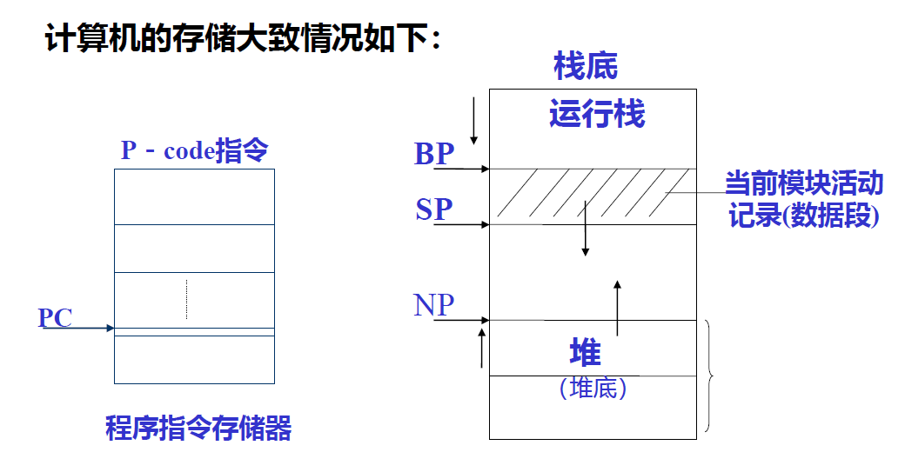

栈式抽象机指令代码：

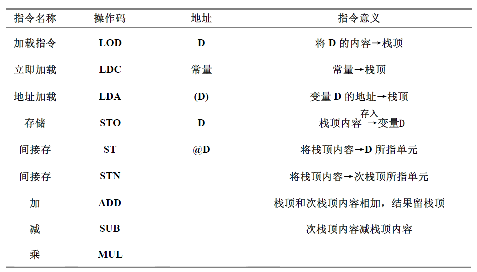

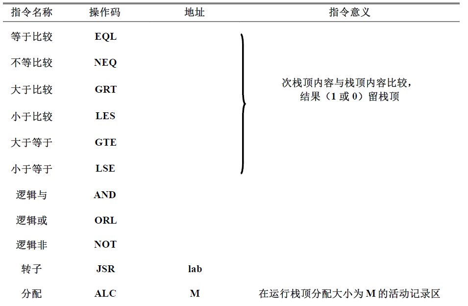

## 10.3 声明的处理

**语义的表示**：给出语言结构的属性翻译文法来说明其语义及语义动作，并把这些语义动作插入属性翻译文法产生式中的适当位置。

**编译程序的任务**：

1. **分离**出每一个被声明的**实体**，并把它们的**名字填入符号表**中
2. 把被声明实体的**有关特性信息尽可能多地填入符号表**中

对于==已声明的实体==，在 **处理对该实体的引用** 时要做的事情：

1. 检查对所声明的实体**引用**（种类，类型等）是否正确
2. 根据实体的特征信息，例如类型，所分配的目标代码地址（可能为数据区单元地址，或目标程序入口地址）**生成相应的目标代码**

> in a word：
>
> - 处理声明语句——填表（先查表看是否重名）
> - 处理对已声明的实体的引用——查表
>
> 我们主要考虑常量、简单变量、数组声明的处理

**声明语句的输入文法**：（PL/I语言）

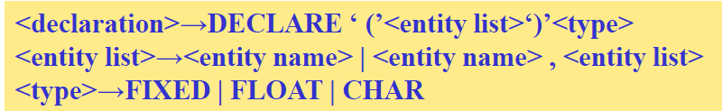

**属性翻译文法**：

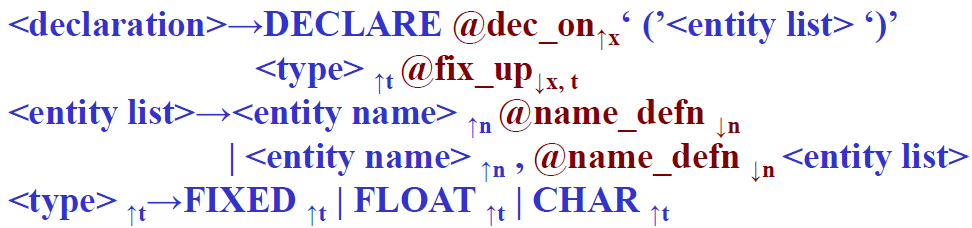

**动作程序**：

==$@dec\_on↑_x$== 是把符号表当前可用表项的入口地址（指向符号表入口的指针，或称表项下标值）赋给属性变量 x 。——（此处综合属性是赋值，其他继承属性都是取值）

==$@name\_defn↓_n$==​ 是将由各实体名所得的 **n 继承属性值**，依次填入（从 x 开始的）符号表中。

> 注：显**然应有内部计数器或内部指针**，指向下一个该填的符号表项。

==$@fix\_up↓_{x, t}$==​ 是将**类型信息** t 和相应的数据存储区分配地址填入**从 x 位置开始的符号表中**。（反填）

> 当然，如果声明语句中，类型说明符放在头上，就无需“反填”处理了。

### 10.3.1 常量类型声明处理

常量标识符通常被看作是全局名。

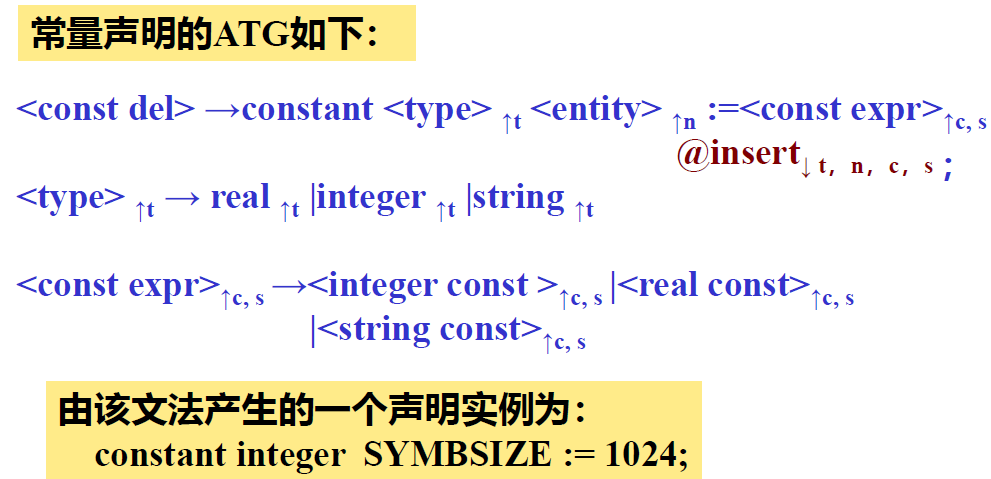

先识别类型（integer），将它赋给属性 t ；然后识别常量名字（SYMBSIZE)，将它赋给属性 n ；最后识别常量表达式，并将其值赋给 c ，其类型赋给属性 s 。——==s 和 t 不一样！==

@insert 的功能：

1. 检查声明的类型 t 和常量表达式的类型 s 是否一致，若不一致，则输出错误信息
2. 把名字 n ，类型 t 和常量表达式的值 c 填入符号表（常量表）中

### 10.3.2 简单变量声明处理

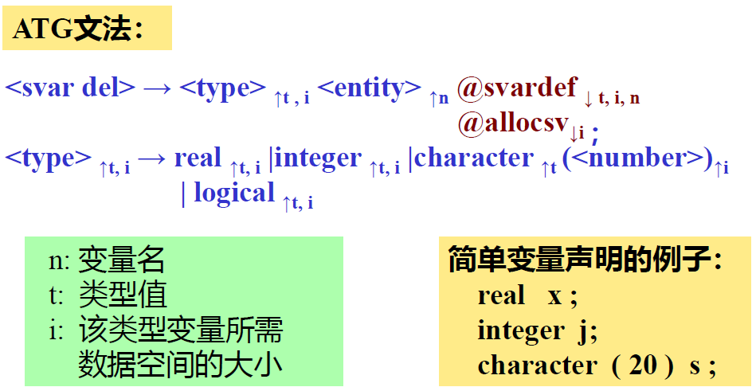

@svardef 动作符号是把 n, i 和 t 填入符号表中。

> @allocsv 和 @svardef 可以合并。
>
> 对于变长字符串（或其它大小可变的数据实体），往往需要采用**动态申请存储空间**的办法把可变长实体存储在堆中。我们可通过**指向存放该实体数据区的指针**来引用该实体。

### 10.3.3 数组变量声明处理

- **静态数组**：编译时大小已知。编译程序可建立一个**数组模板**（**亦称数组信息向量**），以便以后的程序中引用该数组元素时，可按照该模板提供的信息，计算数组元素 （下标变量）的**存储地址** 。
- **动态数组**：大小只有在运行时才能最后确定。编译时仅为该模板分配一个空间，而模板本身的内容将在运行时才能填入。

大部分语言，数组元素按行（优先）存放在存储器中（FORTRAN例外，按列）。规定LOC是数组首地址（该数组第一个元素的地址）

#### n维数组的地址计算公式

- 我们设数组的维数为 n， 各维的**下界和上界为 L(i) 和 U(i)**；

- 我们还假定n维数组**元素的下标为 V(1), V(2),…, V(n)**

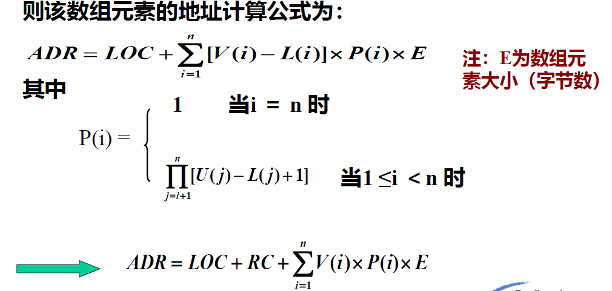

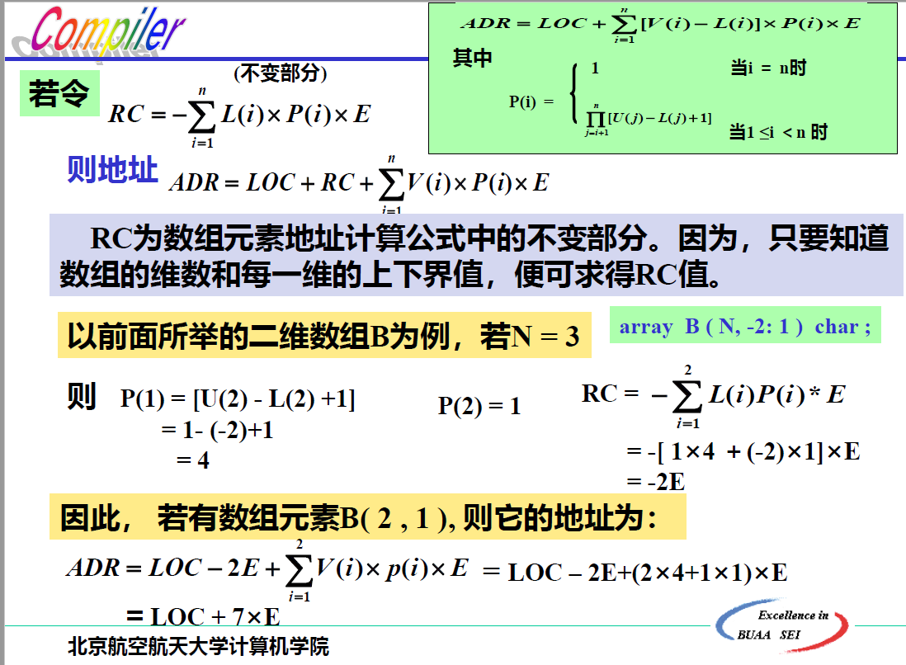

#### 数组信息向量表（模板）

功能：计算下标变量地址，检查下标是否越界

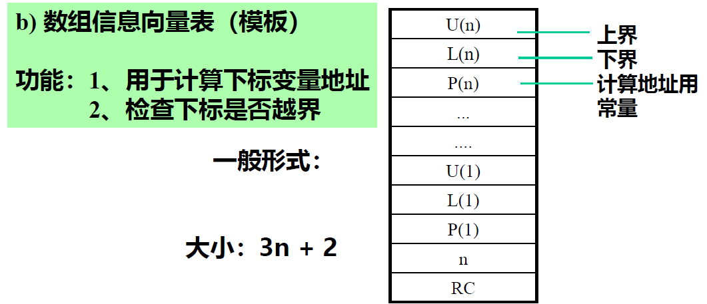

1. 数组模板所需的空间 **大小取决于数组的维数** ，即 3n+2

   所以，无论是常界或变界数组，在**编译时就能确定数组模板的大小**

2. **常界** 数组，在 **编译时就可造信息向量表** ；而 **变界数组** 信息向量表要在**目标程序运行时才能造**。编译程序要 **生成相应的指令**

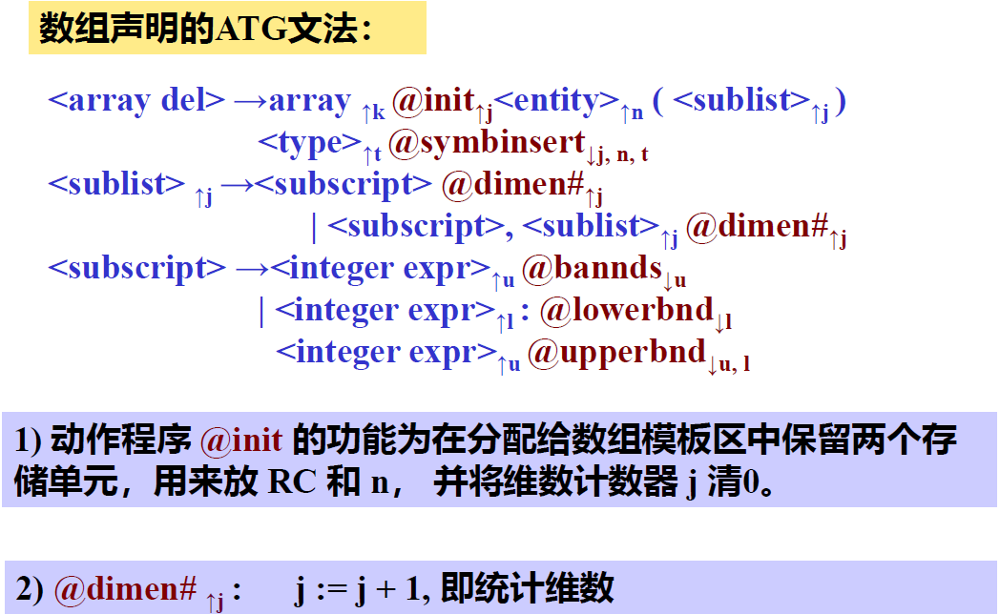

动作符号的具体说明详见PPT/P29-31

### 10.4 表达式的处理

主要目的：生成 计算该表达式值的 **中间代码**

通常做法：把表达式中的操作数装载（ LOD ）到 **操作数栈**（或运行栈）栈顶单元或某个寄存器中，然后执行表达式所指定的操作，而操作的结果保留在栈顶或寄存器中。

**本章中所指的操作数栈**（即操作栈） 实际应与**动态运行（存储分配）栈**分开 。

整型表达式ATG文法：

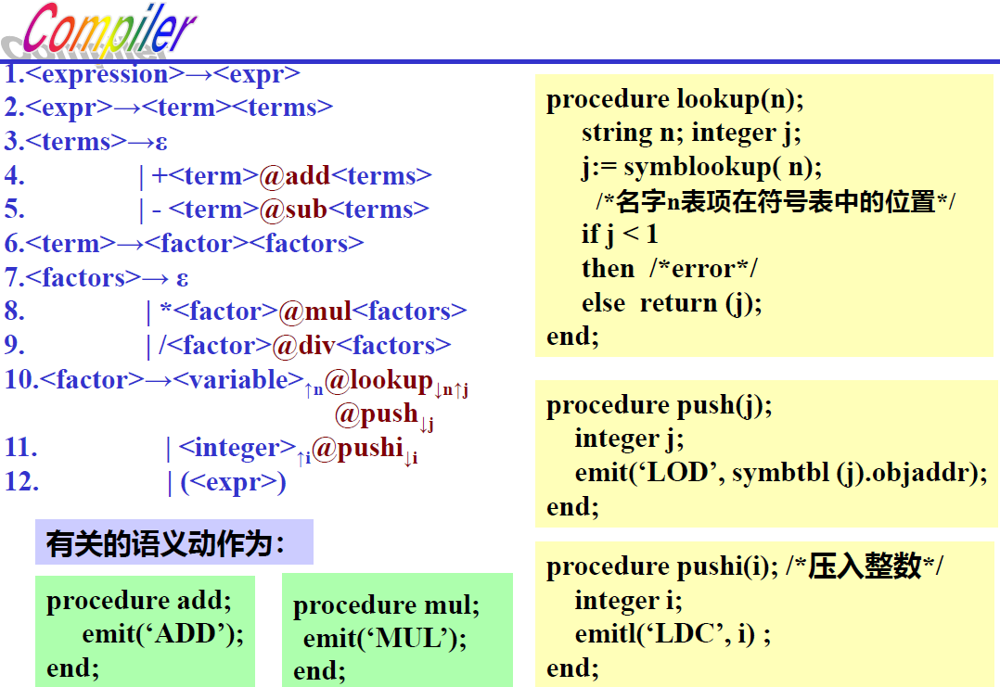

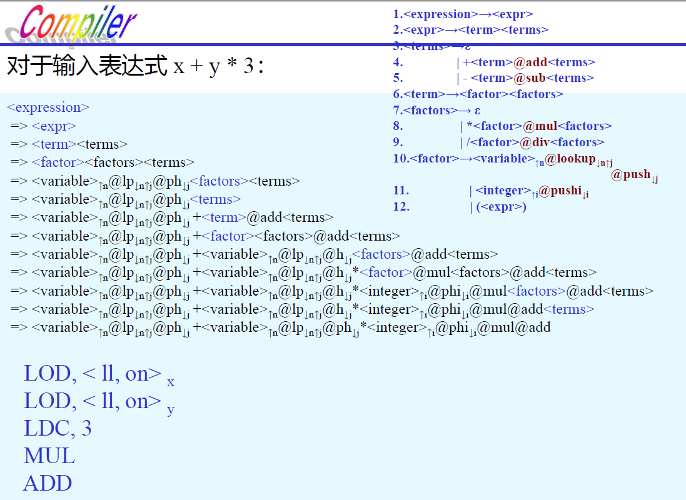

上述表达式处理实际上**忽略了**出现在表达式中==各操作数类型的不同==，且变量也仅限于==简单变量==。

下面假定表达式中允许**整型和实型混合运算**，并允许在表达式中出现**下标变量**（数组元素）。因此应该增加有关类型==一致性检查==和==类型转换==的语义动作，也要相应产生计算下标变量地址和取下标变量值的有关指令。

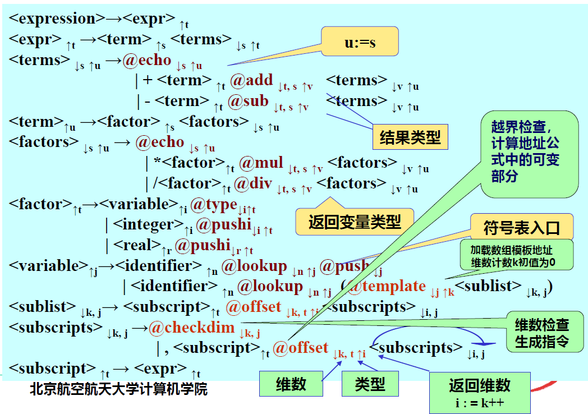

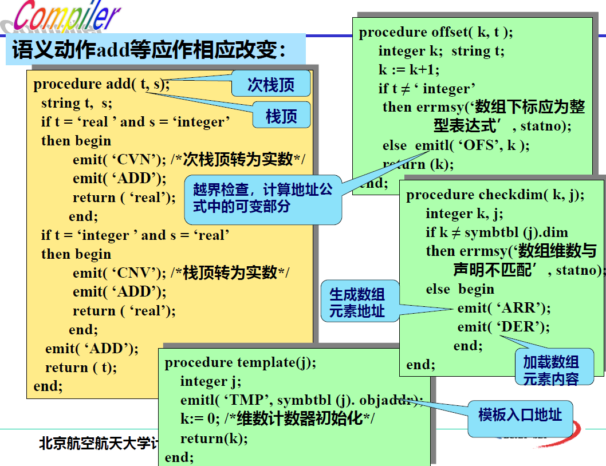

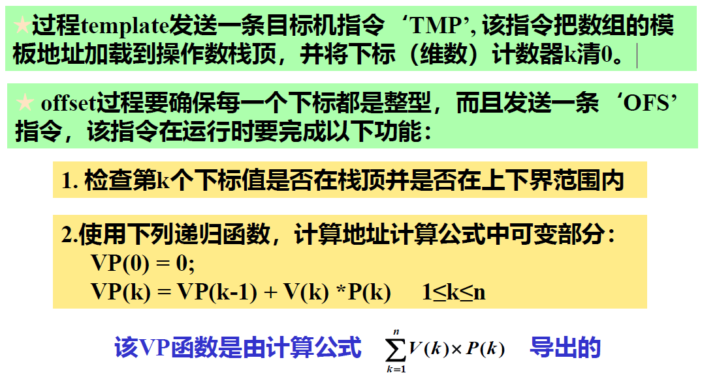

处理逻辑表达式（关系表达式）的方法与处理算术表达式的方式基本相同。

### 10.5 赋值语句的处理

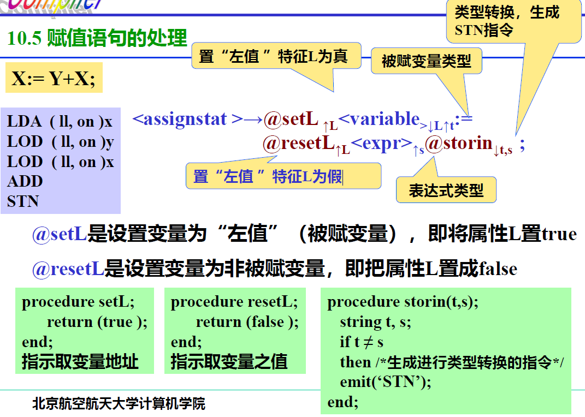

### 10.6 控制语句的处理

#### 10.6.1 if 语句

#### 10.6.4 for 循环语句

### 10.7 过程调用和返回

#### 10.7.1 参数传递的基本形式

1. 传值（call by value）- 值调用
2. 传地址（call by reference）- 引用调用‘