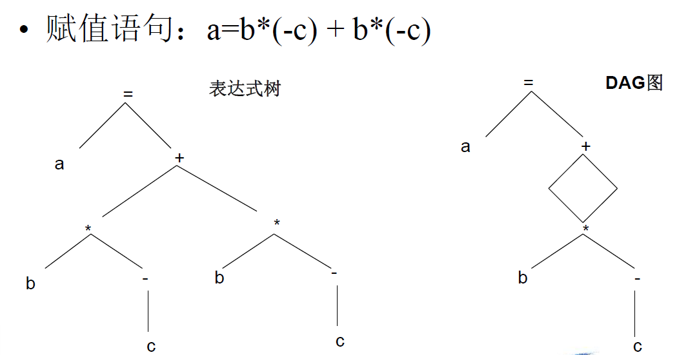
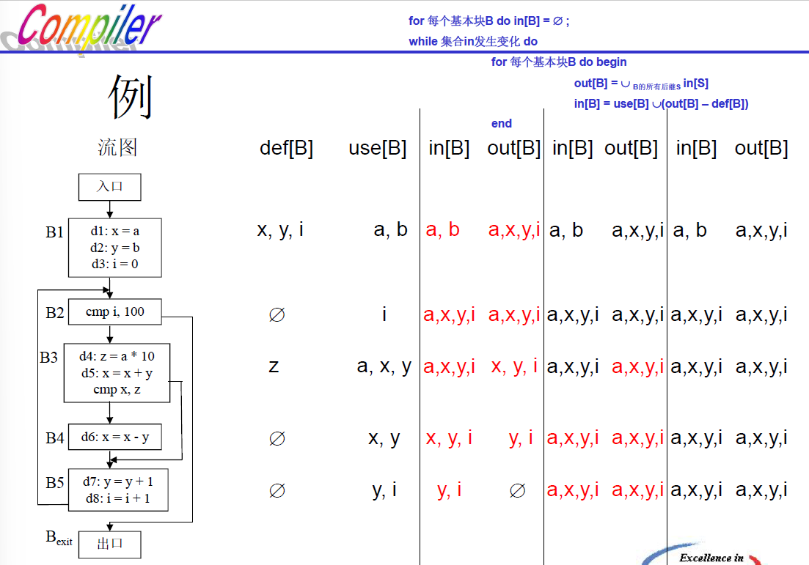

# 第十一章 代码优化

> 期末考试，代码优化占15分！有区分度的题在这里！

[TOC]

## 11.1 基本块和流图

### 11.1.1 基本块

- 基本块中的代码是**连续**的语句序列
- 程序的执行（控制流）**只能从基本块的第一条语句进入**
- 程序的执行只能从基本块的最后一条语句离开

### 11.1.2 划分基本块

算法11.1：划分基本块

输入：四元式序列

输出：基本块列表，每个四元式仅出现在一个基本块中

方法：

1. 首先确定入口语句（每个基本块的第一条语句）的集合

   1.1 整个语句序列的==第一条语句==属于入口语句

   1.2 ==任何==能由条件/无条件==跳转语句==转移到的==第一条语句==属于入口语句

   1.3 紧跟在跳转语句==之后==的第一条语句属于入口语句

   > 形如`if(a) goto (1)`的语句，该语句的下一句也是入口语句，因为能“跳转”到下一条语句去！
   >
   > 不仅`if`和`goto`，`return`也是跳转语句！

2. 每个入口语句直到下一个入口语句，或者程序结束，它们之间的所有语句都属于同一个基本块

——例子见书P356/1（练习14）

### 11.1.3 循环的查找

### 11.1.4 优化的基本方法和例子

> 实际的优化应在中间代码或目标代码上进行

1. **利用代数性质**（代数变换）：

   - 编译时完成**常量表达**式的计算，**整数类型与实型的转换**

   > 如`a = 5 + 6 + x` -> `a = 11 + x`，又如x为实型，`x = 3 + 1` -> `x = 4.0`

   - **下标变量引用时**，其地址计算的一部分工作可在编译时预先做好（运行时只需计算“可变部分”即可）
   - **运算强度削弱**：用低级运算替换高级运算，位运算替换加减乘除

2. **复写（copy）传播**：如`x:=y`这样的赋值语句称为复写语句。由于x和y值相同，所以当满足一定条件时，在该赋值语句下面出现的**x可用y来代替**。

   若y是常量，则复写传播变成了**常量传播**

3. **删除冗余代码**：冗余代码就是毫无实际意义的代码，又称死代码（dead code）或无用代码（useless code）。

   > 例如`x = x + 0`，`x = x * 1`，`if true then ...`

4. **循环优化**：==减少循环部分的目标代码对提高整个程序的时间效率有很大作用。==

   - **循环不变式**（不随循环控制变量改变而改变的表达式或子表达式）的代码外提

     

   - **循环展开**：将构成循环体的代码（不包括控制循环的测试和转移部分），重复产生许多次（这可在编译时确定），而不仅仅是一次，以空间换时间。——必须知道循环终值、初值、步长

     

   - 其他循环优化方法：把多重嵌套的循环变成单层循环、把n个相同形式的循环合成一个循环等。

5. in_line展开：把过程（或函数）调用改为in_line展开可节省许多处理过程（函数）调用所花费的开销。

   省去了函数调用时参数压栈、保存返回地址等指令，**仅适用于简单函数**。

6. 其他：如控制流方法

## 11.2 基本块内优化

### 11.2.1 基本块的DAG图表示

DAG：有向无环图（Directed Acyclic Graph）

### 11.2.2 消除局部公共子表达式

> 不光是左值有node！！右值出现的也要

### 11.2.3 数组、指针及函数调用

当中间代码序列中出现了数组成员、指针或函数调用时，中间代码或者算法13.1需要作出一定的调整，否则将得出不正确的优化结果

### 11.2.4 从DAG图中重新导出中间代码

#### 算法11.3 从DAG导出中间代码的启发式算法

输入：DAG图

输出：中间代码序列

方法：

1. 初始化一个放置DAG图中间节点的队列。

2. 如果DAG图中还有中间节点未进入队列，则执行步骤3，否则执行步骤5

3. 选取一个尚未进入队列，但其**所有父节点均已进入队列**的中间节点n，将其加入队列；或选取**没有父节点**的中间节点，将其加入队列

  > 没有父节点就是根节点

4. 如果n的最左子节点符合步骤3的条件，将其加入队列；并沿着当前节点的最左边，循环访问其**最左子节点**，最左子节点的最左子节点等，将符合步骤3条件的中间节点依次加入队列；如果出现不符合步骤3条件的最左子节点，执行步骤2

5. 将中间节点队列==逆序输出==，便得到中间节点的计算顺序，将其整理成中间代码序列

> 若叶结点有形如a0的节点，且a的值在随后的中间节点会被改变，那么最后生成中间代码的时候，无论有无必要，**要无条件地《在开头》写上：`a0 = a`**，所有类似情况皆同理！
>
> 后面若有`a=a+1`的形式，要写成`a=a0+1`

### 11.2.5 窥孔优化

窥孔优化关注在目标指令的一个较短的序列上，通常称其为“窥孔”。

通过删除其中的冗余代码，或者用更高效简洁的新代码来替代其中的部分代码，达到提升目标代码质量的目的。

## 11.3 全局优化

### 11.3.1 数据流分析

编译器需要了解一些非常重要的信息，如：

- 某个变量在某个特定的执行点（语句前后）是否还“**存活**”
- 某个变量的值，是在什么地方**定义**的
- 某个变量在某一执行点上被定义的值，可能在哪些其他执行点**被使用**

#### 数据流分析方程

$$
out[S]=gen[S]\cup(in[S]-kill[S])
$$

- S代表某条语句（也可以是基本块，或者语句集合，或者基本块集合等）
- out[S]代表在**该语句末尾**得到的数据流信息
- gen[S]代表该语句**本身**产生的数据流信息
- in[S]代表**进入**该语句时的数据流信息
- kill[S]代表该语句**注销**的数据流信息

**数据流方程求解过程中的3个关键因素**

1. 当前语句产生和注销的信息**取决于需要解决的具体问题**：可以由in[S]定义out[S]，也可以反向定义，由out[S]定义in[S]
2. 由于数据是沿着程序的执行路径，也就是控制流路径流动，因此数据流分析的结果**受到程序控制结构的影响**
3. 代码中出现的诸如过程调用、指针访问以及数组成员访问等操作，对定义和求解一个数据流方程**都会带来不同程度的困难**

### 11.3.2 到达定义（reaching definition）分析

- 在程序的某个静态点p，例如某条中间代码之前或者之后，某个变量可能出现的值都是在哪里被定义的？
- 在p处对该变量的引用，取得的值是否在d处定义？
  - 如果从定义点d出发，存在一条路径达到p，并且在该路径上，不存在对该变量的其他定义语句
  - 如果路径上存在对该变量的其他赋值语句，那么路径上的前一个定义点就被路径上的后一个定义点“杀死”，或者消除了

**基本块B的到达定义数据流方程**：
$$
out[B]=gen[B]\cup(in[B]-kill[B])
$$

- in[B] 为进入基本块时的数据流信息，$in[B] = \cup_{B的前驱基本块P}out[P]$
- $kill[B] = kill[d1]\cup kill[d2]…\cup kill[dn]$，d1~dn 依次为基本块中的**语句**
- $gen[B] = gen[dn]\cup (gen[dn-1] – kill[dn])\cup ...\cup(gen[d1] - kill[d2] –kill[d3]…- kill[dn])$

> 我的理解：
>
> gen：基本块中，定义语句的集合
>
> kill：所有语句中，除定义语句之外的，左值在定义语句左值集合中的语句，无论后面是否会经过该语句

#### 算法11.4 基本块的到达定义数据流分析

输入：程序流图，且基本块的 kill 集合和 gen 集合已经计算完毕

输出：每个基本块入口和出口处的 in 和 out 集合，即 in[B] 和 out[B]

方法：

1. 将包括代表==流图出口基本块== $B_{exit}$ 的所有基本块的 out 集合，初始化为**空集**。
2. 根据方程 $in[B] = \cup_{B的前驱基本块P}out[P]$，$out[B] = gen[B]\cup ( in[B] – kill[B] )$​，为每个基本块 B 依次计算集合 in[B] 和 out[B]。如果某个基本块计算得到的 out[B] 与该基本块此前计算得出的 out[B] ==不同==，则**循环执行**步骤2，直到所有基本块的 out[B] 集合不再产生变化为止。

### 11.3.3 活跃变量分析

- 变量x在某个执行点p是活跃的

  - 在流图中沿着**从p开始**的某条路径中**可能引用变量x在p点的值**

- 数据流方程如下：
  $$
  in[B]=use[B]\cup(out[B]-def[B])
  $$

  - $out[B]=\cup_{B的后继基本块P}in[P]$
  - def[B]：引用该变量前已经进行了赋值，代表当前基本块**新生成**的数据流信息
    - 即**使用前被定义**的变量集合
  - use[B]：在该变量的任何定义之前对其引用，代表当前基本块**消除**的数据流信息
    - 即**定义前被使用**的变量集合

- 与**到达定义分析**的区别：

  - 采用 ==in[B]== 而不是 out[B] 来计算==当前基本块==中的数据流信息
  - 采用 ==out[B]== 而不是 in[B] 来计算==其它基本块汇集到当前基本块==的数据流信息
  - 在**汇集**数据流信息时，考虑的是==后继基本块==而不是前驱基本块

#### 算法11.5 基本块的活跃变量数据流分析

输入：程序流图，且基本块的 use 集合和 def 集合已经计算完毕

输出：每个基本块入口和出口处的 in 和 out 集合，即 in[B] 和 out[B]

方法：

1. 将流图内所有基本块的 in 集合，初始化为空集。
2. 根据方程 $out[B] = \cup_{B的后继基本块P} in[P]$，$in[B] = use[B]\cup(out[B] – def[B])$，为每个基本块 B 依次计算集合 out[B] 和 in[B]。如果计算得到某个基本块的 in[B] 与此前计算得出的该基本块 in[B] ==不同==，则**循环执行**步骤2，直到所有基本块的 in[B] 集合不再产生变化为止。

> 我的理解：
>
> def：基本块中，定义语句的**左值**；use：基本块中，定义语句的**右值**（同时出现优先归为use，因为是先使用后定义）

从活跃变量到冲突图（看 in[B] 和 out[B]）

- 变量 x, y, i：均定义于B1，在B2~B5入口处均活跃。

  > ==注意，x在B3、B4中都被重新定义过，但x被定义前均被使用过（`x=x+y`），因此其在同一基本块中**发生在使用之前的定义**仅余B1。变量y和i的情况类似。==

- 变量 a（形参）：在流图中无定义点，在 x,y,i,z 的定义点处均活跃。

  > a 从 x, y, i, z 的定义点处开始往后走，当前值均可能被使用

- 变量 b（形参）：在流图中无定义点，在 x,y 的定义点处活跃。==a,b同为形参，互相冲突==。

  > b 只在B1使用过，因此只在x, y的定义点活跃（值能被用到），后面就不可能被用到了，因此在 i, z 定义点处不活跃。

- 变量 z：在z的定义点，a,x,y,i 均活跃。

### 11.3.4 定义 - 使用链和网

所谓变量的定义 - 使用链，是指**变量**的某一定义点（**这条链从某一个定义点开始**），以及所有可能使用该定义点所定义变量值的使用点（使用点，**即变量作为右值**）所组成的一个链（无序）

> L2, L4, L6, L8中，同一点可能既是定义点又是使用点，是循环造成的

**同一变量的**多个定义 - 使用链，如果它们拥有某个同样的使用点，则合并为同一个==网==

