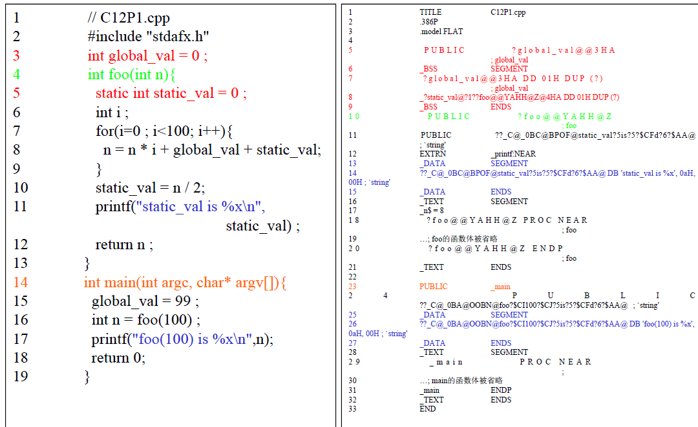
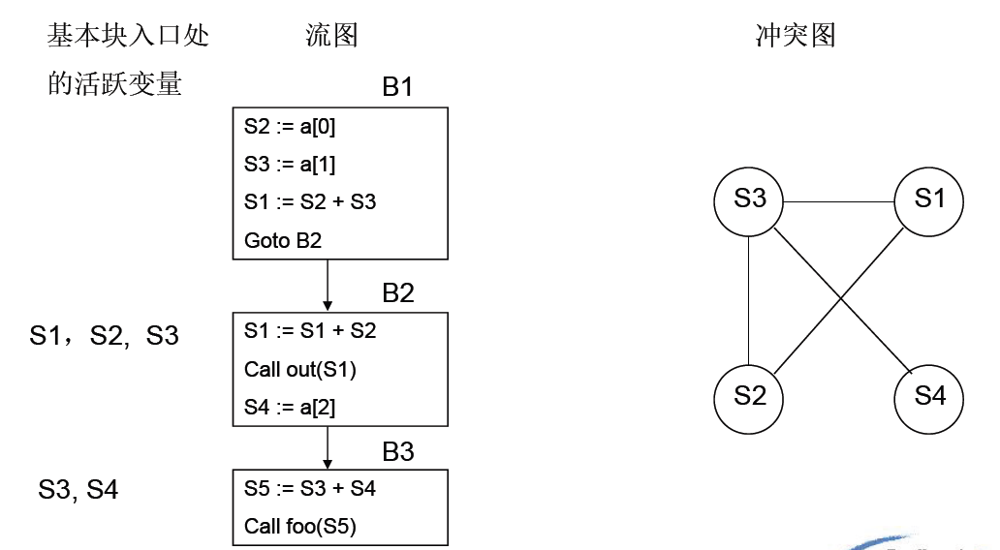
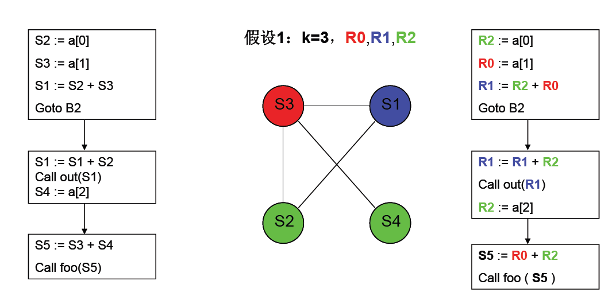
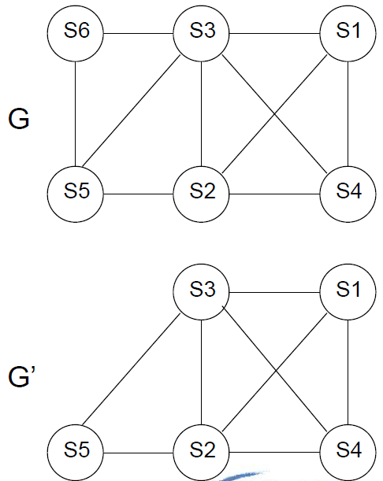
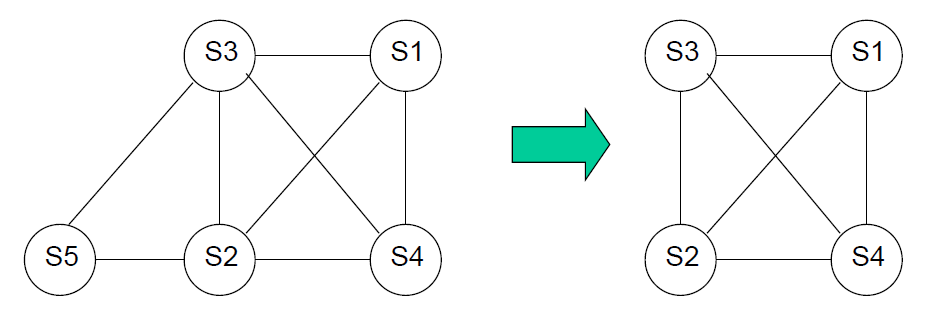
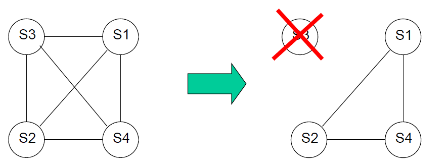
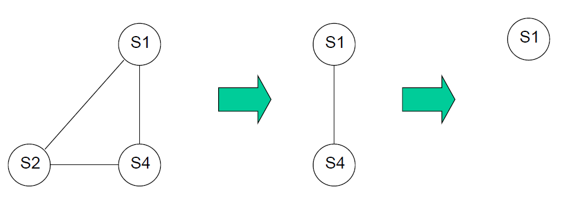
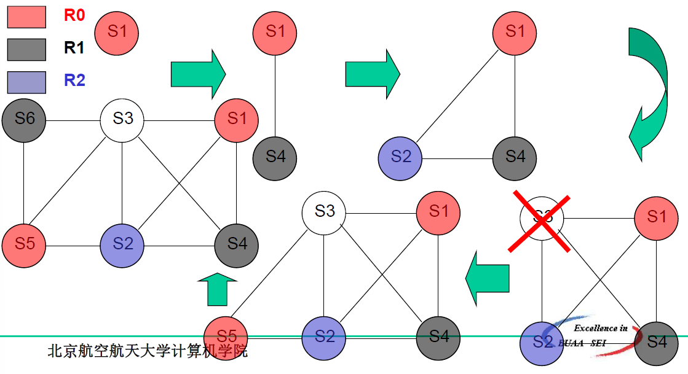
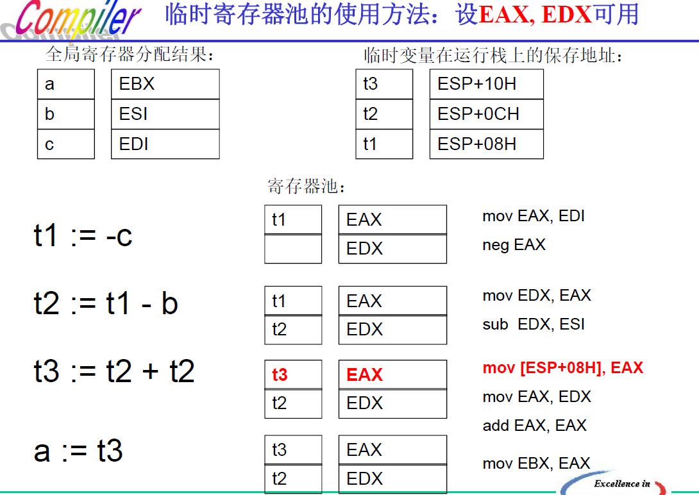
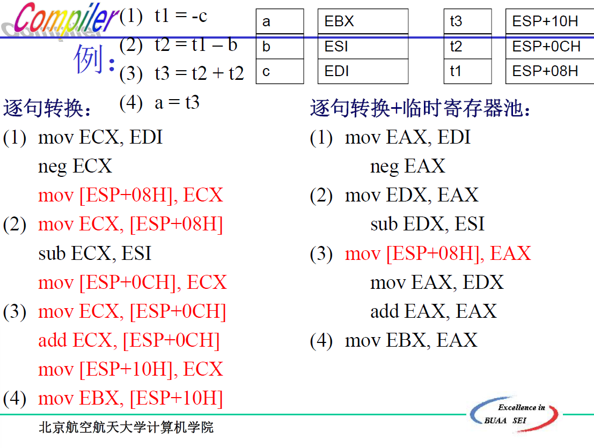

# 第十二章 目标代码生成

[TOC]

——面向目标体系结构的代码生成和优化技术

**代码生成器的主要任务**：

- 目标代码**地址空间的划分**，目标体系结构上存贮单元，例如寄存器和内存单元的分配和指派
- 从中间代码（或者源代码）到目标代码转换过程中所进行的**指令选择**
- 面向目标体系结构的**优化**

**代码生成器的输入**

- 源程序的中间表示：以前两种为主
  - 线性表示（波兰式）
  - 三地址码（四元式）
  - 栈式中间代码（P-CODE/Java Bytecode）
  - 图形表示
- 符号表信息
- 要求：
  - 编译器前端已将源程序扫描、分析、翻译成足够详细的中间表示
  - 中间语言中的标识符表示为目标机器能直接操作的变量（位、int、float、指针等）
  - 完成了必要的类型检查，类型转换/检测操作已经加入到中间语言的必要位置
  - 完成语法和必要的语义检查，也即，代码生成器可以认为输入中没有与语法或语义错误

目标程序的种类：

- **汇编语言**：.s/.asm，生成宏汇编代码，再由汇编程序进行编译，连接，从而生成最终代码
- **包含绝对地址的机器语言**：.exe/a.out，执行时必须被载入到地址空间中（相对）固定的位置
- **可重定位的机器语言**：
  - 一组可重定位的模块/子程序可以用连接器装配后生成最终的目标程序（.obj/.o文件组）
  - 可动态加载的模块/子程序（DLL/.SO动态连接库）

## 12.1 现代微处理器体系结构简介

### 12.1.1 指令集架构

四种：栈式、累加式、寄存器 - 内存式、寄存器 - 寄存器（读 - 取式）

> 重点看书P359-361，以及P381作业第一题，要求会写这四种指令集架构的指令序列

### 12.1.2 存贮层次架构

四级：寄存器、缓存、内存、磁盘

### 12.1.3 流水线

## 12.2 地址空间

- **代码区**：存放目标代码
- **静态数据区**：全局变量、静态变量、常量（例如字符串）
- **动态内存区**：也被称为内存堆Heap
  - 程序员管理：C、C++
  - 自动管理（内存垃圾收集器）：Java、Ada
- **程序运行栈**
  - 活动记录
  - 函数调用的上下文现场
    - 由调用方保存的一些临时寄存器
    - 被调用方保存的一些全局寄存器

### 12.2.1 程序地址空间的实例分析

### 12.2.2 程序运行栈的设计

- 子程序/函数运行时所需的**基本空间**
- 进入子程序/函数时分配，**地址空间向下生长**（从高地址到低地址）
- 从子程序/函数返回时，**当前运行栈将被废弃**
- **递归**调用的同一个子程序/函数，每次调用都将获得**独立的运行栈空间**

一个典型的运行栈包括：

- 函数的**返回地址**
- **全局寄存器**的保存区
- **临时变量**的保存区
- 未分配到全局寄存器的**局部变量**的保存区
- 其他辅助信息的保存区：例，PASCAL/PL-I类语言的DISPLAY区

## 12.4 寄存器的分配和指派

为什么要分配和管理寄存器？

- 某些运算只能发生在寄存器当中
- 寄存器的访问速度是所有存储形式中**最快**的
- 从程序优化的角度来说，我们希望所有指令的执行都仅在寄存器中完成

寄存器：

- 通用寄存器
  - 保留寄存器
  - 调用方保存的寄存器——临时寄存器。MIPS：生存范围不超过基本块，不跨越函数调用
  - 被调用方保存的寄存器——全局寄存器。MIPS：跨越基本块，跨越函数调用。一个函数使用多少全局寄存器，在入口处保存多少，返回前恢复多少
  - MIPS：寻址及堆栈寄存器
- 专用寄存器

### 12.4.1 全局寄存器分配

分配原则：

- 局部变量参与全局寄存器分配

> 为什么全局变量/静态变量**不参与全局寄存器分配**？
>
> 
因为寄存器专属于线程！

#### 12.4.1.1 引用计数

原则：如果一个局部变量被访问的次数较多，那么它获得全局寄存器的**机会也较大**

需要注意的是：出现在**循环**，尤其是内层嵌套循环中的变量的被访问次数**应该得到一定的加权**

#### 12.4.1.2 图着色算法

##### 一种简化的图着色算法

步骤：

1. 通过数据流分析，构建变量的冲突图

   变量的冲突图：

   - 它的节点是**待分配全局寄存器**的变量
   - 当两个变量中的==一个变量在另一个变量定义（赋值）处是活跃的，它们之间便有一条边连接==。所谓变量i在代码n处活跃，是指程序运行时变量i在n处拥有的值，在从n出发的某条路径上会被使用。
   - 直观的理解，可以认为==有边相连的变量，它们无法共用一个全局寄存器，或者同一存贮单元，否则程序运行将可能出错==
   - ==无连接关系的变量，即便它们占用同一全局寄存器，或同一存贮单元，程序运行也不会出错==

   

   > 上图中，同一入口处的活跃变量两两有一条边相连

2. 如果可供分配k个全局寄存器，那么我们就尝试用k种颜色给该冲突图着色

##### 算法12.2 一种启发式图着色算法

给定冲突图G和寄存器数目K（例子中假设为3）

1. 找到第一个连接边数目==小于==K的节点，将它从图G中移走，形成图G’

   

2. 重复步骤1，直到无法再从G’中移走节点

   

3. 在图中选取==**适当**==的节点，将它记录为“**不分配全局寄存器**”的节点，并从图中移走

   

4. 重复步骤1~步骤3，直到图中仅剩余1个节点

   

5. 给剩余的最后一个节点**选取一种颜色**，然后按照节点被移走的**顺序**，反向**将节点和边添加进去**，并依次给新加入的节点**选取颜色**

   

### 12.4.2 临时寄存器分配

为什么在代码生成过程中，需要对临时寄存器进行管理？

- 因为生成某些指令时，**必须使用指定寄存器**
- 临时寄存器中保存有此前的计算中间结果

以X86为例，生成代码时可用的临时寄存器：EAX, ECX, EDX等

临时寄存器的管理原则和方法

- 临时寄存器的生存范围：不超越基本块、不跨越函数调用
- 临时寄存器的管理方法：寄存器池

- 进入基本块时，==清空==临时寄存器池
- 为当前中间代码生成目标代码时，无论临时变量还是局部变量（亦或全局变量和静态变量），如需使用临时寄存器，都可以向临时寄存器池==申请==
- 临时寄存器池接到申请后，
  - 如寄存器池中有空闲寄存器，则可将该寄存器==标识为被该申请变量占用，并返回该空闲寄存器==
  - 如寄存器池中没有空闲寄存器，则**选取一个在即将生成代码中不会被使用的寄存器写回相应的内存空间**，标识该寄存器被==新的变量占用，返回该寄存器==
- 在基本块结尾，或者函数调用发生前，将寄存器池中所有被占用的临时寄存器==写回相应的内存空间==，==清空==临时寄存器池

## 12.5 指令选择

不同的体系结构采用了不同类型的指令集，由于体系结构和指令集的差异，使得在生成代码时需要采用不同的指令选择策略。

- RISC：ARM, MIPS
- CISC：X86
- VLIW/EPIC：Itanium