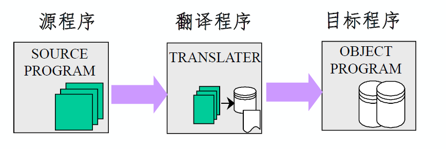
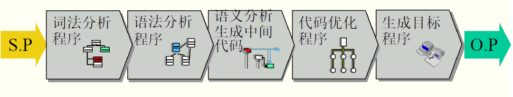
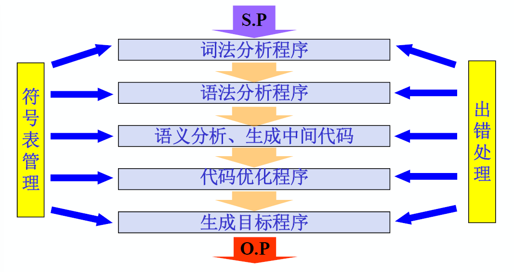
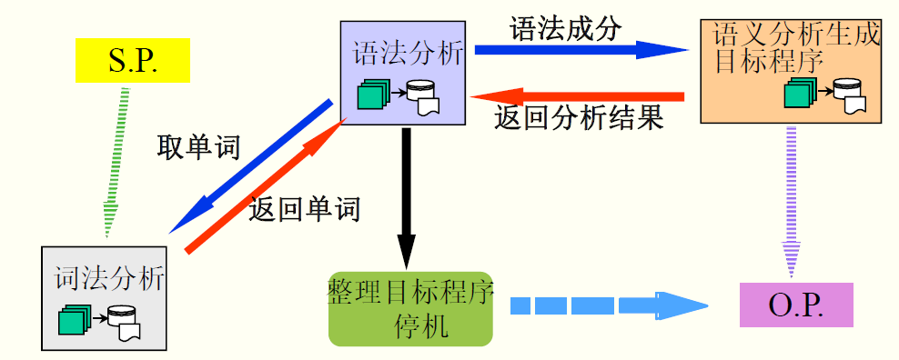
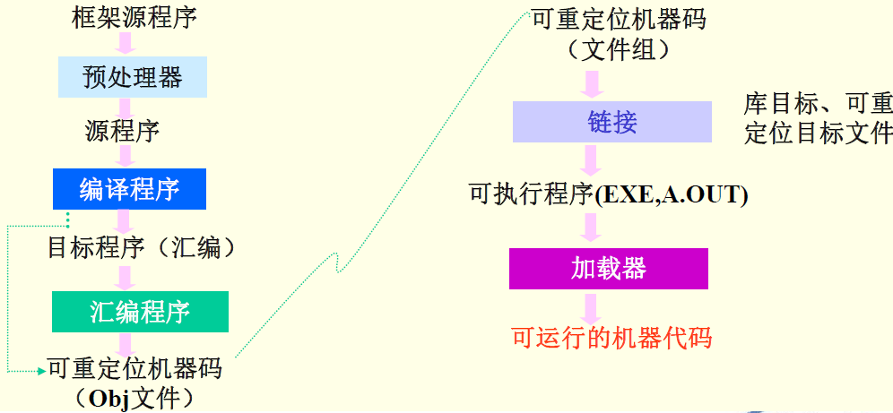

|     项目      | 分值 |
| :-----------: | :--: |
|     作业      |  6%  |
| 3~5次随堂小测 | 18%  |
| 期末闭卷考试  | 36%  |
|   上机实践    | 40%  |

# 第一章 概论

## 1.1 程序设计语言的发展

机器语言 - 汇编语言（前两者为低级语言）- 面向用户的语言 - 面向问题的语言（后两者为高级语言）

- **低级语言**：与特定的机器有关，运行效率高；但使用和编程复杂、繁琐、费时、易出错
- **高级语言**：不依赖某个具体的硬件体系结构，可移植性好、对用户要求低、易用易维护

## 1.2 基本概念

- **源程序**：用**汇编语言或高级语言**编写的程序
- **目标程序**：用**目标语言**（可以是介于源语言和机器语言之间的中间语言，也可以是某种机器的机器语言、汇编语言）所表示的程序。

- **翻译程序**：将**源程序转换为目标程序**的程序称为翻译程序。包括汇编程序和编译程序

> 源程序是翻译程序的输入，目标程序是翻译程序的输出

- **汇编程序**（Assemble）：源程序用**汇编**语言书写，经过翻译程序得到用**机器**语言表示的程序，这时的翻译程序就称之为汇编程序
- **编译程序**（Compile）：源程序用**高级**语言书写，经加工后得到**目标程序**（一般为汇编程序或可重定位的机器代码），这种翻译过程称为“编译”
  - 二者都是翻译程序，主要区别是加工对象的不同

编译阶段：源程序 -> 编译程序或汇编程序 -> 错误信息 + 目标程序

运行阶段：输入数据 -> 目标程序+运行时库程序 -> 输出数据

- **解释程序**：对源程序进行解释执行的程序。
  - 输入数据 + 源程序 -> 解释程序 -> 错误信息 + 输出数据

## 1.3 编译

### 1.3.1 编译过程

编译过程是指将**高级语言程序**翻译为语义等价的**目标程序**的过程。

划分为5个阶段：

#### 1. 词法分析

- 分析和识别单词
- 扫描源程序（字符串），根据语言的词法规则分析并识别单词，并以某种编码形式输出。

#### 2. 语法分析

- 根据语法规则（即语言的文法），分析并识别出各种语法成分，如表达式、各种说明、各种语句、过程、函数等，并进行语法正确性检查。

#### 3. 语义分析、生成中间代码

- 对识别出的各种语法成分进行语义分析（如赋值两边类型是否一致，变量是否被声明），并产生相应的中间代码。
- **中间代码**：一种介于源语言和目标语言之间的中间语言形式
  - 生成中间代码的目的：便于优化处理，便于编译程序移植
  - 形式：常用的有四元式、三元式、逆波兰表示等

#### 4. 代码优化

- 为了得到高质量的目标程序（计算常量表达式值可省略）

#### 5. 生成目标程序

- 由中间代码很容易生成目标程序（地址指令序列）。这部分工作与机器关系密切 ，所以要根据机器进行。

- 在做这部分工作时，要注意充分利用目标机特性，也可以进行优化处理。

  > 切记保持语义的等价性

### 1.3.2 编译程序构造

#### 1. 编译程序的逻辑结构

与1.3.1中**编译过程**的五个基本阶段相对应，我们将实现整个编译过程的**编译程序**划分为五个逻辑阶段（即五个逻辑子过程）。

编译程序中都需要包括：

- **符号表管理**：及时地把源程序中的信息和编译过程中所产生的信息**登记**在表格中，而在随后的编译过程中同时又要不断地**查找**这些表格中的信息。
- **出错处理**：能诊察出错误，并能报告用户错误的性质和位置，以便用户修改源程序

典型的编译程序具有7个逻辑部分：

#### 2. 遍（Pass）

遍：对源程序（包括源程序中间形式）从头到尾**扫描**一次，并做有关的加工处理 ，生成新的源程序中间形式或目标程序，通常称之为一遍。

> 五个基本阶段：是将源程序翻译为目标程序在逻辑上要完成的工作。
>
> 遍：完成上述5个基本阶段的工作，要**经过几次扫描处理**。

一遍扫描编译程序：

#### 3. 前端和后端

**前端**：与源程序有关的编译部分

- 词法分析、语法分析、语义分析、中间代码生成——分析部分

**后端**：与目标机有关的部分

- 代码优化、目标代码生成——综合部分

#### 4. 编译程序的前后处理器

**源程序**：多文件、宏定义和宏调用，包含文件

**目标程序**：一般为汇编程序或可重定位的机器代码

## 1.4 编译技术的应用

- 语法制导的结构化编辑器
- 程序格式化工具
- 软件测试工具
- 程序理解工具
- 高级语言的翻译工具等。