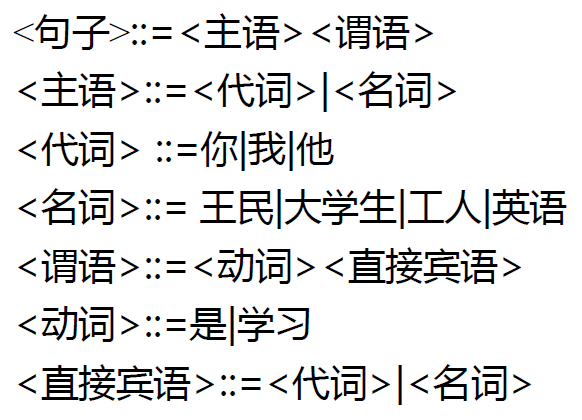
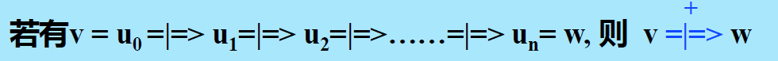

# 第二章 文法和语言的概念和表示

[toc]

## 2.1 预备知识

### 2.1.1 字母表和符号串

- **字母表**：符号的非空有限集，例如：$\Sigma=\{a,b,c\}$

- **符号**：字母表中的元素，例：a, b, c

- **符号串**：符号的有穷序列，例：a, aa, ac, abc, ...

- **空符号串**：无任何符号的**符号串**（$\epsilon$​）

  > 符号串的形式定义：有字母表$\Sigma$，定义：
  >
  > 1. $\epsilon$是$\Sigma$上的符号串；
  > 2. 若x是$\Sigma$上的符号串，且$a\in\Sigma$，则 ax 或 xa 是$\Sigma$​上的符号串
  > 3. y是$\Sigma$上的符号串，iff（当且仅当）y可由1. 或2. 产生

- **符号串集合**：由符号串构成的集合

> 通常约定：
>
> - 用开头的小写字母和末尾的大写字母表示**符号**：a, b, c, ..., r, S, T, ..., X, Y, Z
> - 用末尾的小写字母表示**符号串**：s, t, ..., x, y, z
> - 用开头的大写字母表示**符号串集合**：A, B, C, ..., R

### 2.1.2 符号串和符号串集合的运算

1. **符号串相等**：若 x、y 是集合上的两个符号串，则 x = y ==当且仅当==组成 x 的每一个符号和组成 y 的每一个符号**依次相等**。

2. **符号串的长度**：x 为符号串，其长度 |x| 等于组成该符号串的符号个数。

3. **符号串的联接**：若 x、y 是定义在 $\Sigma$ 上的符号串， 且 x = XY，y = YX，则 x 和 y 的联接 xy = XYYX 也是 $\Sigma$ 上的符号串。

   - 注意：一般 $xy\neq yx$ ，而 $εx=xε=x$

4. **符号串集合的乘积运算**（似乎类似卡氏积）：令A、B为符号串集合，定义：
   $$
   AB=\{xy\;|\;x\in A,y\in B\}
   $$
   

   > [!CAUTION]
   >
   > 注意：
   > $$
   > \{\epsilon\}A=A\{\epsilon\}=A\\\{\}A=A\{\}=\{\}
   > $$

5. **符号串集合的幂运算**：有符号串集合A，定义$A^0=\{\epsilon\}$，$A^1=A$，$A^2=AA$，……，$A^n=A^{n-1}A=AA^{n-1},n>0$

6. **符号串集合的闭包运算**

   - **正闭包**：设A是符号串集合，定义$A^+$为集合A的正闭包：
     $$
     A^+=A^1\;\cup\; A^2\;\cup\;A^3\;\cup\;...\;\cup\;A^n\;\cup\;...
     $$

   - **闭包**：$A^*=A^0\;\cup\;A^+$称为集合A的闭包。（就是比正闭包多了个$\{\epsilon\}$​）

   > 作业P39/4：可证明 $A^+=AA^*=A^*A$

若把字符看作符号，则单词就是符号串，**单词集合就是符号串的集合**。

若把单词看作符号，则句子就是符号串，而**所有句子的集合（即语言）就是符号串的集合**。

## 2.2 文法的非形式讨论

1. 什么是**文法**：文法是==对语言结构的定义与描述==。即从形式上用于描述和规定语言结构的称为“文法”（或称为“语法”）。

2. **语法规则**：一组描述句子的语法==结构==的规则，规定用`::=`表示“由…组成”（或“定义为…”）

   

3. **由规则推导句子**：有了一组规则之后，可以按照一定的方式用它们去推导或产生句子。

   - 推导方法：从一个 **要识别的符号** 开始推导，即用相应规则的 **右部**（你） 来替代规则的 **左部**（代词） ，每次仅用**一条**规则去进行推导。
     - 例：<句子> => <主语><谓语> => <代词><谓语>... 直到所有带<>的符号由终结符号替代为止
   - **最左推导**：有若干语法成分同时存在时，我们总是==从最左的语法成分进行推导==，类似有**最右推导**，还有一般推导

   所谓**文法**是在==形式上==对句子结构的定义与描述，而**未涉及语义**问题。

4. **语法（推导）树**：用来描述一个句子的语法结构

   识别符号 + 语法成分（非终结符） + 单词符号（终结符号） 

## 2.3 文法和语言的形式定义

### 2.3.1 文法的定义

**定义1**：文法 $G=(V_n,V_t,P,Z)$，

- $V_n$：==非终结符号集==

- $V_t$：==终结符号集==
- P：**产生式或规则**的集合，规则：$U::=x,\;U\in V_n,\;x\in V^*$
- Z：开始符号（**识别符号**），$Z\in V_n$。
- $V=V_n\cup V_t$ 称为文法的**字汇表**

**规则**的定义：规则是一个有序对$(U, x)$，通常写为：$U::=x$ 或 $U\rightarrow x$，$|U|=1,|x|\ge0$​

几点说明：

- 产生式左边符号构成集合$V_n$，且$Z\in V_n$
- 有些产生式具有相同的左部，可以合在一起
  - 例：$<数字串>\rightarrow<数字串><数字>|<数字>$——文法的BNF表示（Backus范式）
- 给定一个**文法**，需给出产生式（规则）集合，并指定识别符号
  - 例子如上图，产生式集合是 P，识别符号就是 Z = <无符号整数>

### 2.3.2 推导的形式定义

**定义2**：文法G：$v=xUy,\;w=xuy$，其中 $x,y\in V^*$，$U\in V_n$，$u\in V^*$。若 $U::=u\in P$，则$v\xRightarrow[G]{} w$。

若 $x=y=\epsilon$，有 $U::=u$，则$U\xRightarrow[G]{} u$

> x和y是符号串，U是非终结符号，u是符号串，v是符号串混搭非终结符，w是符号串

根据文法和推导定义，可推出终结符号串，所谓通过文法能推出句子来。

> 当符号串已没有非终结符号时，推导就必须终止。因为终结符不可能出现在规则左部，所以将**在规则左部出现的符号称为非终结符号**。

**定义3**：文法G，$u_0,u_1,u_2,...,u_n\in V^+$，若 $v=u_0\xRightarrow[G]{}u_1\xRightarrow[G]{} u_2\xRightarrow[G]{}...\xRightarrow[G]{} u_n=w$，则$v\xRightarrow[G]{+} w$（w不一定由终结符号组成）​

**定义4**：文法G，有 $v,w\in V^+$，若 $v\xRightarrow[G]{+} w$ 或 $v=w$，则 $v\xRightarrow[G]{*} w$（0步或多步）

**定义5**：**规范推导**：有 $xUy\Rightarrow xuy$，若 $y\in V_t^*$，则此推导为**规范**的，记为$xUy\xRightarrow[\mid]{\mid}xuy$

> ==规范推导=最右推导==（若规则右端符号串中有两个以上的非终结符时，先推 **右** 边的。）
>
> 

### 2.3.3 语言的形式定义

**定义6**：文法G[Z]

1. **句型**：x是句型 $\Longleftrightarrow Z\xRightarrow{*}x,\;且\;x\in V^*$（x 不一定由终结符组成）
2. **句子**：x是句子 $\Longleftrightarrow Z\xRightarrow{+}x,\;且\;x\in V^*_t$（x 一定由终结符组成）
3. ==**语言**==：$L(G[Z])=\{x|x\in V^*_t,\;Z\xRightarrow{+}x\}$（即：文法G[Z]所产生的**所有句子的集合**）

形式语言理论可以证明：

1. $G\rightarrow L(G)$ ——已知文法，求语言，通过推导（作业P38/8）

2. $L(G)\rightarrow G_1,G_2,...,G_n$ ——已知语言，构造文法，无形式化方法，更多凭经验（作业P38/5）

   > 例：$\{ab...ba|n\ge1\}$，构造其文法：
   > $$
   > G_1[Z]:Z\rightarrow aBa,\;B\rightarrow b\;|\;bB\\
   > G_2[Z]:Z\rightarrow aBa,\;B\rightarrow b\;|\;Bb
   > $$

**定义7**：G 和 G’ 是两个不同的文法，若 L(G) = L(G’) ，则 G 和 G’ 为 **等价文法**

### 2.3.4 递归文法

1. **递归规则**：规则右部有与左部相同的符号（非终结符）

   对于$U::= xUy$，

   - 若 $x=\epsilon$，即 $U::=Uy$​，左递归
   - 若 $y=\epsilon$，即 $U::=xU$，右递归
   - 若 $x,y\ne\epsilon$，即 $U::=xUy$，自嵌入递归

2. **递归文法**：文法G，存在$U\in V_n$

   - 若$U\xRightarrow{+}...U...$，则G为递归文法
   - 若$U\xRightarrow{+}U...$，则G为左递归文法
   - 若$U\xRightarrow{+}...U$，则G为右递归文法

3. **递归文法的优点**：可用有穷条规则，定义无穷语言

4. **左递归文法的缺点**：不能用自顶向下的方法来进行语法分析，会造成死循环

### 2.3.5 句型的短语、简单短语和句柄

**定义8**：给定文法 G[Z]， $w=xuy\in V^+$ 为该文法的句型，其中 $U\in V_n,\;u\in V^+,\;x,y\in V^*$（言外之意：x, y 可以是 $\epsilon$）

- 若$Z\xRightarrow{*}xUy$，且$U\xRightarrow{+}u$，则u是==句型w==相对于U的**短语**
- 若$Z\xRightarrow{*}xUy$，且$U\xRightarrow{}u$​，则u是==句型w==相对于U的**简单短语**
- 直观理解：短语是前面句型中的某个非终结符所能推出的符号串。任何句型（==除了 Z 以外==）本身一定是相对于识别符号 Z 的短语。

**定义9**：任一句型的最左简单短语称为该句型的 **句柄**。

> 注意：短语、简单短语是相对句型而言的，一个句型可能有多个短语、简单短语，只能有一个句柄

找短语和简单短语时：画语法图，砍非叶节点，它的叶节点就是短语，高度为1的叶节点就是简单短语

## 2.4 语法树与二义性文法

### 2.4.1 推导与语法（推导）树

#### 1. 语法（推导）树

句子（句型）结构的图示表示法，它是有向图，由结点和有向边组成

**结点**：符号

- 根节点：识别符号（开始符号）
- 中间节点：==非终结符==
- 叶节点：终结符==或非终结符==

**有向边**：表示结点间的派生关系

#### 2. 句型的推导及语法树的生成（自顶向下）

给定G[Z]，句型w：可建立**推导序列**，$Z\xRightarrow[G]{*}w$，可建立语法树，以Z为树根节点，每步推导生成语法树的一支，最终可生成句型w的语法树

> [!IMPORTANT]
>
> 注意一个重要事实：文法所能产生的句子，可以用==不同的推导序列==（使用产生式**顺序不同**）将其推导出来。语法树的**生长规律不同**，但最终生成的语法树**形状完全相同**。**某些文法有此性质，而某些文法不具此性质**（二义性文法）。

一般推导：广度优先；最左推导：左侧深度优先；==最右推导（规范推导）==：右侧深度优先

#### 3. 子树与短语

**子树**：语法树中的某个节点（子树的根）连同它向下派生的部分所组成

定理：某子树的末端结点按**自左向右**顺序为句型中的符号串，则该符号串为该句型的**相对于该子树根**的短语。

只需画出句型的语法树（句型就是叶节点），根据**子树**（各个中间节点）找短语 -> 简单短语 -> 句柄

> 找短语：剪中间节点；简单短语：剪掉某中间节点后，所剩叶子结点高度为1；句柄：最左简单短语

#### 4. 树与推导

句型推导过程 $\Leftrightarrow$ 该句型语法树的生长过程

1. 由推导构造语法树：

   从识别符号开始，自左向右建立**推导序列** => 从根节点开始，自上而下建立**语法树** 

2. 由语法树构造推导：

   **自下而上**地修剪子树的某些末端结点（短语），直至把整棵树剪掉（留根），每剪一次对应一次归约。

   => 从句型开始，**自右向左** 地逐步进行 **归约** ，建立推导序列。

   - 通常我们每次都剪掉当前句型的句柄（==最左简单短语==），即每次均进行规范归约

> TEACHER SAYS：“基于规约”的分析方法比“基于推导”的难

定义12：对句型中==最左简单短语==进行的规约称为**规范规约**

定义13：通过规范推导或规范规约所得到的句型称为**规范句型**

> TEACHER SAYS：只有在任何规范推导都推不出某句型时，才能判断某句型不是规范句型

### 2.4.2 文法的二义性

定义14.1：若对于一个文法的某个句子（或句型）存在两棵不同的**语法树**，则该文法是**二义性文法**，否则是无二义性文法

定义14.2：若一个文法的某句子存在两个不同的**规范推导** ，则该文法是**二义性**的，否则是无二义性的。

定义14.3：若一个文法的**某**规范句型的**句柄**不唯一，则该文法是**二义性**的，否则是无二义性的。

- 若文法是二义性的，则在编译时就会产生不确定性。

- 理论上已经证明：**文法的二义性是不可判定的**。即不可能构造出一个算法，通过有限步骤判定任一文法是否有二义性
- 解决办法：1）提出无二义性的充分条件；2）不改变二义性文法，确定编译算法使满足无二义性充分条件

> 例：算术表达式的文法：E::= E+E | E\*E | (E) | i，可写成：
> E ::= E+T | T
> T ::= T*F | F
> F ::= (E) | i

## 2.5 句子的分析

任务：给定 $G[Z]:S\in V_t^*$，判定是否有 $S\in L(G[Z])$

词法分析（Chapter 3）和语法分析（Chapter 4）的工作

## 2.6 有关文法的实用限制

**有害规则**：如 $U::=U$ 的规则。会引起二义性。

**多余规则**：

1. **不可达符号**：在推导文法的所有句子中，==始终用不到==的规则。即该规则的左部非终结符不出现在任何句型中
2. **不活动符号**：在推导句子的过程中，一旦使用了该规则，将==推不出任何终结符号串==。即该规则中含有推不出任何终结符号串的非终结符（My understanding：形如 $U::=aUb$ 的规则）

若某文法中无有害规则或多余规则，则称该文法是**压缩过的**

## 2.7 文法的其他表示法

#### 1. 扩充的BNF表示

- BNF的元符号：< , >, ::= , |
- 扩充的 BNF 的元符号：< , >, ::= , | , { , } , [ , ] , ( , )

#### 2. 语法图

## 2.8 文法和语言分类

形式语言：用文法和自动机所描述的没有语义的语言。

#### 0型文法

$$
P:u::=v,\;其中\;u\in V^+,v\in V^*,\;V=V_n\cup V_t
$$

称为**短语结构文法**。规则左部和右部都可以是符号串，一个短语可以产生另一个短语

0型语言：L0，可以由 **图灵机** 接受

#### 1型文法

$$
P:xUy::=xuy,\;其中\;U\in V_n,\;x,y,u\in V^*
$$

称为**上下文敏感**或**上下文有关**，也即只有在x、y这样的上下文中才能把U改写为u

1型语言：L1，可以由一种 **线性界限自动机** 接受

#### 2型文法

$$
P:U::=u,\;其中\;U\in V_n,\;u\in V^*
$$

称为**上下文无关文法**。也即把 U 改写为 u 时，不必考虑上下文。（1型文法的规则中 x、y 均为 ε 时即为 2 型文法）。与BNF表示等价

2型语言：L2，可以由 **下推自动机** 接受。

#### 3型文法

左线性：
$$
P:U::=t\;或\;U::=Wt,\;其中\;U,W\in V_n,\;t\in V_t
$$
右线性：
$$
P:U::=t\;或\;U::=tW,\;其中\;U,W\in V_n,\;t\in V_t
$$
称为 **正则文法** 。它是对 2 型文法进行进一步限制。

3型语言：L3，又称正则语言、正则集合。可以由 **有穷自动机** 接受。

根据上述讨论：$L0\supset L1\supset L2\supset L3$。n型文法可以产生Ln、Ln+1、……
