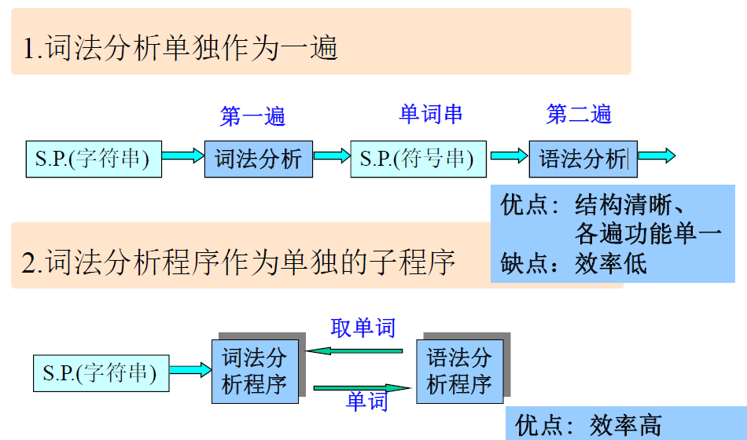
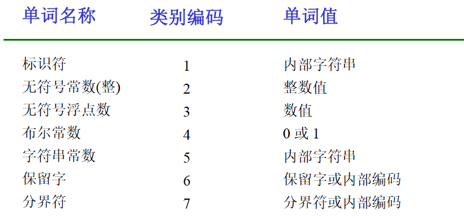
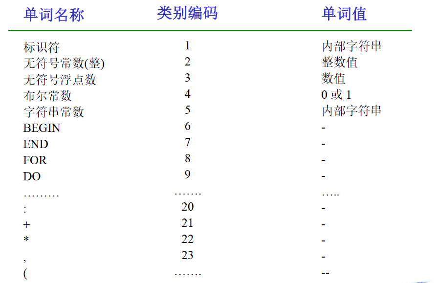
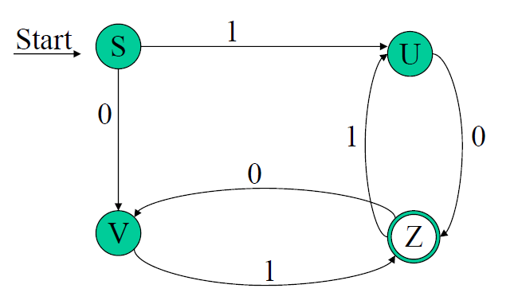
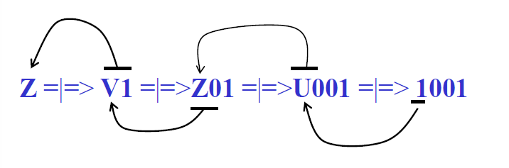
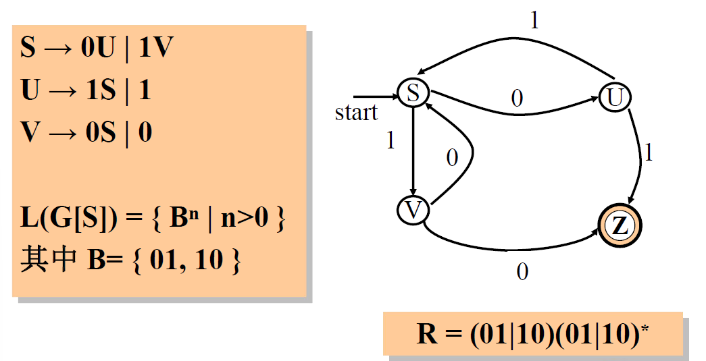
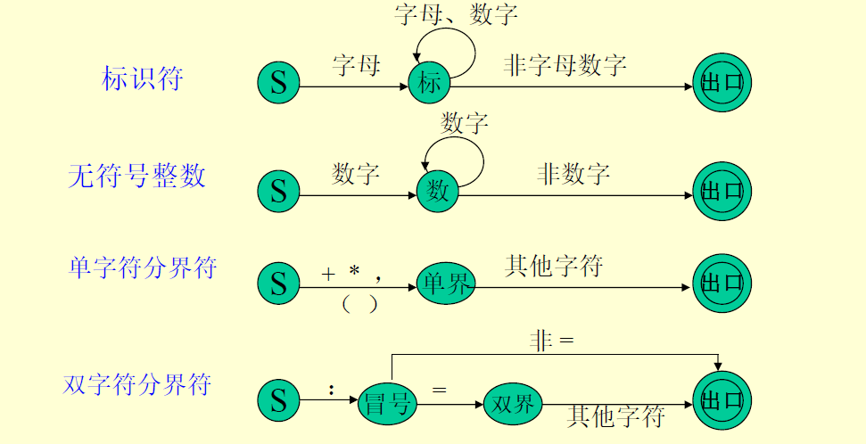
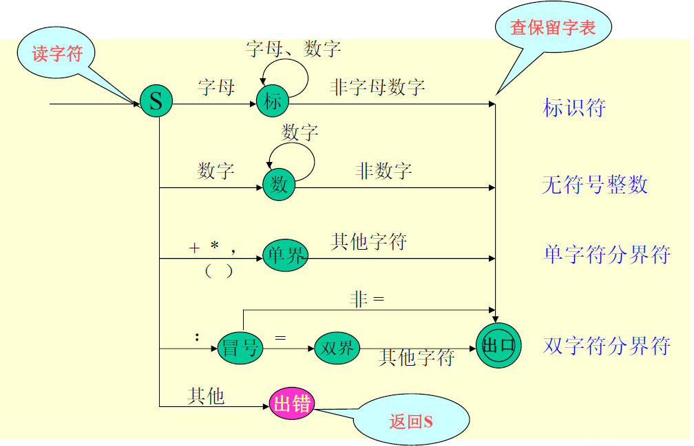
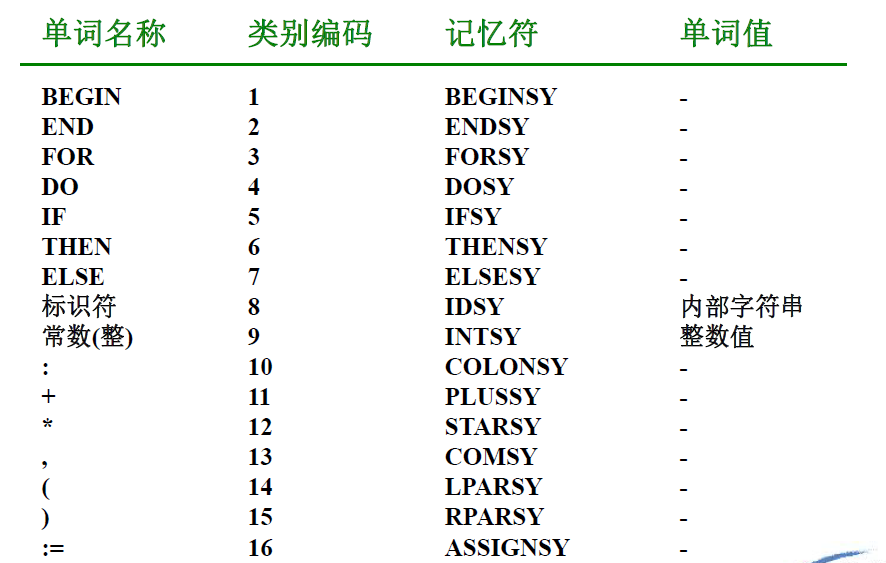
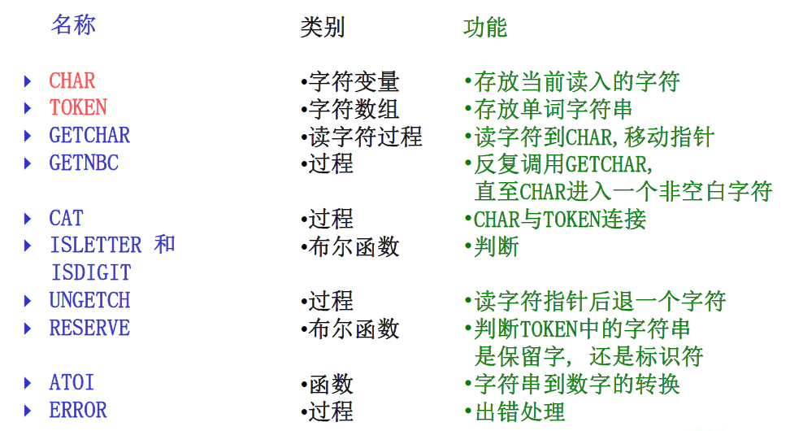

# 第三章 词法分析

[TOC]

## 3.1 词法分析程序的功能及实现方案

词法分析程序的功能：

- 词法分析：根据词法规则识别及组合单词，进行词法检查。
- 对数字常数完成数字字符串到数值的转换。
- 删去空格字符和注释。

实现方案：basically，2种




## 3.2 单词的种类及词法分析程序的输出形式

#### 3.2.1 单词的种类

1. **保留字**：begin, end, for, do...
2. **标识符**：由用户定义，表示各种名字
3. **常数**：无符号数、布尔常数、字符串常数等
4. **分界符**：$+, -, *, /, ...$

#### 3.2.2 词法分析程序的输出形式——单词的内部形式

- 单词类别（表示单词种类，可用整数编码或记忆符表示） - 单词值（不同的单词不同的值）

几种常用的单词内部形式：

1. 按单词种类分类

   

2. **保留字和分界符**采用一符一类

   

3. 标识符和常数的单词值又为指示字（指针值）


## 3.3 正则文法和状态图

#### 3.3.1 状态图的画法（根据文法画出状态图）

> 例子：正则文法，是一个**左线性文法**（定义详见2.8 - 3型文法）：
> $$
> Z::=U0|V1,\;U::=Z1|1,\;V::=Z0|0
> $$
> 该文法所定义的语言：
> $$
> L(G[Z])=\{B^n|n>0,B=\{01,10\}\}
> $$

==左线性文法==的状态图的画法：

1. 令G的每个非终结符都是一个状态
2. 设一个开始状态S（和识别符号Z区分开！）   
3. 若 $Q::=t,\;Q\in V_n,\;t\in V_t$，则：$Q\xleftarrow{t}S$
4. 若 $Q::=Rt,\;Q,R\in V_n,\;t\in V_t$，则：$Q\xleftarrow{t}R$​
5. 按自动机方法，可加上开始状态和终止状态标志。

例子的状态图：



#### 3.3.2 识别算法

利用状态图可按如下步骤分析和识别字符串x：

1. 置初始状态为当前状态，从x的最左字符开始，重复步骤2，直到x右端为止。
2. 扫描x的下一个字符，在当前状态所射出的弧中找出标记有该字符的弧，并沿此弧过渡到下一个状态；如果**找不到**标有该字符的弧，那么x**不是句子，过程到此结束**；如果扫描的是x的最右端字符，并从当前状态出发沿着标有该字符的弧过渡到下一个状态为终止状态Z，则x是句子。

> 这是自底向上分析！
>
> 

右线性正则文法



## 3.4 词法分析程序的设计与实现

语法规则 => 状态图 => 词法分析程序

### 3.4.1 文法及其状态图

（左线性正则）文法：

1. <标识符>::=字母|<标识符>字母|<标识符>数字

2. <无符号整数>::=数字 | <无符号整数>数字

3. <单字符分界符>::= : | + | * | , | ( | )

4. <双字符分界符>::= <冒号>=

   <冒号>::= :





### 3.4.2 状态图的实现——构造词法分析程序

1. 单词及内部表示：保留字和分界符采用一符一类

   

2. 词法分析程序需要引用的公共（全局）变量和过程

   

3. 词法分析程序算法

```
START: 
	TOKEN := ''; /*置TOKEN为空串*/
	GETCHAR; GETNBC;
CASE CHAR OF
'A'..'Z': 
    BEGIN
        WHILE ISLETTER OR ISDIGET DO
        	BEGIN CAT; GETCHAR END;
        UNGETCH;
        C := RESERVE; /* 返回0，为标识符 */
        IF C=0 THEN RETURN('IDSY': TOKEN)
        ELSE RETU	RN (C,-) /* C为保留字编码 */
    END;
'0'..'9':
    BEGIN
        WHILE DIGIT DO
        	BEGIN CAT; GETCHAR END;
        UNGETCH;
        RETURN ('INTSY',ATOI)
    END;
'+' : RETURN('PLUSSY',-) ;
'*' : RETURN('STARSY',-) ;
',' : RETURN('COMMASY',-) ;
'(' : RETURN('LPARSY',-) ;
')' : RETURN('RPARSY',-) ;
':' : 
    BEGIN
        GETCHAR;
        if CHAR='=' THEN RETURN('ASSIGNSY',-) ;
        UNGETCH;
        RETURN('COLONSY',-) ;
    END
END OF CASE;
ERROR;
GOTO START;
```

