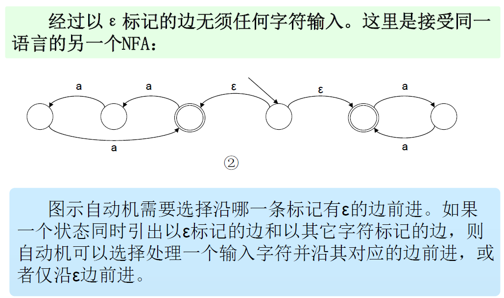
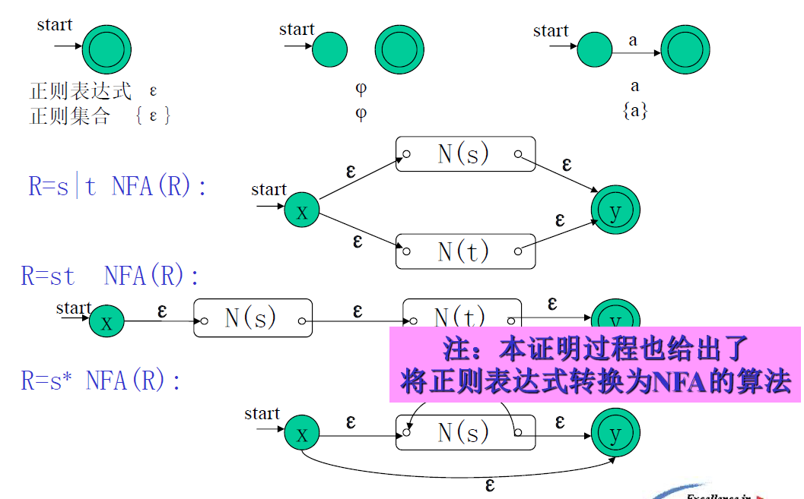
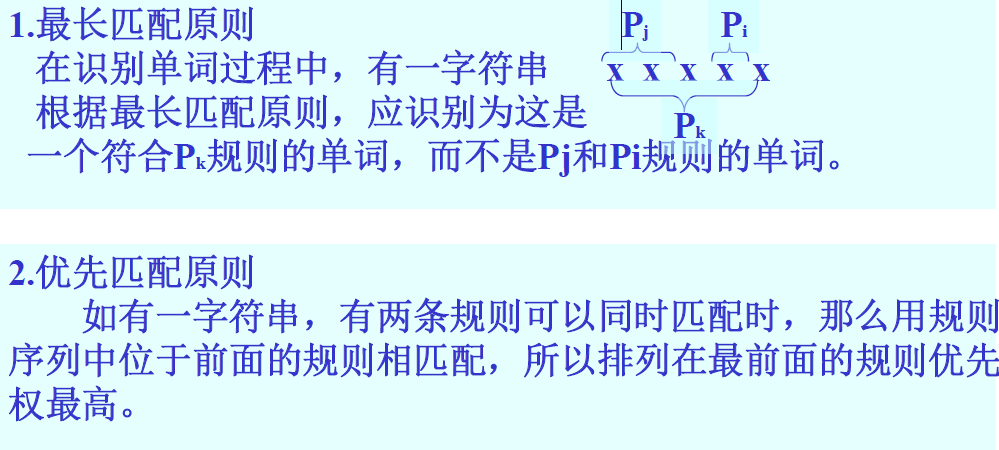
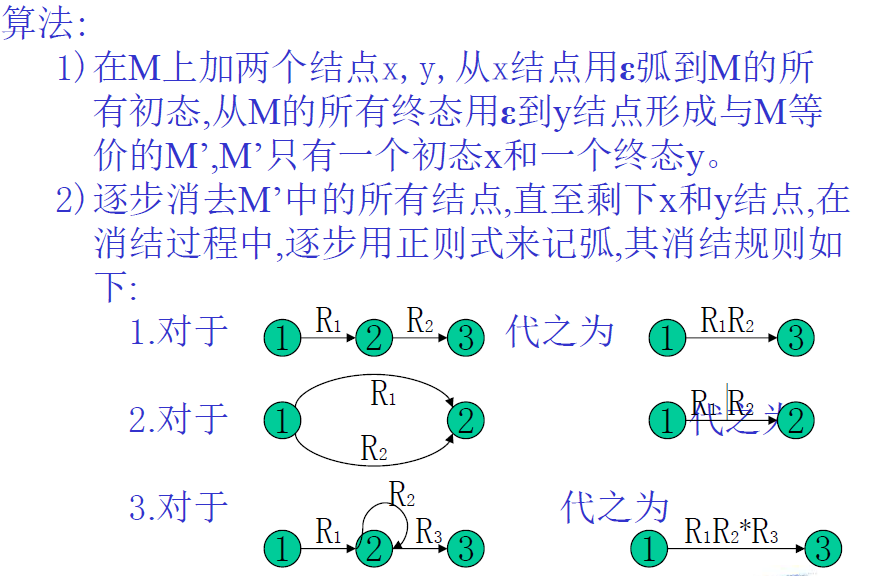

# 第三章 词法分析（2）

> 第10周讲到，从 PPT-Chapter-3/P26 开始

[TOC]

## 3.5 正则表达式与有穷自动机

### 3.5.1 正则表达式和正则集合的递归定义

有字母 $\Sigma$，定义在 $\Sigma$ 上的正则表达式和正则集合递归定义如下:
1. $\epsilon$ 和 $\phi$ 都是 $\Sigma$ 上的正则表达式，其正则集合分别为：$\{\epsilon\}$ 和 $\phi$ ；
2. 任何 $a\in\Sigma$，a是 $\Sigma$ 上的正则表达式，其正则集合为：{a}；
3. 假定U和V是 $\Sigma$ 上的正则表达式，其正则集合分别记为 L(U) 和 L(V) ，那么$U|V$， $U•V$ 和 $U*$也都是 $\Sigma$ 上的正则表达式，其正则集合分别为$L(U)\cup L(V)$、 $L(U) • L(V)$ 和 $L(U)*$；
4. 任何 $\Sigma$ 上的正则表达式和正则集合均由1、2和3产生。

> [!IMPORTANT]
>
> 正则表达式相等，当且仅当这**两个正则表达式表示的语言相等**，在证明正则表达式关系成立时常用！
>
> 正则集合就是一种语言，正则表达式相等就是正则集合相等
>
> 参见作业：书P254/1

正则表达式的性质：

正则表达式与3型文法（左线性或右线性）等价

### 3.5.2 确定的有穷自动机（DFA）——状态图的形式化

DFA： Deterministic Finite Automata

一个确定的有穷自动机（DFA）M是一个五元式：$M=(S,\Sigma,\delta,s_0,Z)$

其中：

1. S —— 有穷状态集
2. $\Sigma$ —— 输入字母表
3. $\delta$ —— 映射函数（亦称状态转换函数），$S\times\Sigma\rightarrow S,\delta(s,a)=s',s,s'\in S,a\in\Sigma$
4. $s_0$ —— 初始状态，$s_0\in S$
5. Z —— 终止状态集，$Z\subseteq S$

DFA M所接受的语言：
$$
L(M)=\{\alpha|\delta(s_0,\alpha)=s_n,s_n\in Z\}
$$

### 3.5.3 不确定的有穷自动机（NFA）

NFA： Nondeterministic Finite Automata

若 δ 是一个多值函数，且输入可允许为 ε，则有穷自动机是不确定的，即在某个状态下，对于某个输入字符存在多个后继状态。

从同一状态出发，有以**同一字符标记的多条边**，==或者==**有以 ε 标记**的特殊边的自动机。

NFA的形式定义：

一个**非确定的有穷自动机（NFA）**M是一个五元式：$M=(S,\Sigma\cup\{\epsilon\},\delta,s_0,Z)$

其中：

1. S —— 有穷状态集
2. $\Sigma\cup\{\epsilon\}$​ —— 输入符号加上ε，即自动机的**每个结点所射出的弧可以是Σ中的一个字符或是ε**
3. $\delta$ —— 映射函数（亦称状态转换函数），$S\times\Sigma\cup\{\epsilon\}\rightarrow 2^S$ （$2^S$：S的幂集——S的子集构成的集合）
4. $s_0$ —— 初始状态，$s_0\in S$
5. Z —— 终止状态集，$Z\subseteq S$​

NFA M’ 所接受的语言：
$$
L(M')=\{\alpha|\delta(S_0,\alpha)=S',S\cap Z\ne\Phi\}
$$

### 3.5.4 NFA的确定化

> 用计算机程序实现DFA是很容易的。但在不能正确猜测路径的情况下，NFA的实现就有些困难了。

已证明：不确定的有穷自动机与确定的有穷自动机从功能上来说是等价的，也就是说：

==能够从 NFA（M’）构造成一个 DFA（M），使得 L(M) = L(M’)==

为了使得NFA确定化，先给出2个定义：

**定义1 - 集合 I 的 $\epsilon$ - 闭包**：

令I是一个状态集的子集，定义 ε-closure(I)为：

1. 若 s∈I，则 s∈ε-closure(I)；
2. 若 s∈I，则从 s 出发经过任意条 ε 弧能够到达的任何状态都属于 ε-closure(I)。状态集 ε-closure(I) 称为 I 的 ε - 闭包。

> 意思就是从 I 集合开始的点，**只经过** ε 弧就能到达的任意状态，==包括 I 自身==

**定义2：**

令 I 是 NFA M’ 的**状态集的一个子集**，a∈Σ，定义：$I_a$=ε-closure(J)，其中 $J=\cup_{S\in I}δ(s,a)$

- ==J 是==从状态子集 I 中的**每个状态出发**，经过标记为 a 的弧而达到的状态集合。（不包括 J 自身）

  > 意味着 I 可以是经过 $\epsilon$ 的，J 就是经过一次标记为 a 的弧

- $I_a$ 是状态子集，其元素为J中的状态，加上从 J 中每一个状态出发通过 ε 弧到达的状态。

> [!IMPORTANT]
>
> 根据定义1，2，可以将上述的M’确定化（即可构造出状态转换矩阵）

> 我的理解：从初始符号开始求 $I$，$I_a$，...，再求所有出现过的状态的 $I$，$I_a$，...，可以求尽所有出现过的状态（直到不再出现新的状态子集）

对每个出现的集合都去求它的 $I_a$、$I_b$、$I_c$，直到全部覆盖为止

> 此时，各状态是原来NFA中各状态组合的集合

#### DFA的最小化

“对于任一个DFA，存在一个唯一的状态最少的等价的DFA”

一个有穷自动机是化简的 **当且仅当** 它没有多余状态并且它的状态中没有两个是互相等价的。

一个有穷自动机可以通过消除==多余状态==和合并==等价状态==而转换成一个最小的与之等价的有穷自动机

定义：

1. **有穷自动机的多余状态**：从该自动机的开始状态出发，任何输入串也不能到达那个状态

   

2. **等价状态**：状态 s 和 t 的等价条件是：

   1. 一致性条件：状态 s 和 t 必须同时为可接受状态或不接受状态。
   2. 蔓延性条件：对于所有输入符号，状态 s 和 t 必须转换到等价的状态里。

   对于所有输入符号 c，$I_c(s)=I_c(t)$​，即状态 s、t 对于c具有相同的后继，则称 s，t 是等价的。

   （任何有后继的状态和任何无后继的状态一定不等价）
   
   有穷自动机的状态 s 和 t 不等价，称这两个状态是**可区别的**。

方法：分割法（更直观的例子，详见书P238~241）

1. 根据一致性条件，按照==是否为终态==划分为2个区
2. 根据蔓延性条件，同一区的某些状态，若 $I_a, I_b...$ **所属分区相同**，则是等价状态，可把等价状态分入同区
3. 更新分区，检查元素个数大于2的分区，若发现**不再等价，分成新区**
4. 一直重复 3，直到**所有分区内的状态都是等价状态**
5. 用**区号**作为自动机的状态

### 3.5.5 正则表达式与DFA的等价性

定理：在 Σ 上的一个子集 V（$V\sube Σ*$）是**正则集合**，当且仅当存在一个DFA M，使得 $V=L(M)$

对任何一个正则表达式，都可以构造出等价的 NFA。

## 3.6 词法分析程序的自动生成器—LEX（LEXICAL）

LEX 的原理：**正则表达式与 DFA 的等价性**：根据给定的正则表达式自动生成相应的词法分析程序。

LEX 的功能：

### 3.6.1 LEX 源程序

一个LEX源程序主要由三个部分组成：辅助定义式、识别规则、用户子程序，各部分之间用%%隔开

1. **辅助定义式**

   辅助定义式是如下形式的LEX语句：$D_i\to R_i$

   其中，$R_i$ 为正则表达式，$D_i$ 为正则表达式名字，称简名

2. **识别规则**：

   是一串如下形式的LEX语句：$P_i\;\;\;\;\{A_i\}$​

   - $P_i$：定义在 $Σ∪\{D_1,D_2,...,D_n\}$ 上的正则表达式，也称词形。
   - $\{A_i\}$：$A_i$ 为语句序列，它指出，在识别出词形为 $P_i$ 的单词以后，词法分析器所应作的动作。其基本动作是返回单词的类别编码和单词值。

识别某语言单词符号的LEX源程序详见 PPT/P69 或 书P249~250

### 3.6.2 LEX的实现

LEX的功能是根据LEX源程序构造一个词法分析程序，该词法分析器实质上是一个有穷自动机。

LEX生成的词法分析程序由两部分组成：状态转换矩阵（DFA）以及 控制执行程序

因此，LEX的功能是根据LEX**源程序**生成**状态转换矩阵和控制程序**

LEX的工作过程：

- 扫描每条识别规则Pi，构造相应的不确定有穷自动机NFA Mi

- 将各条规则的有穷自动机Mi合并成一个新的NFA M

  

- 确定化 $NFA\Rightarrow DFA$

- 生成该 DFA 的状态转换矩阵和控制执行程序

LEX二义性问题的两条原则：

所以在写LEX源程序时**应注意规则的排列顺序**。另要注意的是，优先匹配原则是在符合最长匹配的前提下执行的。

例子见PPT/P76~78

步骤：

1. 读LEX源程序，分别生成NFA，用状态图表示

2. 合并成一个NFA

3. 确定化，给出状态转换矩阵

   

4. 输入字符串，吃进一些字符，按反序检查状态子集，检查前一次状态是否有原NFA的终止状态。

三点说明：

1. 以上是LEX的构造原理，虽然是原理性的，但据此就不难将LEX构造出来。
2. 所构造出来的LEX是一个通用的工具，用它可以生成各种语言的词法分析程序，只需要根据不同的语言书写不同的LEX源文件就可以了。
3. LEX不但能自动生成词法分析器，而且也可以产生多种模式识别器及文本编辑程序等。

> [!IMPORTANT]
>
> PPT/P81开始：涉及所有第三章的考点
>
> 

## 3.7 补充

### 3.7.1 有穷自动机 $\Rightarrow$ 正则文法

算法：

1. 对转换函数 $f(A,t)=B$，可写成一个产生式：A→tB
2. 对可接受状态（终止状态）Z，增加一个产生式：Z→ε
3. 有穷自动机的初态对应于文法的开始符号（识别符号），有穷自动机的字母表为文法的终结符号集。

### 3.7.2 正则文法 $\Rightarrow$ 有穷自动机

算法：

1. 字母表与G的**终结符号相同**；
2. 为G中的每个非终结符生成M的一个状态，G的开始符号S是开始状态S；
3. 增加一个**新状态Z，作为NFA的终态**；
4. 对G中的**形如 $A→tB$**（**右线性正则文法**），其中t为终结符或ε，A和B为非终结符的产生式，构造M的一个转换函数 $f(A,t)=B$；
5. 对G中的形如$A→t$的产生式，构造M的一个转换函数 $f(A,t)=Z$。

左线形正则文法和右线性正则文法的等价，见PPT/P86~87

### 3.7.3 正则式 $\Rightarrow$ 有穷自动机

语法制导方法：PPT上方法不推荐，尽量少写 $\epsilon$，形如PPT/P94即可

### 3.7.4 有穷自动机M $\Rightarrow$ 正则式R

### 3.7.5 正则文法 $\Rightarrow$ 正则式

利用以下转换规则，直至只剩下一个开始符号定义的产生式，并且产生式的右部不含非终结符。

### 3.7.6 正则式 $\Rightarrow$ 正则文法

> [!IMPORTANT]
>
> 对于 $A\rightarrow x*$，其中 * 号后没有东西，需要加一个 $\epsilon$，即 $A\rightarrow xA,\;\;A\rightarrow\epsilon$

