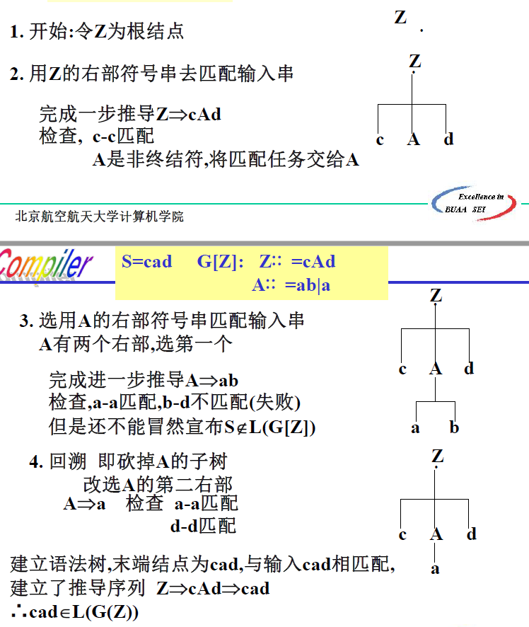
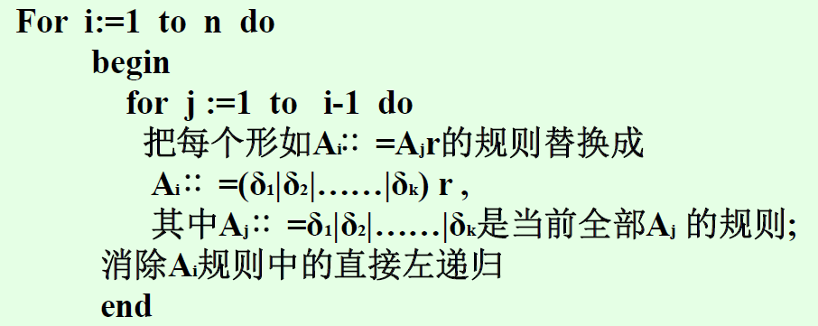
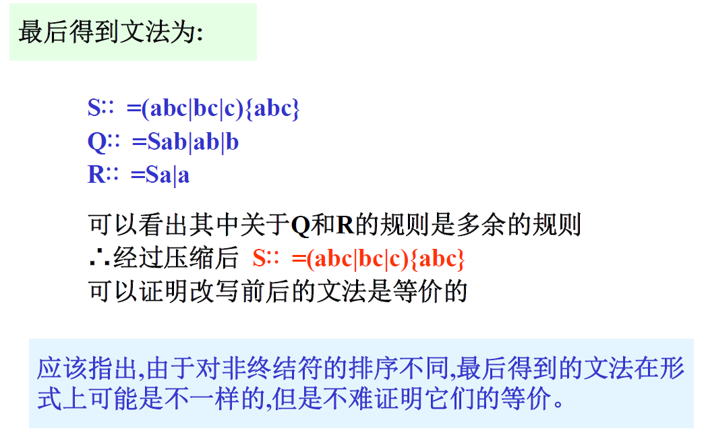
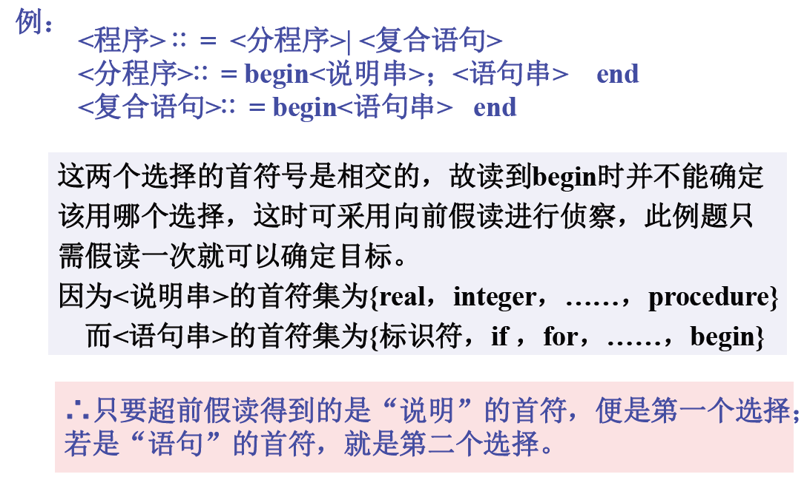
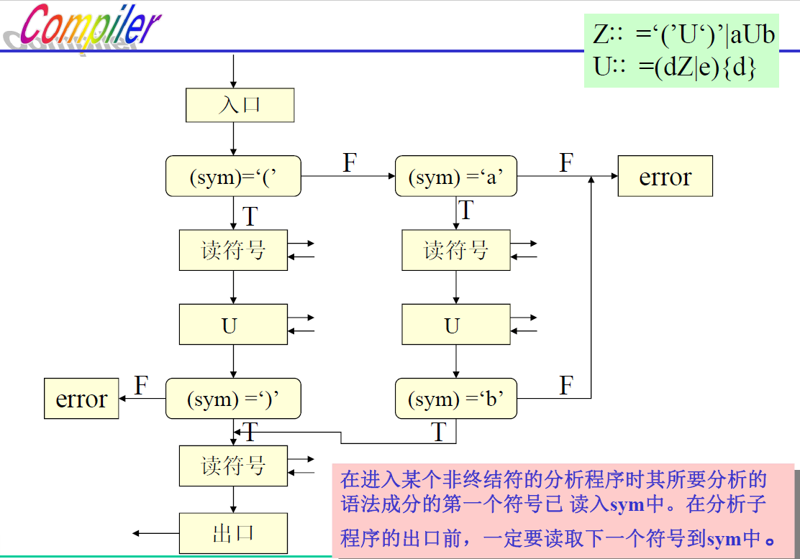
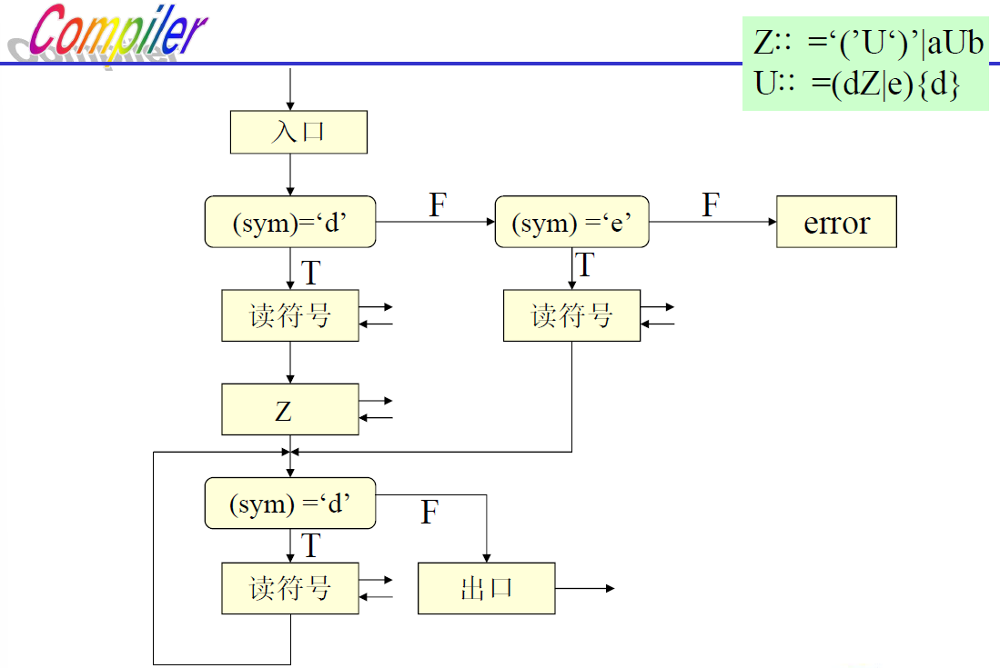

# 第四章 语法分析

[TOC]

## 4.1 语法分析概述

**功能**：根据文法规则，从源程序**单词符号串**中识别出语法成分，并进行语法检查。

**基本任务**：识别==符号串S==是否为某语法成分。

两大分析方法

- 自顶向下分析算法
  - 基本思想：若 $Z\xRightarrow[{G[Z]}]{+}S$，则 $S\in L(G[Z])$，否则 $S\notin L(G[Z])$
  - 主要问题：左递归问题、回溯问题
  - 主要方法：递归子程序法，LL分析法
- 自底向上分析算法
  - 基本思想：若 $Z\xLeftarrow[{G[Z]}]{+}S$，则 $S\in L(G[Z])$，否则 $S\notin L(G[Z])$
  - 主要问题：句柄的识别问题
  - 主要方法：算符优先分析法，LR分析法

## 4.2 自顶向下分析

### 4.2.1 自顶向下分析的一般过程

给定符号串S，若预测是某一语法成分，则可根据该语法成分的文法，设法为S构造一棵语法树，

- 若成功，则S最终被识别为某一语法成分，即 $S\in L(G[Z])$，其中G[Z]为某语法成分的**文法**。

- 若不成功，则 $S\notin L(G[Z])$

> 分析过程是设法建立一棵语法树，使语法树的末端结点与给定符号串相匹配。
>
> 例：$S=cad\;,G[Z]:Z::=cAd,\;A::= ab|a$，求解 $S\in L(G[Z])$​？
>
> 

> 若 $A=ab|a|Ad$，则十分麻烦（左递归文法）

自顶向下分析方法特点：

1. 分析过程是带预测的，对输入符号串要预测属于什么语法成分，然后根据该语法成分的文法建立语法树。
2. 分析过程是一种**试探**过程，是尽一切办法（选用不同规则）来建立语法树的过程，由于是试探过程，难免有失败，所以分析过程需进行回溯，因此也称这种方法是**带回溯**的自顶向下分析方法。
3. 最左推导可以编写程序来实现，但带回溯的自顶向下分析方法在**实际上价值不大**，效率低。

### 4.2.2 自顶向下分析存在的问题及解决方法

#### 1. 左递归文法

有文法：令U是文法的任一非终结符，文法中有规则 $U::=U...$ 或者 $U\xRightarrow{+}U...$ ——这个文法是左递归的

自顶向下分析的基本缺点：不能处理具有左递归性的文法，必须消除文法的左递归

> 原因：如果在匹配输入串的过程中，假定正好轮到要用非终结符U直接匹配输入串，即要用U的右部符号串U¨¨去匹配，为了用U¨¨去匹配，又得用U去匹配，这样无限的循环下去将无法终止。

消除直接左递归：

- **方法一**：使用扩充的BNF表示来改写文法

  > 例：（1）$E::=E+T|T\;\;=>\;\;E::=T\{+T\}$
  >
  > （2）$T::=T*F|T/F|F\;\;=>\;\;T::=F\{*F|/F\}$

  1. 改写后的文法消除了左递归
  2. 可以证明，改写前后的文法是等价的，表现在 $L(G_{改前})=L(G_{改后})$​

  改写文法，使得既能消除左递归，又前后等价，有两条规则：

  - **规则一**（提因子）：

    - 若：$U::=xy|xw|...|xz$，则可改写为：$U::=x(y|w|...|z)$​

    - 若：$y=y_1y_2,\;w=y_1w_2$，则 $U::=x(y_1(y_2|w_2)|...|z)$​

    - 若有规则：$U::=x|xy$，则可改写为：$U::=x(y|\varepsilon)$，==不能==写为 $U::=x(\varepsilon|y)$

    不仅有助于消除直接左递归，而且有助于压缩文法的长度，使我们能更有效地分析句子。

  - **规则二**（具有一个直接左递归的右部并位于最后，这表明该语法类U是由x或y……或z其后随有零个
    或多个v组成）：

    - 若：$U::=x|y|...|z|Uv$，则可改写为：$U::=(x|y|...|z)\{v\}$

- **方法二**：将左递归规则改为右递归规则
  
  - **规则三**：若：$P::=Pa|b$，则可改写为：$P::=bP^{'},P^{'}::=aP^{'}|\varepsilon$

消除一般左递归：一般左递归也可以通过改写文法予以消除

1. 把G的非终结符整理成某种顺序 $A_1,\;A_2,\;...A_n$，使得：
   - $A_1::=\delta_1|\delta_2|...|\delta_k$
   - $A_2::=A_1r...$
   - $A_3::=A_2u|A_1v...$
2. 
3. 化简由2得到的文法即可

> 例：文法G[s]：$S::=Qc|c,\;Q::=Rb|b,\;R::=Sa|a$，无直接左递归，但有间接左递归
>
> 1. 检查规则R是否存在直接左递归 —— $R::=Sa|a$（不存在）
> 2. 把R代入Q的有关选择，改写规则Q —— $Q::=Sab|ab|b$
> 3. 检查Q是否存在直接左递归
> 4. 把Q代入S的右部选择 —— $S::=Sabc|abc|bc|c$
> 5. 消除S的直接左递归 —— $S::=(abc|bc|c)\{abc\}$​
>
> 

#### 2. 回溯问题

**回溯**：分析工作要部分地或全部地退回去

**造成回溯的条件**：文法中，对于某个非终结符号的规则其右部有多个选择，并根据所面临的输入符号不能准确地确定所要的选择时，就可能出现回溯。

**回溯带来的问题**：严重的低效率，只有在理论上的意义而无实际意义

效率低的原因：

1. 语法分析要重做
2. 语义处理工作要推倒重来

> 设文法G（不具左递归性），$U\in V_n$，$U::=\alpha_1|\alpha_2|\alpha_3$，定义首符集：$FIRST(\alpha_i)=\{a|\alpha_i\xRightarrow{*}a...,a\in V_t\}$​
>
> 注意：**定义为最先出现的那些非终结符**，而且是==**最终推导出来的非终结符**==！！而非所有非终结符！！
>
> 坑例见 P91/3(1)
>
> 为避免回溯，对文法的要求是：$FIRST(\alpha_i)\cap FIRST(\alpha_j)=\phi(i\ne j)$

消除回溯的途径：

1. **改写文法**：对具有多个右部的规则**反复**提取左因子

   例：$U::=xV|xW,\;U,V,W\in V_n,\;x\in V^+_t$——首符号都是x，相交

   - 提因子为 $U::=x(V|W)$，==更清楚地表示为 $U::=xZ,Z::=V|W$==

   - 进一步检查V和W首符号是否相交。

     若 $V::=ab|cd$，则 $FIRST(V)=\{a,c\}$；若 $W::=de|fg$，则 $FIRST(W)=\{d,f\}$。

     只要不相交就可以根据输入符号确定目标，==若相交，则要代入，并再次提取左因子==。

   > 更多例子见PPT/P25-26

2. **超前扫描**：当文法不满足避免回溯的条件时，即各选择的首符号相交时，可以采用超前扫描的方法，即向前侦察各输入符号串的第二个、第三个符号来确定要选择的目标

   > 这种方法是通过向前多看几个符号来确定所选择的目标，从本质上来讲也有回溯的味道，因此比第一种方法费时，但是假读仅仅是向前侦察情况，不作任何语义处理工作。

   

文法的两个条件（为了在**不采取超前扫描**的前提下实现**不带回溯**的自顶向下分析）：

1. 文法是**非左递归**的
2. 对文法的**任一非终结符**，若其规则右部有多个选择时，各选择所推出的终结符号串的**首符号集合**要两两不相交。

在上述条件下，就可以根据文法构造有效的、不带回溯的自顶向下分析器。

### 4.2.3 递归子程序法（递归下降分析法）

**具体做法**：对语法的每一个非终结符都编一个分析程序，当根据文法和当时的输入符号预测到要用某个非终结符去匹配输入串时，就调用该非终结符的分析程序。

> 举例：文法G[Z]，$Z::=(U)|aUb,\;\;U::=dZ|Ud|e$

1. **检查并改写文法**

   > $Z::=(U)|aUb,\;\;U::=(dZ|e)\{d\}$
   >
   > 改写后无左递归且首符集不相交：$\{(\}\cap\{a\}=\phi,\;\;\{d\}\cap\{e\}=\phi$

2. **检查文法的递归性**

   > $Z\xRightarrow{}...U...\xRightarrow{}...Z...\;\;\;\;\therefore Z\xRightarrow{}...Z...$
   >
   > $U\xRightarrow{}...Z...\xRightarrow{}...U...\;\;\;\;\therefore U\xRightarrow{}...U...$​
   >
   > 因此，Z和U的分析程序可编程递归子程序

3. **算法框图**

   非终结符号的分析子程序的功能：用规则右部符号串去匹配输入串。

   

   

   - 要注意子程序之间的接口，在程序编制时进入某个非终结符的分析程序时其所要分析的语法成分的**第一个符号已读入sym中**。
   - 递归子程序法对应的是**最左推导**过程

### 4.2.4 用递归子程序法构造语法分析程序的例子

详见：PPT/P37-47
