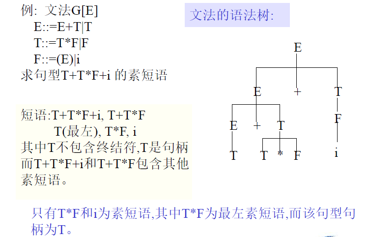
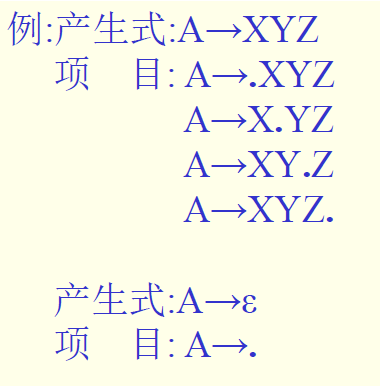

# 第四章 语法分析

[TOC]

## 4.2.5 LL分析法（第12章）

LL - 自左向右扫描、自左向右地分析和匹配输入串

因此，分析过程表现为最左推导的性质

### 4.2.5.1 LL分析程序构造及分析过程

三部分组成：

- 分析表
- 执行程序（总控程序）
- 符号栈（分析栈）

在实际语言中，每一种语法成分都有确定的左右界符，为了研究问题方便，统一以‘＃’表示。

1. **分析表**：二维矩阵M（**只与文法有关**）

2. **符号栈**：四种情况

   

   

3. **执行程序**

   主要实现如下操作：

   1. 把#和文法识别符号E推进栈，读入下一个符号，重复下述过程直到正常结束或出错。
   2. 测定栈顶符号X和当前输入符号a，执行如下操作：
      - 若$X=a=\#$，分析成功，停止。E匹配输入串成功。
      - 若$X=a≠\#$，把X推出栈，再读入下一个符号。（栈顶是a）
      - 若$X∈V_n$，查分析表M。
        1. M[X, a] = $X::=UVW$，则将X弹出栈，将UVW压入。==注：U在栈顶 ，写出来是在最右边（最左推导）==
        2. M[X, a] = error 转出错处理
        3. M[X, a] = $X::=ε$，— a为X的后继符号，则将X弹出栈 (不读下一符号)，继续分析。

> ==一般题目不允许改写文法，只有题目允许时才可改写（消除左递归）==

例子详细步骤见PPT/P55-59，按照分析表一步步推，每一行的符号栈是该行使用规则后的符号栈

> 符号栈顶为终结符，需要出栈读下一个符号

### 4.2.5.2 分析表的构造

设有文法G[Z]：

定义：

- $FIRST(\alpha)=\{a|\alpha\xRightarrow[]{*}a...,a\in V_t\},\alpha\in V^*$，若 $\alpha\xRightarrow[]{*}\epsilon$，则 $\epsilon\in FIRST(\alpha)$，该集合称为 $\alpha$ 的头符号集合

- $FOLLOW(A)=\{a|Z\xRightarrow[]{*}...Aa...,a\in V_t\},A\in V_n$，若 $\alpha\xRightarrow[]{*}\epsilon$，则 $\epsilon\in FIRST(\alpha)$，Z为识别符号，该集合称为 $\alpha$ 的后继符号集合。特殊地，若 $Z\xRightarrow[]{*}A$，则 $\#\in FOLLOW(A)$​

1. 构造集合 FIRST 的算法

第三步就是从头开始看Xi的右部，若出现FIRST为空的则跳到下一个看看能不能加入，若不为空则停止

> **非终结符和终结符都可以有**FIRST集！如果第二步能执行就不用执行第三步了
>
> 莫忘记减去ε！
>
> 若打头的是终结符，那么FIRST就是终结符，不考虑后面的非终结符
>
> 若打头的是非终结符，那么看看非终结符能不能推出ε，若能的话加入它的FIRST-ε，再看下一个，直到遇到不能推出ε的非终结符或终结符

2. 构造集合 FOLLOW 的算法

> 1. 识别符号的FOLLOW必有#号！！！别忘了啊
> 2. A::=B，B后面有东西，若后面的东西不是ε，则把==后面东西的FIRST减去ε==加进去
> 3. A::=B，若B后面的东西是或能推出ε，则把==A的FOLLOW==加进去
>
> 方针：对于B，看B出现在哪个文法的**右部**

**构造分析表**

基本思想：当文法中某一**非终结符**呈现在栈顶时，根据当前的**输入符号**，分析表应指示（M[A,a]）要用该非终结符的哪一条规则去匹配输入串（即进行一步最左推导）

> 先求FIRST集，再求FOLLOW集，但是FOLLOW集很容易错！！！
>
> FIRST集，针对的是各个文法的右部，但左部的也要求（**从下面的文法往上**），以便求FOLLOW！
>
> FOLLOW集，**从上面的文法往下**求，注意FIRST要减去ε
>
> 规则表：
>
> **文法中非ε的**，该文法**右部模块的FIRST集**中的终结符对应位置填上这个文法
>
> **文法中出现ε的**，该文法左部符号**FOLLOW集**中的终结符对应位置填上这个文法

例子

### 4.2.5.3 LL(1)文法

定义：一个文法G，其==分析表M不含多重定义入口==（即分析表中无二条以上规则），则称它是一个LL(1)文法。

定理：文法G是LL(1)文法的==充分必要条件==是：对于G的每一个非终结符A的**任意两条规则**A::=α|β，下列条件成立：

1. $FIRST(\alpha)\cap FIRST(\beta)=\phi$
2. 若 $\beta \xRightarrow[]{*}\epsilon$，则 $FIRST(\alpha)\cap FOLLOW(A)=\phi$

用此构造分析表的算法，可以构造任何文法的分析表，但对于某些文法，有些 M[A,a] 中可能有若干条规则，这称为分析表的**多重定义或者多重入口**。

可以证明：如果G是==左递归==的，或者是==二义性==的文法，则至少有一个多重入口。

有些文法可以从非LL(1)文法改写为LL(1)文法

### 4.2.5.4 LL分析的错误恢复（不要求）

## 4.3 自底向上分析

基本算法思想：

- 若采用自左向右的描述和分析输入串，那么自底向上的基本算法是：

- 从输入符号串开始，通过重复查找当前句型的**句柄**（最左简单短语），并利用有关规则进行归约，若能归约为文法的识别符号，则表示分析成功，输入符号串是文法的合法句子，否则有语法错误。

分析过程是重复以下步骤：

1. 找出当前句型的句柄 x （或句柄的变形）
2. 找出以 x 为右部的规则 X::= x
3. 把 x 归约为X，产生语法树的一枝

关键：找出当前句型的句柄 x (或其变形），这不是很容易。

主要内容：

- 自底向上分析的一般过程（移进-归约分析）
- 算符优先分析法
- LR分析法

## 4.3.1 移进-归约分析（Shift-reduce parsing）

要点：建立==符号栈==，用来记录分析的历史和现状，并根据所面临的状态，**确定下一步动作**是移进还是归约。

分析过程：

1. 把输入符号串按扫描顺序一一地**移进符号栈**（一次移一个）
2. 检查栈中符号，当在==栈顶的若干符号==形成当前句型的==句柄==时，就根据规则进行归约，将句柄从符号栈中弹出，并将相应的==非终结符号==压入栈内（即规则的左部符号）
3. 然后再检查栈内符号串是否形成新的句柄，若有就再进行归约，否则移进符号。
4. 分析一直进行到读到输入串的右界符为止。最后，若栈中仅含有**左界符号和识别符号**，则表示分析成功，否则失败。

> “完整的句柄一旦出现，立刻归约”

例子：

这一方法简单明了，不断地进行移进归约，关键是确定当前句型的句柄。

说明：

1. 例子的分析过程是一步步地归约当前句型的**句柄**

   - 栈内符号串 + 未处理输入符号串 = 当前句型
   - 句柄都在栈顶

   > 实际上，以上分析过程并未真正解决句柄的识别问题

2. 未真正解决句柄的识别。

上述分析过程是怎样识别句柄的，主要看栈顶符号串是否形成规则的右部。这种做法形式上是正确的，但在==实际上不一定正确==。举例的分析过程可以说是一种**巧合**。（第5步既可把Ab归约为A，又可把b归约为A）

## 4.3.2 算符优先分析（Operator-Precedence Parsing）

1. 这是一种经典的自底向上分析法，简单直观，并被广泛使用，开始主要是对表达式的分析，现在已不限于此。**可以用于一大类上下无关的文法**。

2) 称为算符优先分析是因为这种方法是仿效算术式的**四则运算**而建立起来的，作算术式的四则运算时，为了保证计算结果和过程的唯一性，规定了一个统一的四则运算法则，**规定运算符之间的优先关系**。

3. 算符优先分析的特点：仿效四则运算过程，**预先规定相邻终结符之间的优先关系**，然后利用这种优先关系来确定句型的“句柄” ，并进行归约

4. 分析器结构

   

例：G[E]：$E∷ =E+E | E*E | (E) | i$，$V_t::={+, *, (, ), i}$

1. 先确定终结符之间的优先关系

   

   1. 文法终结符之间的优先关系可以用一个矩阵M来表示

      

   2. 矩阵元素空白处表示这两个终结符不能相邻，故没有优先关系

2. 分析过程：i+i*i

   算法：当**栈顶项（或次栈顶项）终结符**的优先级==大于==**栈外的终结符**的优先级，则进行==归约==，否则（==小于或等于==）移进
   
   

分析过程是从符号串开始，根据相邻终结符之间的优先关系确定句型的“句柄”，并进行归约，直到识别符号E，最后分析成功

出错情况:
1. 相邻终结符之间无优先关系
2. 对双目运行符进行归约时，符号栈中无足够项
3. 非正常结束状态

> [!IMPORTANT]
>
> **重要说明**
>
> 1. 上述分析过程不一定是严格的最左归约（**即不一定是规范归约**）也就是每次归约**不一定是归约当前句型的句柄**，而是句柄的变形，但也是短语。
>
> 2. 文法的终结符优先关系可以用一个矩阵表示，也可以用两个优先函数来表示：
>
>    - f—栈内优先函数，g—栈外优先函数
>
>      
>
>      
>
>    - 优先函数值不唯一。
>
>    - 优点：节省内存空间（n^2 → 2n）；易于比较（算法上容易实现，是数与数比，不必查矩阵）
>
>    - 缺点：可能掩盖错误，原来不存在优先级对应关系的终结符之间也被强制赋予了优先关系
>
> 3. 可以设立两个栈来代替一个栈：运算对象栈（OPND）和运算符栈（OPTR）
>
>    优点：便于比较，只需将输入符号与运算符栈的栈顶符号相比较
>
> 4. 使用算符优先分析方法==可以分析==**二义性文法**所产生的语言（上面的例子就是二义性文法，有两棵语法树）
>
>    - 二义性文法按规范分析，其句柄不唯一

## 4.3.3 算符优先分析法的进一步讨论

### 4.3.3.1 算符优先文法（OPG）

> OPG－Operator Precedence Grammar

**算符文法**（OG）的定义：若文法中无形如$U∷ = …VW…$的规则，这里$V,W∈V_n$，则称G为OG文法，也就是算符文法。

> 算符文法包含算符优先文法

**优先关系**的定义：若G是一OG文法，==$a,b∈V_t$==，==$U,V,W∈V_n$==，分别有以下三种情况：

> 能由非终结符推出来的，都比终结符大

**算符优先文法**（OPG）的定义：设有一OG文法，如果在任意两个终结符之间，至多只有上述关系中的一种，则称该文法为算符优先文法(OPG)

对于OG文法的几点说明

1. 运算是以中缀形式出现的
2. 若文法为OG文法，则**不会**出现**两个非终结符相邻**的句型。
3. **算法语言**中的表达式以及**大部分语言成分**的文法均是OG文法

### 4.3.3.2 构造优先关系矩阵

#### 1 构造FIRSTVT

例子：

​         

> 纸面做法：
>
> 1. 先依次找出每条规则==打头==或不是开头但==前面仅有非终结符==的终结符，可能不止一个
>
> 2. 先算F，看哪个终结符==打头==，就把这些终结符加进FIRSTVT。然后自下向上，把==所有开头的==非终结符的FIRSTVT加进去，再看E……

#### 2 构造LASTVT

例子：

> 纸面做法：
>
> 1. 先依次找出每条规则==结尾==或不是结尾但==后面仅有非终结符==的终结符，可能不止一个
>
> 2. 先算F，看哪个  终结符==结尾==，就把这些终结符加进LASTVT。然后自下向上，把==所有结尾的==非终结符的LASTVT加进去，再看E……

#### 3 构造优先关系矩阵

> 前面的终结符 < 后面的非终结符的**FIRSTVT**
>
> 前面的非终结符的**LASTVT** > 后面的终结符
>
> - 终结符永远小，非终结符在前则LASTVT，在后则FIRSTVT
>
> ==特别地，对于#号，要设定一个额外的规则：E’::=#E#==

例子：一定要再看、检查一遍！关系矩阵的填写是围绕着每条规则的终结符来的

#### 4 算符优先分析算法的实现

先定义优先级，在分析过程中通过比较相邻运算符之间的优先级来确定句型的“句柄”并进行归约。

**素短语**：文法G的句型的素短语是一个**短语**，它==至少包含有一个终结符号==，并且除它自身以外==不再包含其他素短语==。

> 我的算法：先找到所有包含终结符的短语，然后删掉包含别的短语的短语

例子1：

例子2：

算符优先分析法确定当前句型的最左素短语：

根据该定理，要找句型的最左素短语就是要找满足上述条件的最左子串。（夹在小于和大于号之间的串）

可以看出:
1. 每次归约==最左子串==，确实是当前句型的最左素短语（语法树）
2. 归约的==不都是真句柄==（仅i归约为F是句柄，但它是最左素短语）
3. ==没有完全按规则进行归约==，因为素短语**不一定是简单短语**

回到4.3.2的算符优先分析法：基本部分是找句型最左子串（最左素短语）并进行归约

- 当栈内终结符的优先级＜＝栈外的终结符的优先级时，移进；
- 栈内终结符的优先级＞栈外的终结符的优先级时，表明找到了素短语的尾，再往前找其头，并进行归约。

## 4.3.4 LR分析法

> 有区分度的题出在这里！还有自动机优化的问题！

### 4.3.4.1 概述

LR分析法：从左到右扫描(==L==)自底向上进行归约(==R==)（是规范归约）， 是自底向上分析方法的高度概括和集中。

历史 + 展望 + 现状 => 句柄

1. LR分析法的**优缺点**
   1. 适合文法类足够大
   2. 分析效率高
   3. 报错及时
   4. 可以自动生成
   5. 手工实现工作量大
2. LR分析器的**三部分**
   - **状态栈**：放置分析器状态和文法符号
   - **分析表**：由两个矩阵组成，其功能是指示分析器的动作，是移进还是归约，根据不同的文法类要采用不同的构造方法。
   - **控制程序**：执行分析表所规定的动作，对栈进行操作。
3. **分析表的种类**
   - ==SLR分析表（简单LR分析表）==：构造简单，最易实现，大多数上下文无关文法都可以构造出SLR分析表，所以具有较高的实用价值。使用SLR分析表进行语法分析的分析器叫SLR分析器。
   - LR分析表（规范LR分析表）：适用文法类最大，几乎所有上下文无关文法都能构造出LR分析表， 但其分析表体积太大，实用价值不大。
   - LALR分析表（超前LR分析表）：这种表适用的文法类及其实现上难易在上面两种之间，在实用上很吸引人。使用LALR分析表进行语法分析的分析器叫LALR分析器。
4. **几点说明**
   1. 三种分析表对应三类文法
   2. 一个SLR文法必定是LALR文法和LR文法
   3. ==仅讨论SLR分析表的构造方法==

### 4.3.4.2 LR分析

#### 1 逻辑结构

**状态栈**：$S_0,S_1,…,S_m$ 状态

$S_0$——初始状态；$S_m$——栈顶状态，概括了从分析开始到该状态的全部分析历史和展望信息。

**符号串**：$x_1x_2...x_m$，为从开始状态S0到当前状态Sm所识别的**规范句型的活前缀**

**规范句型**：通过规范归约得到的句型。

**规范句型前缀**：将输入串的剩余部分与其连接起来就构成了规范句型。

- 如： $x_1x_2...x_ma_i...a_n$为规范句型

**活前缀**：若分析过程能够保证栈中符号串均是**规范句型的前缀**，则表示输入串已分析过的部分没有语法错误，所以称为规范句型的活前缀。

**规范句型的活前缀**：

> 书上的具体定义：
>
> 对于文法G，其开始符号为S，对于输入串x，其最右推导为：
> $$
> S\xRightarrow[\mid]{\mid}\alpha_1\xRightarrow[\mid]{\mid}\alpha_2...\xRightarrow[\mid]{\mid}\alpha_{m-1}\xRightarrow[\mid]{\mid}\alpha_m=x
> $$
> 推导序列中的每一步都有形式：
> $$
> \alpha_i=\phi At\xRightarrow[\mid]{\mid}\phi\beta t
> $$
> 其中 $A\rightarrow\beta$ 是使用的产生式。由于是最右推导，因此 $t\in V^*_t$。
>
> 现在，$\phi\beta t$ 是规范句型，$\phi\beta$ 就是规范句型的前缀，这里$\beta$表示句柄。若 $\phi\beta=u_1u_2...u_r$，那么符号串 $u_1u_2...u_i(1\le i\le r)$ 即是规范句型 $\phi\beta t$​ 的==活前缀==
>

> **我的理解**：题目问某句型的活前缀，就是求它的 $\phi\beta$（求法是：最右推导到该句型的那个句型，**从右往左看**==终结符第一次消失==的地方就是 $\phi\beta$ 结束的地方，从开头到那个位置就是**活前缀的范围**，从左到右从少到多写即可）

**分析表**

1. **状态转移表（GOTO表）**

   是一个矩阵：行——分析器的状态；列——文法符号

   

   > 人话：增加一个符号组成了新的活前缀，则要跳到新的状态 $S_i$

   通过对有穷自动机的了解，可以看出：状态转移函数GOTO是定义了一个以文法符号集为字母表的有穷自动机，该自动机识别文法==所有规范句型的活前缀==。
   $$
   M=(S, V, GOTO, S_0, Z )
   $$

2. **分析动作表（ACTION表）**

   分析动作：

   1. **移进**（shift）：$ACTION[S_i,a] = s$
      - 动作：将a推进栈，并设置新的栈顶状态 $S_j=GOTO[S_i,a]$，将指针指向下一个输入符号
   2. **归约**（reduce）：$ACTION[S_i,a] = r_d$​，d：**文法规则编号**，(d) A→β
      - 动作：将符号串β（假定长度为n）连同状态从栈内弹出，把A推进栈，并设置新的栈顶状态 $S_j$，$S_j = GOTO[S_{i-n},A]$
   3. **接受**（accept）：$ACTION[S_i,\#]=accept$
   4. **出错**（error）：$ACTION[S_i,a]=error$
   
   控制程序：（Driver Routine）
   
   1. 根据**栈顶状态**和**现行输入符号**，查分析动作表（ACTION表），执行由分析表所规定的操作；
   2. 并根据GOTO表设置新的栈顶状态（**即实现状态转移**）。

> ACTION表：与输入符号挂钩，先执行动作
>
> GOTO表：执行完ACTION表动作后根据GOTO表完成状态转移

#### 2 LR分析过程

> 填表顺序：对于新一行，先填上一步的状态加上新符号动作对这一步有什么影响（S还是r）
>
> - 若为S则移进，符号和输入串相应增加和减少。状态栈增加对应符号，并计算**前面的数字**和**这一符号**产生的数字（用ACTION表），再填下一行的动作
> - 若是r则归约，符号和输入串不变。把栈顶的若干符号和数字换成新的符号，计算**前面的数字**和**这一符号**产生的数字（用GOTO表），然后用新数字和符号算下一行的动作
>
> 状态栈栈顶一定是数字，符号和数字一定是绑定的。
>
> 值为几取决于前面的输入符号和再前面的状态能转移到哪个状态。例如。步骤3的3从哪儿来？是通过0-F算出来的

由分析过程可以看到：

1. 每次归约总是归约当前句型的句柄，是规范归约。（算符优先分析归约最左素短语）
2. 分析的每一步**栈内符号串均是规范句型的活前缀**，与输入串的剩余部分构成规范句型。

#### 3 构造SLR分析表

方法：

1. 根据文法构造识别**规范句型活前缀**的有穷自动机DFA
2. 由DFA构造分析表

##### （1）构造DFA

1. DFA是一个五元式：$M=(S, V, GOTO, S_0, Z )$​

   - S：有穷状态集。在此具体情况下，S = LR(0) 项目集规范族。
     - 项目集规范族：其元素是由项目所构成的集合。

   - V：文法字汇表

   - $S_0$：初始状态 $S_0∈S$

   - GOTO：状态转移函数。$GOTO[S_i,X]=S_j$，$S_i ,S_j∈S$，$S_i ,S_j$ 为项目集合，$X∈V_n∪V_t$。
     - 表示当前状态 $S_i$ 面临文法符号为 X 时，应将状态转移到 $S_j$

   - Z：终态集合 $Z = S-\{S_0\}$，即除 $S_0$​ 以外，**其余全部是终态**

   构造DFA：

   1. 确定 S 集合，即 LR(0) ==项目集规范族==，同时确定 $S_0$​
   2. 确定==状态转移函数==GOTO

2. 构造 LR(0) 的方法

   LR(0)是DFA的状态集，其中每个状态又都是项目的集合。

   **项目**：文法G的每个产生式（规则）的右部添加一个圆点就构成一个项目。

   项目的直观意义：指明在分析过程中的某一时刻**已经归约的部分和等待归约部分**。

   

构造LR(0)的方法（三步）

1. 将文法拓广

   - 目的：使构造出来的分析表**只有一个接受状态**，这是为了实现的方便。
   - 方法：修改文法，使**识别符号的规则只有一条**。

   

   

2. 根据文法列出所有的项目

   

3. 将有关项目组合成集合，即 DFA 中的状态；所有状态再组合成一个集合，即 LR（0）**项目集规范族**

   需要先定义：

   - 项目集闭包closure：递归查找“.”后面的非终结符能推出的规则，加入闭包

     

     注意：紧跟在点号后面的**必须是非终结符**才需要递归加入闭包！！

   - 状态转移函数GOTO

     

     所以，$GOTO(I,X) = closure(J)$​ 的直观意义是：**它规定了识别文法规范句型活前缀的DFA，从状态 I（项目集）出发，经过X弧所应该到达的状态（项目集合）**

     

LR(0)和GOTO的构造算法：

例子详见PPT/P163~167。

关于自动机的说明：

1. 除I0以外，其余状态都是终态，从I0到每一状态的每条路径都识别和接受一个规范句型的活前缀

   

2. 状态中每个项目对该状态能识别的活前缀都是有效的。

   

   > **圆点前的符号串成为活前缀的后缀**！另外注意是规范（最右）推导
   >
   > 所有有效项目组成了活前缀的有效项目集

3. 有效项目能预测分析的下一步动作

   

4. DFA中的状态，既代表了分析历史又提供了展望信息

   - 每条规范句型的活前缀都代表了一个确定的规范归约过程，故由状态可以代表分析历史。
   - 由于状态中的项目都是有效项目，所以提供了下一步可能采取的动作。
   - 历史+展望+现实 → 句柄

##### （2）由DFA构造SLR表

GOTO表在求LR(0)时已求出

求ACTION表：设k为状态编号，E为原文法识别符号，E’为扩充文法识别符号

1. 求出文法每个非终结符的FOLLOW集合
2. 若项目 $A→α.aβ ∈k$，且$a ∈V_t$，则置$ACTION[k,a] = s$ （**点号后是终结符则移进**）
3. 若项目 $A→ α.∈k$，那么对输入符号a，若 $a∈FOLLOW(A)$，则置 $ACTION[k,a]=r_j$，其中 $A→ α$​ 为文法G’的第j个产生式。（**点号后没东西且输入在FOLLOW(A)中，则按照该规则归约**）
4. 若项目 $E’→E.∈k$，则置 $ACTION[ k , \# ] =accept$（**对 $E’→E.$ 所属规则的#号位置置为accept**）
5. ACTION表中不能用步骤2~4填入信息的空白格，均置error

> 在状态中可有三种类型的项目，其中只有两种有移进或归约动作：
>
> 
>
> 根据上述算法，可以构造出文法G’[E’]的ACTION

两点说明：

1. 由DFA构造出的SLR分析表，在造表时，**只需向前看一个符号就能确定分析的动作是移进还是归约**，所以称为==SLR(1)分析表==，简称SLR分析表，使用SLR分析表的分析器叫SLR分析器。
2. 对文法G，若应用上述算法所造出的分析表具有多重定义入口，分析动作不唯一，则文法G就不是SLR的，需要用别的方法来构造分析表。
   - 归约-归约冲突
   - 移进-归约冲突