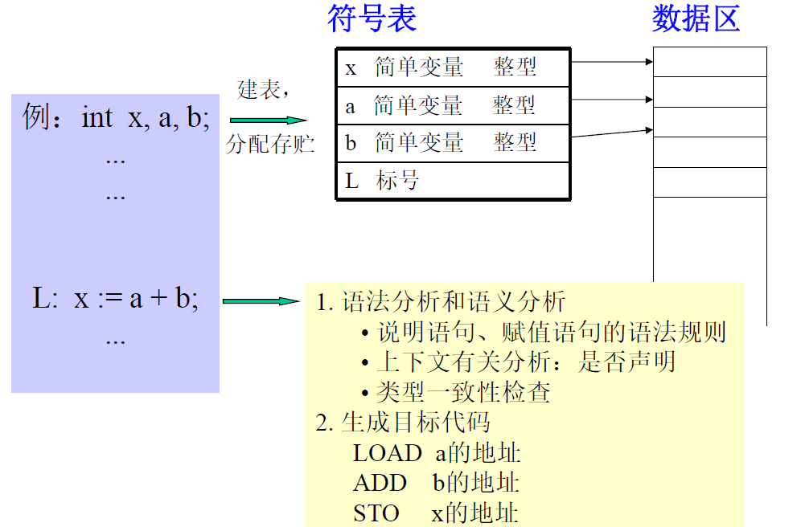
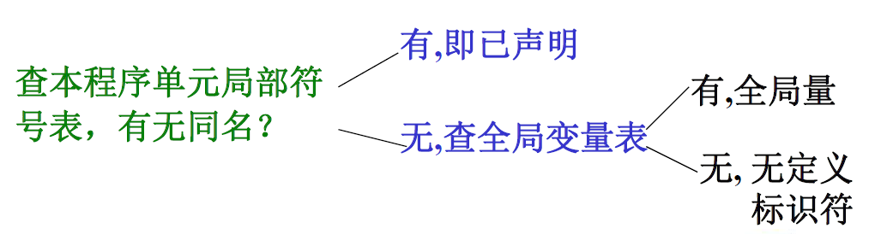
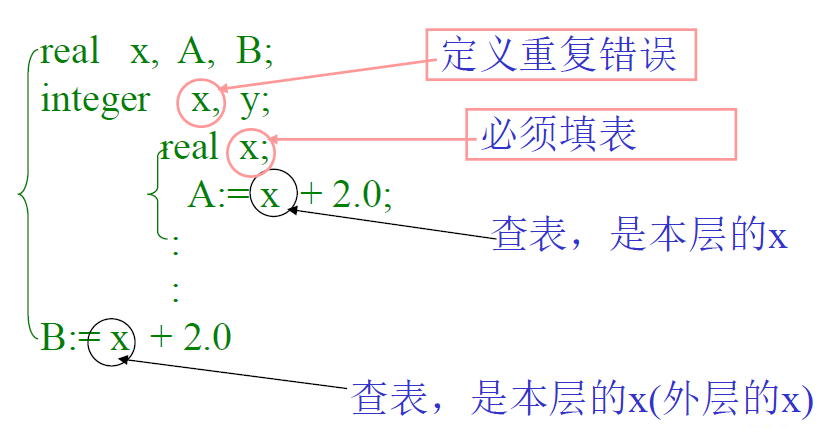
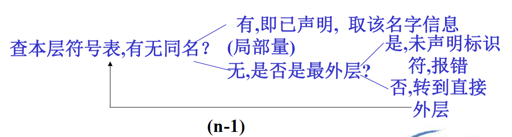
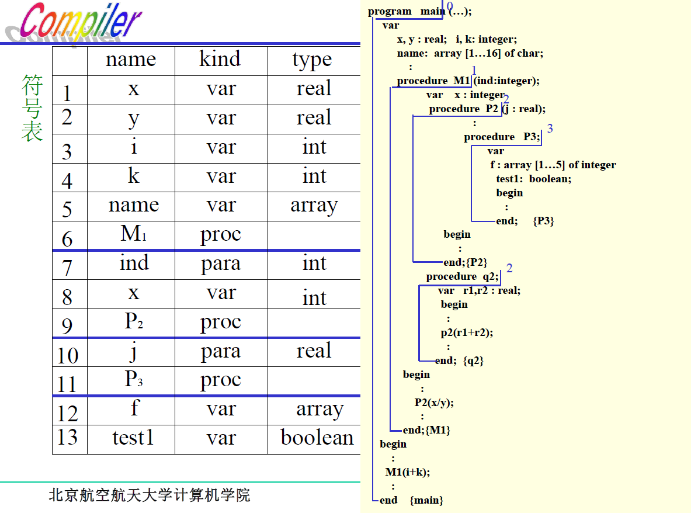
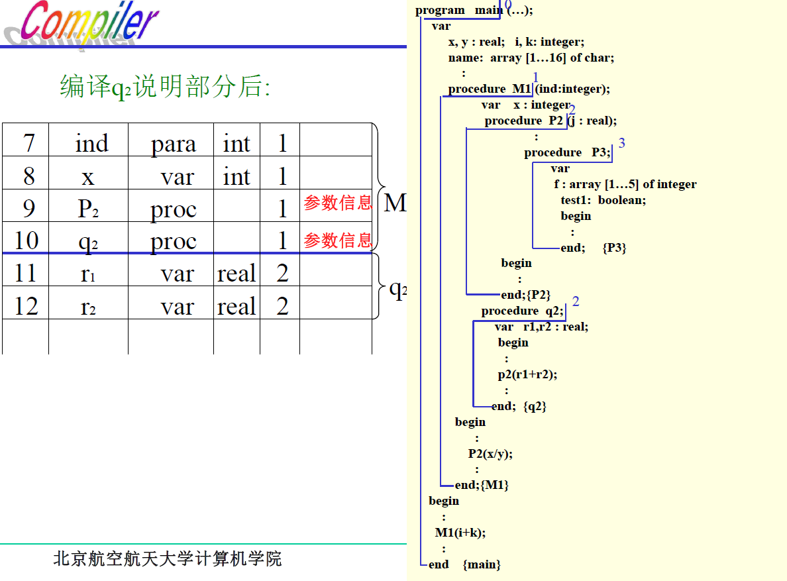
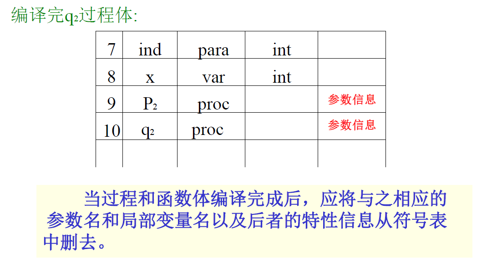

# 第五章 符号表管理技术

[TOC]

## 5.1 概述

### 5.1.1 什么是符号表

在编译过程中，编译程序用来记录源程序中各种名字的特性信息，所以也称为**名字特性表**。

- **名字**：程序名、过程名、函数名、用户定义类型名、变量名、常量名、枚举值名、标号名等。
- **特性信息**：上述名字的种类、类型、维数、参数个数、数值及目标地址（存储单元地址）等。

### 5.2.2 建表和查表的必要性（符号表在编译过程中的作用）

- 源程序中变量要先声明，然后才能引用。
- 用户通过**声明语句**，声明各种名字，并给出它们的类型、维数等信息，编译程序在处理这些声明语句时，应该将声明中的==名字及其信息==**登录**到符号表中，同时编译程序还要给变量分配存储单元，而==存储单元地址==也必须登录在符号表中。
- 当编译程序编译到引用所声明的变量时（赋值或引用其值），要进行**语法语义正确性检查**（类型是否符合要求）和**生成相应的目标程序**，这就需要查符号表以取得相关信息。

### 5.1.3 有关符号表的操作：填表和查表

**填表**：当分析到程序中的==说明或定义语句==时，应将说明或定义的名字，以及与之有关的信息填入符号表中。

**查表**：

1. 填表前查表，检查在程序的同一作用域内名字是否**重复定义**；
2. 检查名字的**种类**是否与**说明**一致；
3. 对于强类型语言，要检查表达式中**各变量的类型**是否一致；
4. 生成目标指令  时，要取得所需要的**地址**。

……

## 5.2 符号表的组织和内容

### 5.2.1 符号表的结构与内容

符号表的基本结构：

- **“名字”域**：存放名字，一般为标识符的符号串，也可为指向标识符字符串的指针
- **“特性”域：**可包括多个子域，分别表示标识符的有关信息，如：
  - 名字（标识符）的种类：简单变量、函数、过程、数组、标号、参数等
  - 类型：如整型、浮点型、字符型、指针等
  - 性质：变量形参、值形参等
  - 值： 常量名所代表的数值
  - 地址：变量所分配单元的首址或地址位移
  - 大小：所占的字节数
  - 作用域的嵌套层次:
    - 对于数组：维数、上下界值、计算下标变量地址所用的信息（数组信息向量）以及数组元素类型等。
    - 对于记录（结构、联合）：域的个数，每个域的域名、地址位移、类型等。
    - 对于过程或函数：形参个数、所在层次、函数返回值类型、局部变量所占空间大小等。
    - 对于指针：所指对象类型等。

### 5.2.2 符号表的组织方式

1. 统一符号表：不论什么名字都填入统一格式的符号表中

   > 符号表表项应按信息量最大的名字设计，填表、查表比较方便，结构简单，但是浪费大量空间。

2. 对于不同种类的名字分别建立各种符号表

   > 节省空间，但是填表和查表不方便。

3. 折中办法：大部分共同信息组成统一格式的符号表，特殊信息另设附表，两者用指针连接。

   > 例：简单变量和数组同存一个格式的表中，但数组的额外信息另存一张表，用指针连接补充

## 5.3 非分程序结构语言的符号表组织

### 5.3.1 非分程序结构语言

每个可独立进行编译的程序单元是不包含有子模块的单一模块，如FORTRAN语言。

### 5.3.2 标识符的作用域及基本处理办法：

1. **作用域**：

   - 全局：子程序名、函数名和公共区名
   - 局部：程序单元中定义的变量

2. **符号表的组织**：全局符号表、局部符号表

3. **基本处理办法**：

   1. 子程序、函数名和公共区名填入全局符号表

   2. 在子程序（函数）**声明部分**读到标识符，造局部符号表。（全局和局部变量重名不算重名）

      > 查本程序单元局部符号表，若有重名则报错，否则造表

   3. 在语句部分读到标识符，查表。

      

4. **程序单元结束**：释放该程序单元的局部符号表

5. **程序编译完成**：释放全部符号表

### 5.3.3 符号表的组织方式：

1. 无序符号表：按扫描顺序建表，查表要逐项查找。查表操作的平均长度为 $(n+1)/2$
2. 有序符号表：符号表按变量名字典序排序。线性查表：$(n+1)/2$，折半查表：$\log_2n-1$
3. 散列符号表（Hash表）：符号表地址=Hash（标识符）。需要解决冲突

## 5.4 分程序结构语言的符号表组织

### 5.4.1 分程序结构语言

**定义**：模块内可嵌入子模块

### 5.4.2 标识符的作用域和基本处理方法：

**作用域**：标识符局部于所定义的模块（最小模块）

1. 模块中所定义的标识符作用域是**定义该标识符的子程序**

2. 过程或函数说明中定义的标识符（包括形参）其作用域为**本过程体**。

3. 循环语句中定义的标识符，其作用域为**该循环语句**

   > 不能从循环体外转到循环体内。循环语句应看作一层

**基本处理办法**：建查符号表均要遵循标识符的**作用域**规定进行

- ==建表==：不能重复，不能遗漏

- ==查表==：按标识符作用域

  

**处理方法**：

1. **在程序声明部分读到标识符时**（声明性出现），建表：

   > 查本层符号表，有无同名？有，重复声明，报错；无，填入符号表

2. **在语句中读到标识符**（引用性出现），查表：

   > 

3. **标准标识符的处理**：主要是语言定义的一些标准过程和函数的名字，它们是标识符的子集，如 sin, cos, abs...

   - 特点：
     1. 用户不必声明，就可全程使用
     2. 设计编译程序时，标准名字及其数目已知
   - 处理方法：
     1. 单独建表：使用不便，费时
     2. 预先将标准名填入名字表中（最外层）

栈式符号表

