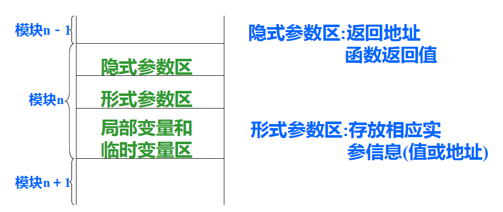

# 第六章 运行时的存储组织及管理

[TOC]

运行时的存储管理：以 MS-WIN+VS+X86 下的可执行程序为例，**从高地址到低地址，自上而下**的是：

- 全局和静态量表
- 代码段
- 运行栈：子程序/函数运行所需基本空间，进入时分配，**向下（从高地址到低地址）生长**，返回时当前运行栈被废弃，递归调用同一个函数则每次调用获得独立的运行栈空间
- 内存堆

## 6.1 概述

### 6.1.1 运行时的存储组织及管理

目标程序**运行**时所需存储空间的组织与管理 以及 源程序中变量存储空间的分配。

### 6.1.2 静态存储分配和动态存储分配

**静态存储分配**：在 **编译阶段** 由 **编译程序** 实现对存储空间的管理和为源程序中的变量分配存储的方法。

- 条件：如果在编译时能够确定源程序中变量在运行时的数据空间大小，且运行时不改变，那么就可以采用静态存储分配方法。

  > 但是并非所有数据空间大小都能在编译过程中确定。

**动态存储分配**：在目标程序 **运行阶段** 由 **目标程序** 实现对存储空间的组织与管理，和为源程序中的变量分配存储的方法。

- 特点
  - 在目标程序运行时进行变量的存储分配
  - 编译时要生成进行**动态分配的目标指令**


## 6.2 静态存储分配

### 6.2.1 分配策略

由于每个变量所需空间的大小在编译时已知，因此可以用简单的方法给变量分配目标地址。

- 开辟一数据区。（首地址在加载时定）
- 按编译顺序给每个模块分配存储空间。
- 在模块内部**按顺序**给模块的变量分配存储，一般用相对地址，所占数据区的大小由变量类型决定。
- 目标地址**填入变量的符号表中**。

### 6.2.2 模块（FORTRAN子程序）的完整数据区

变量、返回地址、形式参数、临时变量

FORTRAN**子程序**的典型数据区



## 6.3 动态存储分配

- 编译时不能具体确定程序所需数据空间
- 编译程序生成有关存储分配的目标代码
- 实际上的分配要在目标程序运行时进行

分程序结构，且允许递归调用的语言：**栈式动态存储分配**

**分配策略**：整个数据区为一个堆栈，

1. 当进入一个过程时，在栈顶为其分配一个数据区
2. 退出时，撤销过程数据区


### 6.3.1 活动记录（Active Record）

一个典型的活动记录可以分为三部分：

#### 1. 局部数据区

存放模块中定义的各个**局部变量**

#### 2. 参数区

存放==隐式参数和显式参数==。


- **prev abp**：指向前一个活动记录基的指针（PREVious Active record Base Pointer），存放调用模块记录基地址，函数执行完时，释放其数据区，数据区指针指向**调用前的位置**

  > 保留该信息是为了确保当控制返回到调用过程时，能使运行环境恢复到调用前的格局

- **ret addr**：返回地址，即调用语句的**下一条执行指令地址**

- **ret value**：函数返回值（无值则空）

- **形参数据区**：每一形参都要分配数据空间，形参单元中存放实参值或实参地址

#### 3. display区

存放==各外层模块活动记录的基地址==

变量二元地址（BL、ON）

- BL（Block Level，分程序的层次）：变量声明所在的层次

  > 可得到该层数据区开始地址；并列过程具有相同层次

- ON（Order Number，顺序号）：相对于显式参数区的开始位置的位移（相对地址）


例子：     


此处AR1实际上是模块1的缩写，真正需要扩写出来；此外X、Y、NAME是从下往上按栈的方式填的；abp需要指向这些模块，若是扩写成的则指向最底下即可。


当模块4执行完，则 abp == prev abp，这样 abp 恢复到进入模块4时的情况，运行栈情况如（c）

后面以此类推，当最外层模块执行完，运行栈恢复到进入模块时的情况，运行栈空


### 6.3.2 建造display区的规则

从i层模块进入（调用）j层模块，则：

#### 1. 若$j=i+1$

==复制 i 层的 display==，然后增加一个指向 i 层模块记录基地址的指针

#### 2. 若$j\le i$，即调用外层模块或同层模块

将 i 层模块的 display 区中==前面 j - 1 个入口==（保证这些入口在 j 的外层）复制到第 j 层模块的 display 区


### 6.3.3 运行时的地址计算

设要访问的变量的二元地址为：（BL, ON）

地址计算公式：

```pascal
// BL-1 - Display区大小
// nip - 隐式参数区大小
if BL = LEV then
	addr := abp + (BL-1) + nip + ON
else if BL < LEV then
	addr := display[BL] + (BL-1) + nip + ON
else
	write("地址错，不合法的模块层次")
```

> 理论课要求：告诉代码是怎么运行的、如何调用函数，要求能够把函数栈画出来


## 6.4 内存垃圾收集器（Garbage Collector, GC）

是一种自动内存管理机制

### 典型技术

无需标记和“stop-the-world”回收

- 引用计数

需要标记和“stop-the-world”回收

- 标记和清除
- 标记紧缩
- 拷贝回收
- 分代回收

### 引用计数


局限和问题：

- 效率问题：每次改变对象指针均需要递归改写计数（出现引用为 0 的情况）
- 引用环问题：导致内存泄漏——通过“弱引用”解决

