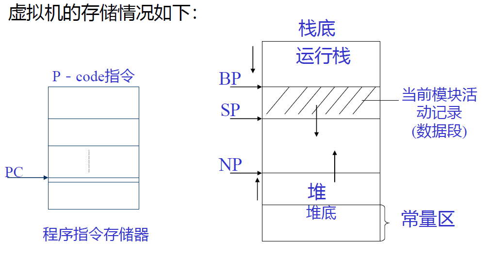
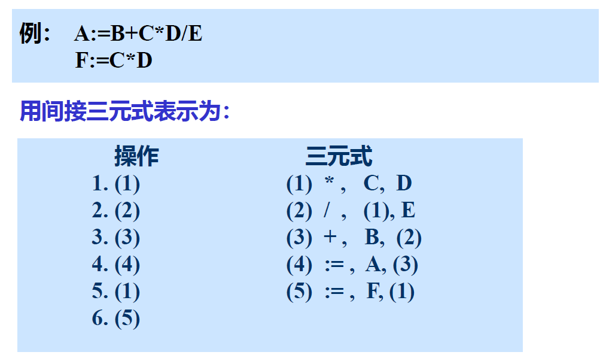
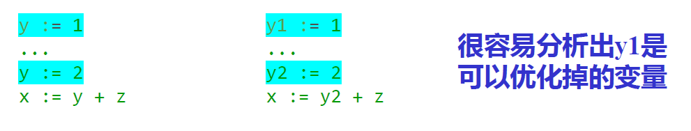

# 第七章 源程序的中间形式

[TOC]

一般编译程序都生成中间代码，然后再生成目标代码，主要优点是可移植（与具体目标程序无关），且易于目标代码优化。有多种中间代码形式：波兰表示、N-元组表示、抽象机代码

## 7.1 波兰表示

（重要，但是很差的）

算术表达式转换成波兰表示的算法：

设一个操作符栈。当读到**操作数**时，立即输出该操作数；当扫描到**操作符**时，与栈顶操作符比较优先级，若栈顶操作符优先级高于栈外，则输出该栈顶操作符，反之，则栈外操作符入栈

> 算术表达式：`F * 3.1416 * R * (H + R)`
>
> 转换成波兰表示：`F 3.1416 * R * H R + *`
>
> 赋值语句：`A := F * 3.1416 * R * ( H + R )`
>
> 波兰表示：`A F 3.1416 * R * H R + * :=`

if 语句的波兰表示

- if 语句：`if <expr> then <stmt1> else <label1> <stmt2> <label2>`

- 波兰表示：`<expr> <label1> BZ <stmt1> <label2> BR <stmt2>`

  > BZ：二目操作符，若<expr>的计算结果为0，则产生一个到<label1>的转移
  >
  > BR：一目操作符，（无条件）产生一个到<label2>的转移

  由if语句的波兰表示可生成如下目标程序框架：

```
		<expr>
		BZ label1	# if expr == true, continue to stmt1, else goto label1
		<stmt1>
		BR label2	# skip stmt2 and go straight to label2
label1: <stmt2>
label2:
```


## 7.3 抽象机代码

许多 pascal 编译系统生成的中间代码是一种称为 P-code 的抽象代码，P-code 的 “P” 即 “Pseudo”

抽象机：寄存器、保存程序指令的存储器、堆栈式数据及操作存储

寄存器有：

1. PC－程序计数器
2. NP - New 指针，指向“堆”的顶部。“堆”用来存放由 New 生成的动态数据。
3. SP - 运行栈指针，存放所有可按源程序的数据声明**直接寻址**的数据。
4. BP－基地址指针，即指向当前活动记录的起始位置指针。
5. 其他，（如 MP －栈标志指针，EP - 极限栈指针等）

虚拟机的存储情况：



运行P-code的抽象机没有专门的运算器或累加器，所有的运算（操作）都在运行栈的栈顶进行，如要进行`d:=(a+b)*c`的运算，生成P-code序列为：

```
取a	LOD a
取b	LOD b
+	ADD
取c	LOD c
*	MUL
送d	STO d
```

编译程序生成 P-code 指令程序后，我们可以用一个虚拟机来解释或者即时编译执行 P-code 。
显然，生成抽象机 P-code 的编译程序是与平台无关的。

## 7.2 N-元表示

在该表示中，每条指令由n个域组成，通常第一个域表示操作符，其余为操作数

常用的n元表示：三元式、四元式

### 三元式

| 操作符 | 左操作数 | 右操作数 |
| :----: | :------: | :------: |

> 表达式的三元式例：`w * x + (y + z)`
>
> (1) \*, w, x
>
> (2) +, y, z
>
> (3) +, (1), (2)

> 条件语句的三元式例：
>
> ```pascal
> if x > y then
> 	z := x;
> else z := y + 1;
> ```
>
> (1) －, x, y
> (2) BMZ , (1), (5)
> (3) :=, z, x
> (4) BR , , (7)
> (5) +, y, 1
> (6) :=, z, (5)
>
> 其中，
>
> BMZ：是二元操作符，测试第二个域的值，若<=0，则按第 3 个域的地址转移，若>0，则顺序执行。
>
> BR：一元操作符，按第 3 个域作无条件转移。

使用三元式不便于代码优化，因为优化要删除一些三元式，或对某些三元式的位置要进行变更，由于三元式的结果（表示为编号），可以是某个三元式的操作数，随着三元式位置的变更也将作相应的修改，很费事。

间接三元式：便于在三元式上作优化处理——三元式的执行次序用另一张表表示，这样优化时不用变三元式，仅改变其执行顺序表即可



### 四元式

| 操作符 | 操作数1 | 操作数2 | 结果 |
| :----: | :-----: | :-----: | :--: |

结果：通常是由编译引入的临时变量，可由编译程序分配一个寄存器或主存单元

> 例：`(A + B) * (C + D) - E` 写成四元式表示：
>
> ```
> +, A, B, T1
> +, C, D, T2
> *, T1, T2, T3
> -, T3, E, T4
> ```

一种特殊的四元式表达方式：SSA（Single Static Assignment form），静态单一赋值形式：==每个变量只赋值一次==

优点：

1. 可以简化很多优化的过程
2. 可以获得更好的优化结果

