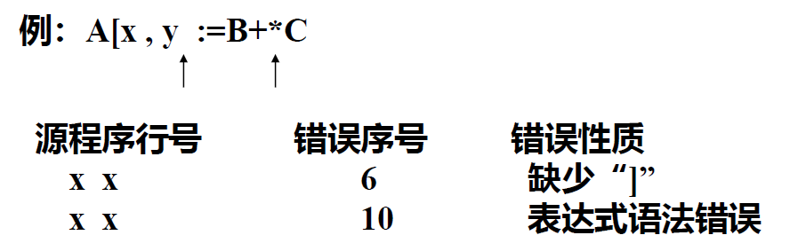
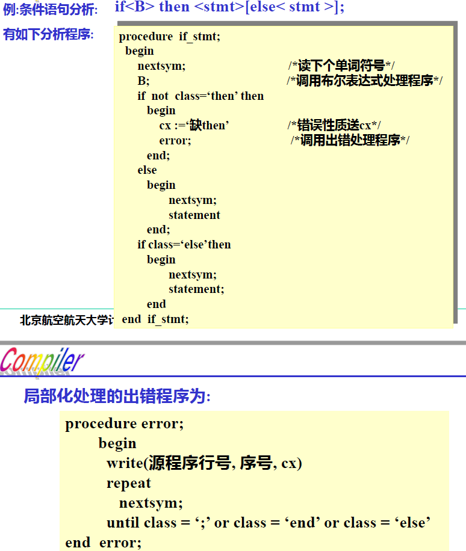

# 第八章 错误处理

[TOC]

## 8.1 概述

**必备功能**：

- 正确的源程序：通过编译生成目标代码
- 错误的源程序：通过编译发现并指出错误

**错误处理能力**：

1. 诊察错误的能力
1. 报错及时准确
1. 一次编译找出错误的多少
1. 错误的改正能力
1. 遏止重复的错误信息的能力


## 8.2 错误分类

编译角度，分为两类：语法错误和语义错误

**语法错误**：源程序在语法上不合乎文法

> 例：`A[I, J := B + * C`，`J`后面缺失`]`，`+`后面缺失标识符

**语义错误**：程序不符合语义规则或超越具体计算机系统的限制

- **语义规则**：
  - 标识符==先说明后引用==
  - 标识符引用要符合==作用域==规定
  - 参与运算的==操作数==类型一致或兼容
  - 过程调用时实参与==形参类型==要一致或兼容
  - 下标变量下标==不能越界==
- **超越系统限制**：
  - 数据溢出错误
  - 符号表、静态存储分配数据区溢出
  - 动态存储分配数据区溢出


## 8.3 错误的诊察和报告

### 8.3.1 错误诊察

1. 违反语法和语义规则以及超过编译系统限制的错误

   > **编译程序**：语法和语义分析时（语义分析要借助符号表和语法树等）

2. 下标越界，计算结果溢出以及动态存储数据区溢出

   > **目标程序**：目标程序运行时
   >
   > 对此，编译程序要生成相应的目标程序作检查和进行处理

### 8.3.2 错误报告

1. **出错位置**：即源程序中出现错误的位置

   > 实现：行号计数器——line_no；单词序号计数器——char_no
   >
   > 一旦诊察出错误，当时的计数器内容就是出错位置

2. **出错性质**：可直接显示文字信息，可给出错误编码

3. **报告错误的两种方式**：

   1. 分析完以后再报告（显示或者打印）

      > 编译程序可设一个保存错误信息的数据区（可用记录型数组），将语法语义分析所诊察到的错误送数据区保存，待源程序分析完以后，显示或打印错误信息。
      >
      > 

   2. 边分析边报告

      > 可以在分析一行源程序时若发现有错，立即输出该行源程序，并在其下输出错误信息。
      >
      > 有时，报错不一定十分准确（位置和性质），需要进一步分析。例如：
      >
      > ```pascal
      > begin
      > 	...
      > 	i := 1 step 1 until n do
      > 	...
      > end
      > ```
      >
      > 实际错误是少个`for`，但报错会在`i = 1`处


## 8.4 错误处理技术

发现错误后，在报告错误的同时还要对错误进行处理，以方便编译能进行下去。目前有两种处理办法：

### 8.4.1 错误改正

指编译诊察出错误以后，根据文法进行错误改正。

> 有的好改，如`A[I, J := B + * C`。
>
> 但不是总能做到，如`A := B - C * D + E)`，不知道左括号应填到何处
>
> ——要正确地改正错误是很困难的

### 8.4.2 错误局部化处理

指当编译程序发现错误后，尽可能把错误的影响限制在一个局部的范围，避免错误扩散和影响程序其他部分的分析。

1. **一般原则**：当诊察到错误以后，就暂停对后面符号的分析，跳过错误所在的语法成分然后继续往下分析。

   - 词法分析：发现不合法字符，显示错误，并跳过该标识符（单词）继续往下分析
   - 语法语义分析：跳过所在的语法成分（短语或语句），一般是跳到语句右界符，然后从新语句继续往下分析

2. **错误局部化处理的实现（递归下降分析法）**

   - 用递归下降分析时，如果发现错误，便将有关错误信息（字符串或者编号）**送CX**（全局变量，存放错误信息），**然后转出错误处理程序**；

   - 出错程序先打印或显示出错位置以及出错信息，然后跳过一段源程序，**直到跳到语句的右界符**（如：`end`）或正在分析的语法成分的**合法后继符号为止**，然后再往下分析。

     

     > 可能存在跳过太多的问题，例如：
     >
     > `real x, 3a, a, bcd, 2fg;`中，`3a`有问题，会一直跳到分号处

3. **提高错误局部化程度的方法**

   - 设 $S_1$：合法后继符号集（某语法成分的后继符号），$S_2$​：停止符号集（跳读必须停止的符号集）

   - 进入某语法成分的分析程序时，分别赋值

     > 当发现错误时，执行`error(S1,S2)`：
     >
     > ```pascal
     > procedure error(S1, S2)
     > 	begin
     > 		write(line_no, char_no, cx);
     > 		repeat
     > 			nextsym
     > 		until(class in S1 or class in S2);
     > 	end
     > ```


### 8.4.3 目标程序运行时错误检测与处理

下标变量下标值越界、计算结果溢出、动态存储分配数据区溢出

需要在编译时生成检测该类错误的代码。

- 对于这类错误，要正确的报告出错误位置很难，因为目标程序与源程序之间**难以建立位置上的对应关系**

一般处理办法：当目标程序运行检测到这类错误时，就调用异常处理程序，打印错误信息和运行现场（寄存器和存储器中的值）等，然后停止程序运行。
