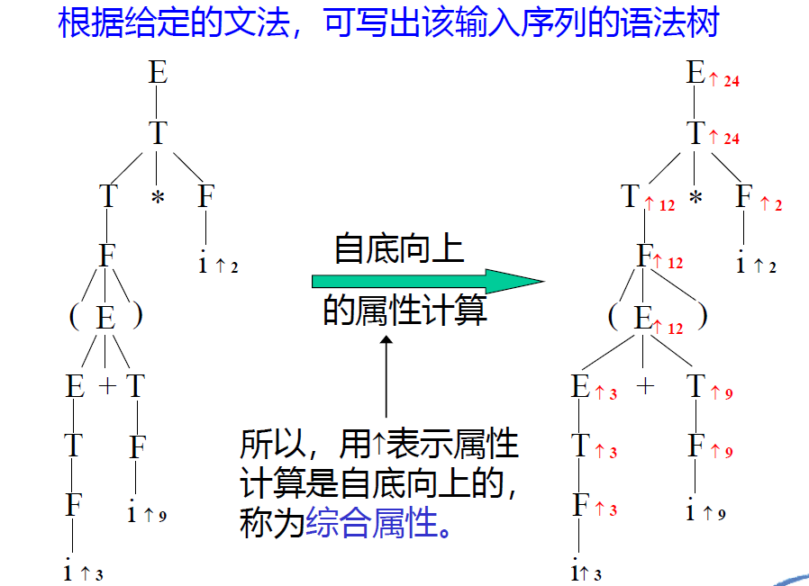
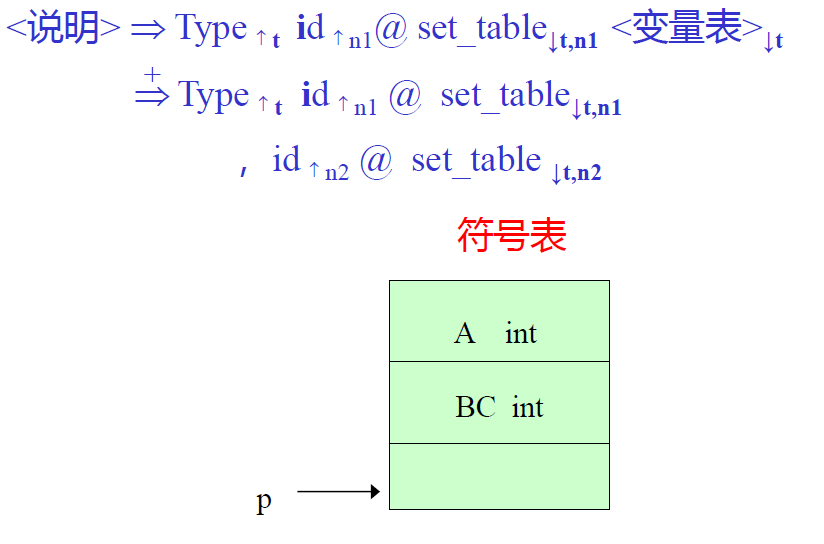
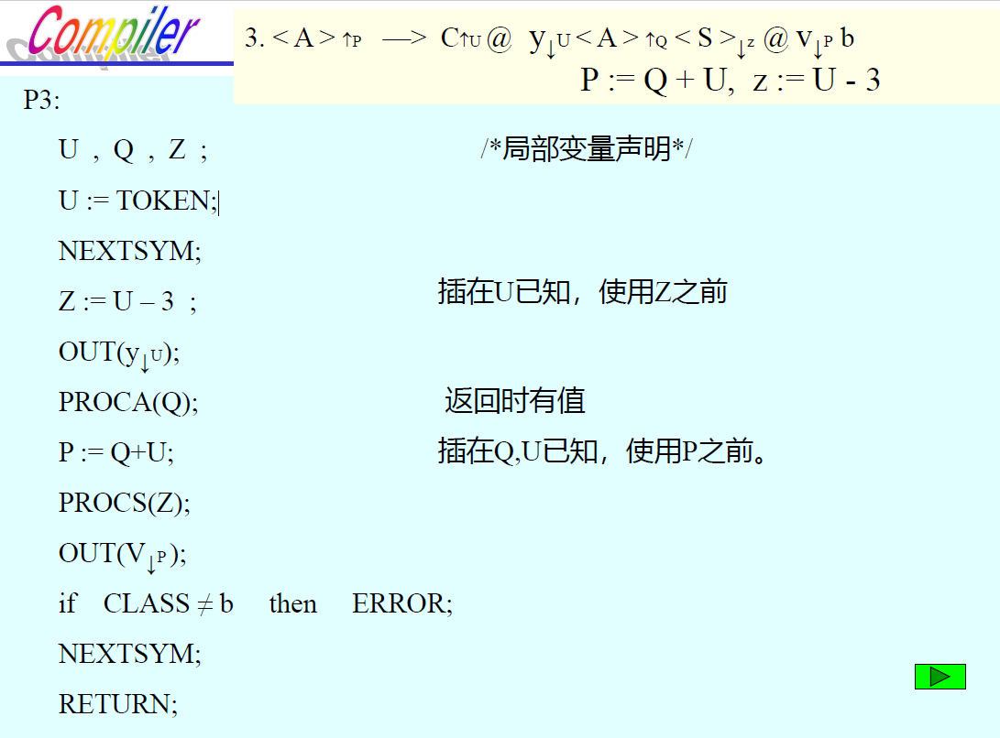

# 第九章 语法制导翻译技术

[TOC]

## 9.0 导言

本章要介绍的是语义分析和（中间）代码生成技术。

程序语言的语义形式化描述目前有三种基本描述方法：操作语义、指称语义、公理语义

## 9.1 翻译文法和语法制导翻译

### 9.1.1 翻译文法

翻译的任务：中缀表达式 -> 波兰后缀表示

假如翻译任务是要将中缀表达式简单变换为波兰后缀表示，只需在上述文法中插入相应的动作符号。

其中：

- @+,@*,@i 为==**动作符号**==。@为**动作符号标记**，后面为字符串。
- 在本例中，其对应**语义子程序的功能**是要输出打印动作符号标记后面的字符串。
- 所以，产生式1：E→E+T@+ 的语义是分析 E, + 和 T ，输出 +
- 产生式6：F→i @ i 的语义是分析 i ，输出 i

**输入文法**：未插入动作符号时的文法。由 **输入文法** 可以通过推导产生 **输入序列** 。

> 不要被“输入”误导，输入序列就是正常推导后、不带有动作符号的符号串。

**翻译文法**：插入动作符号的文法。由 **翻译文法** 可以通过推导产生 **活动序列**（输入序列+动作序列）

**活动序列**：由翻译文法推导出的符号串，由终结符和动作符号组成。(i@i+i@i@+)*i@i@\*

- 从**活动序列**中，去掉**动作符号**，则得到**输入序列**：$(i+i)*i$

- 从**活动序列**中，去掉**输入符号**，则得到**动作序列**，执行动作序列，则完成翻译任务：

  @i@i@+@i@* => ii+i*

**定义9.1**：**翻译文法**是上下文无关文法，其 **终结符号集** 由 **输入符号** 和 **动作符号** 组成。由翻译文法所产生的终结符号串称为**活动序列** 。

**符号串翻译文法**：插入文法中的动作符号 对应的语义子程序是输出符号标记@后的字符串 的文法

**语法制导翻译**：按翻译文法进行的翻译。给定一输入符号串，根据翻译文法获得翻译该符号串的动作序列，并执行该序列所规定的动作的过程。

### 9.1.2 语法制导翻译

语法制导翻译的实现方法：在文法的适当位置==插入语义动作符号==，当按文法分析到动作符号时就==调用相应的语义子程序==，完成翻译任务。

翻译文法所定义的翻译是由输入序列和动作序列组成的**对偶集**。

> 因此，给定了一个翻译文法，就给定了一个对偶集

## 9.2 属性翻译文法

在翻译文法的基础上，可以进一步定义**属性文法**，翻译文法中的符号，包括终结符、非终结符、动作符号均可带有属性，这样可以更好的描述和实现编译过程

分为两种：综合属性、继承属性

### 9.2.1 综合属性

其中的属性值是程序员赋的值，与编译器无关。

### 9.2.2 继承属性

考虑下列**文法**：G[<说明>]：

1. <说明> → Type id <变量表>
2. <变量表> → , id <变量表>
3. <变量表> → $\epsilon$

> 其中，Type：类型名（值：int, real, bool 等）；id：变量名（值：指向该变量符号表项的指针）
>
> - 上述文法所产生的语句：`int A, BC`
> - 该文法的翻译任务：将声明的变量**填入符号表**
> - 完成该工作的**动作符号**：@set_table

==**翻译文法**==：

1. <说明> → Type id @set_table <变量表>
2. <变量表> → , id @set_table <变量表>
3. <变量表> → ε

> 填表时需要的信息：类型，名字，以及填的位置（可以用全程变量或指针）。类型和名字在词法分析时得到，可设两个综合属性。
>
> - $Type\uparrow_t$​：t 中放类型值；
>
> - $id\uparrow_n$：n 中放变量名
>
> 填表动作符号也可带有属性：
>
> - $@set\_table\downarrow_{t_1,n_1}$：$\downarrow_{t_1,n_1}$，可从前面得到，所以称为继承属性，继承前面的值
> - $<变量表>\downarrow_{t_2}$：$\downarrow_{t_2}$，同上

==**属性翻译文法**==：

1. <说明> → Type$\uparrow_t$ id$\uparrow_n$ @set_table$\downarrow_{t_1,n_1}$ <变量表>$\downarrow_{t_2}$，$t_2,t_1:=t;\;\;n_1:=n;$
2. <变量表>$\downarrow_{t_2}$ → , id$\uparrow_n$ @set_table$\downarrow_{t_1,n_1}$ <变量表>$\downarrow_{t_3}$，$t_3,t_1:=t_2;\;\;n_1:=n;$
3. <变量表>$\downarrow_{t_2}$ → ε

> `int A, BC`的分析翻译过程：
>
> 

### 9.2.3 L-属性翻译文法

#### 1. L-属性翻译文法（L-ATG）：LL(1)文法

**定义**：$FOLLOW(A)=\{a|Z\rightarrow...Aa...,a\in V_t,\;A\in V_n,\;Z为识别符号\}$。该集合称为==A==的后继符号集合

**定理**：==文法 G 是 LL(1) 文法==的 **充分必要条件** 是：对于 G 的每一个非终结符 A 的任意两条规则 A ::= α|β，下列条件成立：

1. $FIRST(α)\cap FIRST(β) =\phi$
2. 若 $\beta\xRightarrow{*}\epsilon$，则 $FIRST(α)\cap FOLLOW(A) =\phi$

这是属性翻译文法中较简单的一种。其输入文法要求是LL(1)文法，可用自顶向下分析构造分析器。在分析过程中可进行属性求值。

**定义9.2**：L-属性翻译文法是带有下列说明的翻译文法：

1. 文法中的终结符，非终结符及动作符号==都带有属性==，且每个属性都有一个值域。

2. 非终结符及动作符号的属性可分为继承属性和综合属性。

3. ==开始符号的继承属性==具有指定的初始值。

4. ==输入符号（终结符号）的每个综合属性具有指定的初始值==。

5. 属性的求值规则：

   **继承属性**：——体现==自顶向下，自左向右==的求值特性

   1. 产生式**左部非终结符号**的继承属性值，取**前面产生式右部**该符号已有的继承属性值。
   2. 产生式**右部符号**的继承属性值，用该**产生式左部**符号的继承属性或出现在该**符号左部**的符号的属性进行计算。

   **综合属性**：——体现==自底向上，自右向左==的求值特性，适合在自顶向下分析过程中求值

   1. 产生式**右部非终结符号**的综合属性值，取其**下部产生式左部同名非终结符号**的综合属性值。
   2. 产生式**左部非终结符号**的综合属性值，用该**产生式左部符号的继承属性**或**某个右部符号的属性**进行计算。
   3. 动作符号的综合属性用该符号的继承属性或某个右部符号的属性进行计算。

   > TEACHER：继承属性就是传的值，综合属性就是返回值

#### 2. 简单赋值形式的L-属性翻译文法（SL-ATG）

- 一般属性值计算：`x:=f(y,z)`

- SL-ATG属性值计算：x:=某符号的属性值或常量——简单形式的属性求值

  > 例：x:=y, x,y,z:=17——复写规则

定义9.4：一个 L-ATG 被定义为简单赋值形式的（SL-ATG），当且仅当满足如下条件：

1. 产生式右部符号的继承属性是一个常量，它等于左部符号的继承属性值或等于出现在所给符号左边符号的一个综合属性值。
2. 产生式左部非终结符号的综合属性是一个常量，它等于左部符号的继承属性值或等于右部符号的综合属性值。

因此，一个简单赋值形式的L-ATG除动作符号外，其余符号的属性求值规则其右部是属性或常量

##### 找到等价的SL-ATG

考虑产生式：$<A>\rightarrow a\uparrow_R<B>\uparrow_S<C>\downarrow_I$，$I := f(R,S)$

第一步：设动作符号“@f”表示函数f求值，该动作符号有2个继承属性和1个综合属性：
$$
@f\downarrow_{I_1,I_2}\uparrow_{S_1}\;\;且\;S_1:=f(I_1,I_2)
$$
第二步：修改产生式

1. 插入“@f”（在适当位置）
2. 引进新的复写规则（将R，S赋给$I_1$和$I_2$，f 赋值给$S_1$）
3. 删去原有包含 f 的规则

## 9.3 自顶向下语法制导翻译

### 9.3.1 翻译文法的自顶向下翻译——递归下降翻译器

按翻译要求，在文法中插入语义动作符号，在分析过程中调用相应的语义处理程序，完成翻译任务。

实际上就是在原先语法分析程序基础上加入`OUT(x)`、`OUT(z)`等语句

### 9.3.2 属性文法自顶向下翻译的实现——递归下降翻译器

方法：对于每个非终结符号都编写一个翻译子程序（过程）。根据该非终结符号具有的属性数目，设置相应的参数。

- **继承属性**：声明为==赋值形参==
- **综合属性**：声明为==变量形参或返回值==

> 例如：对于产生式 $U\downarrow_x\uparrow_y\rightarrow...$，可写成：`Procedure U(x,y)`，x - 赋值形参，y - 变量形参

过程调用语句的实参：

- 继承属性：继承属性==值==
- 综合属性：属性==变量==名（传地址，返回时有值）

关于属性名的约定：

1. 产生式**左部**的同名非终结符使用**相同的属性名**。（不同产生式使用相同属性名）
2. 具有相同值的属性取相同的属性名。具有简单赋值形式的属性变量名取相同的属性名，可删去属性求值规则。

详例，如何构造属性文法的递归下降翻译器：

有如下属性翻译文法G[\<S>]：

1. $<S>\downarrow_{R_1}\rightarrow a\uparrow_{T_1}<A>\uparrow_{Q_1}@x\downarrow_{T_2,R_2}<S>\downarrow_{Q_2}$，$R_2:=R_1, T_2:=T_1, Q_2:=Q_1$
2. $<S>\downarrow_{R_1}\rightarrow b@Z\downarrow_{R_2}$，$R_2:=R_1$
3. $<A>\uparrow_{P}\rightarrow C\uparrow_{U_1}@y\downarrow_{U_2}<A>\uparrow_Q<S>\downarrow_Z@ V\downarrow_Pb$，$U_2:=U1, P:=Q+U_1 , Z:= U_1-3$
4. $<A>\uparrow_{P}\rightarrow @w$，$P:=8$

对简单赋值形式的属性变量取相同的属性名，其求值规则可以删去。开始符号的继承属性 $R_1 =7$。

具体程序见PPT/P38-42

细节注意：

- 对于产生式1中的T，它是综合属性，应该把TOKEN值赋给它，并且随之调用NEXTSYM。

- 对于PROCS(R)，先声明R，此处为==值==形参声明；而PROCA(P)中，先声明P，此处为==变量==形参声明。
- P3中的P和Z的赋值很有讲究；递归调用PROCA(Q)会有返回值！最后读入了单词b，需要再NEXTSYM一下！

还有一个例子，将算术表达式翻译成四元式的属性翻译文法，见PPT/P43-49

## 9.4 小结

**翻译文法**：在输入文法中插入语义动作符号（完成翻译任务的语义子程序）

**属性翻译文法**：文法符号（包括动作符号）可带有属性，并定义相应的属性求值规则，就成为属性翻译文法。比翻译文法能更细地描述翻译过程。（属性有综合属性和继承属性之分）

程序语言的属性翻译文法都是 L - 属性的，**一般无求值规则**。